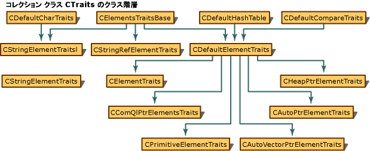

# ATL コレクション クラス
[!INCLUDE[vs2017banner](../assembler/inline/includes/vs2017banner.md)]

ATL は、データの格納とアクセスするためのクラスを提供します。  どのクラスを使用するかどうかは、次に示すいくつかの要因によって:  
  
-   格納されるデータの量  
  
-   効率とデータ アクセスのパフォーマンス  
  
-   インデックスまたはキーを使用してデータにアクセスできます  
  
-   データを並べる順序を  
  
-   個人的な好み  
  
## 小さいコレクション クラス  
 ATL は、オブジェクトに対処するには、次の配列クラスを提供します。  ただし、これらのクラスは、ATL での使用に限定し、内部的に設計されています。  プログラムで使用することは推奨されません。  
  
|Class|データ ストレージの種類|  
|-----------|------------------|  
|[CSimpleArray](../atl/reference/csimplearray-class.md)|いくつかのオブジェクトを扱うための配列クラスを実装します。|  
|[CSimpleMap](../atl/reference/csimplemap-class.md)|いくつかのオブジェクトを扱うためのマッピングのクラスを実装します。|  
  
## ジェネリック コレクション クラス  
 は、ジェネリック コレクションを使用するように実装の配列、リスト、マップを並べ替え、提供されます:  
  
|Class|データ ストレージの種類|  
|-----------|------------------|  
|[CAtlArray](../atl/reference/catlarray-class.md)|配列を実装します。|  
|[CAtlList](../Topic/CAtlList%20Class.md)|リストを実装します。|  
|[CAtlMap](../atl/reference/catlmap-class.md)|データは、キーまたは値によって参照できるという、マップ構造体を実装します。|  
|[CRBMap](../atl/reference/crbmap-class.md)|アルゴリズムを使用して、レッドブラック マップ構造体を実装します。|  
|[CRBMultiMap](../atl/reference/crbmultimap-class.md)|multimapping、レッドブラック構造を実装します。|  
  
 これらのクラスは、デバッグ ビルドでは多くのプログラミング エラーをなしにトラップが、パフォーマンスの向上のために、これらのチェックは、リリース ビルドで行われません。  
  
## 特別なコレクション クラス  
 特化されたコレクション クラスは、メモリ管理とインターフェイス ポインターのポインターに提供されています:  
  
|Class|目的|  
|-----------|--------|  
|[CAutoPtrArray](../atl/reference/cautoptrarray-class.md)|、スマート ポインターの配列を構築するときに役立つメソッドを提供します。|  
|[CAutoPtrList](../atl/reference/cautoptrlist-class.md)|スマート ポインターのリストを構築するときに役立つメソッドを提供します。|  
|[CComUnkArray](../atl/reference/ccomunkarray-class.md)|`IUnknown` のポインターを格納し、[IConnectionPointImpl](../Topic/IConnectionPointImpl%20Class.md) テンプレート クラスにパラメーターとして使用されるようにデザインされています。|  
|[CHeapPtrList](../atl/reference/cheapptrlist-class.md)|ヒープ ポインターのリストを構築するときに役立つメソッドを提供します。|  
|[CInterfaceArray](../atl/reference/cinterfacearray-class.md)|配列を COM インターフェイス ポインターの構築するときに役立つメソッドを提供します。|  
|[CInterfaceList](../Topic/CInterfaceList%20Class.md)|リストを COM インターフェイス ポインターの構築するときに役立つメソッドを提供します。|  
  
## コレクション クラスの選択  
 使用可能なコレクション クラスには、次の表に示すように、さまざまなパフォーマンス特性を提供します。  
  
-   2 および 3 列は、各クラスの順序、およびアクセスの特性を記述します。  テーブルで」、注文した用語は「項目が挿入、削除する順序がコレクションの順序を決定することを意味します; これは、項目がコンテンツに並べ替えることを意味しません。  」指示する用語は「一般的な配列の項目と同じように、コレクション内の項目の整数のインデックスで取得できることを意味します。  
  
-   4 および 5 列は、各クラスのパフォーマンスについて説明します。  コレクションに挿入する必要があるアプリケーションでは、挿入の速度は特に重要になる場合があります。; そのほかのアプリケーションでは、検索の速度はより重要場合があります。  
  
-   6 列には、各図形が重複する要素を許可するかどうかを説明します。  
  
-   指定されたコレクション クラスの操作のパフォーマンスは、コレクションの要素の数および操作の完了に必要な時間の間の関係の点で表現されます。  要素の数は O として記述するときに直線的にインクリメントする時間がかかる処理 \(n\) アルゴリズム。  一方、要素の数は O \(log n\) アルゴリズムとして記述すると同時に、あまり使用しない時間がかかる処理。  したがって、パフォーマンスの面では、要素数が増加するように O \(log n\) のアルゴリズムは O \(n\) に優って、アルゴリズム。  
  
### コレクション形状の機能  
  
|Shape|命令されます。|インデックス付きか。|挿入   要素|を探します。   指定した要素|Duplicate   要素か。|  
|-----------|-------------|----------------|---------------|-----------------------|------------------------|  
|リスト|はい|いいえ|高速 \(定数時間\)|新しい O \(n\)|はい|  
|配列|はい|によって int \(定数時間\)|最後に挿入、定数時間は除きます。O が低下します \(n\) を除き|新しい O \(n\)|はい|  
|マップ|いいえ|によってキー \(定数時間\)|高速 \(定数時間\)|高速 \(定数時間\)|\(キー\) ○ \(値\)|  
|マップ、レッドブラック|○ \(キーによって\)|キー O \(n\) によってログ|高速 O \(n\) ログ|高速 O \(n\) ログ|いいえ|  
|Multimap、レッドブラック|○ \(キーによって\)|キーによって O \(n\) \(キーに対して複数の値\) ログ|高速 O \(n\) ログ|高速 O \(n\) ログ|○ \(キーに対して複数の値\)|  
  
## オブジェクトを使用して CTraits  
 ユーザー定義データ型の広いスコープを格納するために ATL コレクション クラスを使用できるように比較などの重要な関数をオーバーライドできます便利です。  これは CTraits のクラスを使用して実行されます。  
  
 CTraits のクラスは同様に、柔軟性が広範では、MFC のコレクション クラスのヘルパー関数ではありません。詳細については、[コレクション クラスのヘルパー](../mfc/reference/collection-class-helpers.md) を参照してください。  
  
 作成したコレクション クラスを構築する際には、CTraits のクラスの指定の方法があります。  このクラスには、コレクション クラスを構成する他のメソッドによって呼び出された比較などの操作を実行するコードが含まれています。  たとえば、リスト オブジェクトに独自のユーザー定義の構造体が含まれている場合は、特定のメンバー変数を比較する場合にのみ等価テストを再定義することもできます。  このように、リスト オブジェクトの検索メソッドはより便利な方法で動作します。  
  
## 例  
  
### コード  
 [!CODE [NVC_ATL_Utilities#112](../CodeSnippet/VS_Snippets_Cpp/NVC_ATL_Utilities#112)]  
  
## コメント  
 CTraits クラスのリストについては、[コレクション クラス](../Topic/Collection%20Classes.md)を参照してください。  
  
 次の図は CTraits のクラスのクラス階層構造を示しています。  
  
   
  
## コレクション クラスのサンプルします  
 次の例ではコレクション クラスを示しています:  
  
-   [MMXSwarm サンプル](../top/visual-cpp-samples.md)  
  
-   [DynamicConsumer サンプル](../top/visual-cpp-samples.md)  
  
-   [UpdatePV サンプル](../top/visual-cpp-samples.md)  
  
-   [Marquee サンプル](../top/visual-cpp-samples.md)  
  
## 参照  
 [概念](../atl/active-template-library-atl-concepts.md)   
 [コレクション クラス](../Topic/Collection%20Classes.md)