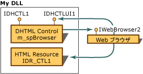

# DHTML コントロール プロジェクトの要素の識別
[!INCLUDE[vs2017banner](../assembler/inline/includes/vs2017banner.md)]

ほとんどの DHTML コントロール コードは、ATL コントロール用に作成されたのとまったく同じです。  [ATL チュートリアル](../Topic/Active%20Template%20Library%20\(ATL\)%20Tutorial.md)によるジェネリック コード、作業の基本的な理解するには、" "および" " [ATL プロジェクトの作成](../atl/reference/creating-an-atl-project.md) 読み取りと [ATL COM オブジェクトの基本](../atl/fundamentals-of-atl-com-objects.md)。  
  
 DHTML コントロールは、すべての ATL のコントロールに似ていますが、を除く:  
  
-   標準のインターフェイスに加えて、実装します \(C\+\+ コードと HTML ユーザー インターフェイス \(UI\) の通信に使用される追加のインターフェイスを実装します。  このインターフェイスを使用する C\+\+ コードへの HTML の UI を呼び出します。  
  
-   これは、コントロールの UI の HTML リソースを作成します。  
  
-   この型は、型 [IWebBrowser2](https://msdn.microsoft.com/en-us/library/aa752127.aspx)のスマート ポインターのメンバー変数 `m_spBrowser`を通じて DHTML オブジェクト モデルへのアクセスを可能にします。  DHTML オブジェクト モデルの一部にアクセスするには、このポインターを使用します。  
  
 次の図は、DLL、DHTML コントロール、Web ブラウザーと HTML リソースの関係を示しています。  
  
   
  
> [!NOTE]
>  このグラフィックスの名前はプレースホルダーです。  には、HTML リソースと、コントロールに公開する ATL コントロール ウィザードに割り当てる名前にインターフェイスの名前に基づいています。  
  
 この図で、要素は次のとおりです:  
  
-   **My DLL** ATL プロジェクト ウィザードを使用して作成された DLL。  
  
-   **DHTML Control** \(`m_spBrowser`\) ATL オブジェクト ウィザードを使用して作成される DHTML コントロール。  このコントロールは、Web ブラウザーのオブジェクトのインターフェイス、**IWebBrowser2**を使用して Web ブラウザーのオブジェクトとメソッドにアクセスします。  コントロール自体は、コントロールに必要なそのほかの標準インターフェイスに加え、次の 2 種類のインターフェイスを公開します。  
  
    -   **IDHCTL1** コンテナーでのみ使用するコントロールによって公開されるインターフェイス。  
  
    -   **IDHCTLUI1** C\+\+ コードと HTML ユーザー インターフェイス間で通信するためのディスパッチ インターフェイス。  Web ブラウザーでは、コントロールを表示するには、コントロールのディスパッチ インターフェイスを使用します。  `window.external`を呼び出すことにより、このディスパッチ インターフェイス メソッドの名前の前にコントロールのユーザー インターフェイスからこのディスパッチ インターフェイスのさまざまなメソッドを呼び出すことで開始する。  このコントロールの UI を構成する HTML スクリプト内のタグの `window.external` にアクセスします。  リソース ファイルの外部メソッドの呼び出しに関する詳細については、[DHTML から C\+\+ コードの呼び出し](../Topic/Calling%20C++%20Code%20from%20DHTML.md)を参照してください。  
  
-   **IDR\_CTL1** HTML リソースのリソース id。  そのファイル名が、この場合は DHCTL1UI.htm です。  DHTML コントロールは、テキスト エディターを使用して編集できるように標準の HTML タグを含む外部ウィンドウのディスパッチを指示 HTML リソースを使用します。  
  
-   **Web Browser** では、HTML リソースの HTML に基づいて Web ブラウザー コントロールの UI を表示します。  Web ブラウザーの **IWebBrowser2** インターフェイスへのポインターは、DHTML オブジェクト モデルへのアクセスを許可して DHTML コントロールで使用できます。  
  
 ATL コントロール ウィザードでは、HTML リソースと .cpp ファイルの両方の既定のコントロール コードが生成されます。  ウィザードによって生成されるようにコントロールをコンパイルおよび実行し、Web ブラウザーまたは ActiveX コントロール テスト コンテナーでコントロールが表示されます。  次の図は、テスト コンテナーに表示されるボタンを 3 つ対して既定の ATL DHTML コントロールを示しています:  
  
   
  
 最初に [ATL DHTML コントロールの作成](../atl/creating-an-atl-dhtml-control.md) が表示されます。DHTML コントロールを作成します。  テスト コンテナーにアクセスする方法の詳細については、[テスト コンテナーでテストのプロパティおよびイベント](../mfc/testing-properties-and-events-with-test-container.md) を参照してください。  
  
## 参照  
 [DHTML コントロールのサポート](../atl/atl-support-for-dhtml-controls.md)