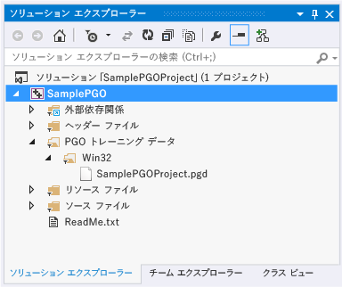
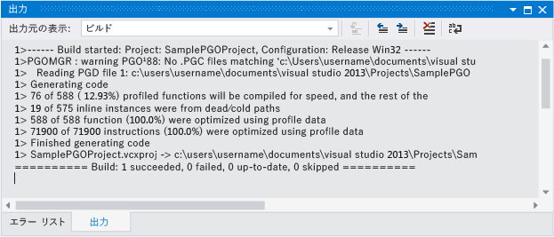

# Visual Studio 2013 のパフォーマンスと診断ハブでのガイド付き最適化をプロファイルします。

Visual Studio 2013 を使用している場合、プロファイル ガイド付き最適化の Visual c のパフォーマンスと診断ハブでプラグインには、開発者のプロファイル ガイド付き最適化のエクスペリエンスが効率化します。 できます[プラグインをダウンロード](https://marketplace.visualstudio.com/items?itemName=ProfileGuidedOptimizationTeam.ProfileGuidedOptimizationforVisualC)Visual Studio の web サイトからします。 プラグインは以降のバージョンの Visual Studio ではサポートされません。

ガイド付き最適化のプロファイル (PGO: Profile Guided Optimization) を使用すると、ユーザーとの対話を最適化した形で、x86 および x64 のネイティブ アプリのビルドを作成できます。 PGO は複数の手順: は、プロファイリング用にインストルメント化されているアプリのビルドを作成して、「トレーニングします」を実行し、。 つまり、ユーザーの対話の一般的なシナリオ インストルメント化されたアプリを実行します。 キャプチャされたプロファイル データを保存して、プログラム全体を最適化するためのガイドとして結果を使用し、アプリを再構築します。 これらの手順を個々に Visual Studio またはコマンド ラインで実行することもできますが、PGO プラグインを使用すると、プロセスを一元化および単純化することができます。 PGO プラグインにより、必要なオプションがすべて設定され、各手順のガイドおよび分析結果が示されます。また、その結果を使用してビルドを構成することで、各関数のサイズまたは速度が最適化されます。 PGO プラグインを使用すると、コードの変更に伴って、アプリのトレーニングを再実行し、ビルド最適化データを更新することも容易になります。

## 必須コンポーネント

必要があります[PGO プラグインをダウンロード](https://marketplace.visualstudio.com/items?itemName=ProfileGuidedOptimizationTeam.ProfileGuidedOptimizationforVisualC)し、パフォーマンスと診断ハブで使用する前に Visual Studio でインストールします。

## チュートリアル: PGO プラグインを使用してアプリを最適化する

まず、Visual Studio で基本的な Win32 デスクトップ アプリを作成します。 最適化対象のネイティブ アプリが既にある場合は、それを使用できるため、この手順を省略できます。

### アプリを作成するには

1. メニュー バーで、 **[ファイル]**、 **[新規作成]**、 **[プロジェクト]** の順にクリックします。

1. 左側のウィンドウで、**新しいプロジェクト**] ダイアログ ボックスで、展開**インストール済み**、**テンプレート**、 **Visual C**、し、[ **MFC**します。

1. 中央のウィンドウで次のように選択します。 **MFC アプリケーション**します。

1. プロジェクトの名前を指定 — たとえば、 **SamplePGOProject**-で、**名前**ボックス。 **[OK]** を選択します。

1. **概要**のページ、 **MFC アプリケーション ウィザード** ダイアログ ボックスで、選択、**完了**ボタン。

次に、アプリのビルド構成を [リリース] に設定します。これにより、PGO ビルドおよびトレーニングの手順用の準備が完了します。

### ビルド構成を設定するには

1. メニュー バーで **[ビルド]**、 **[構成マネージャー]** の順に選択します。

1. **Configuration Manager**  ダイアログ ボックスで、選択、**アクティブ ソリューション構成**ドロップダウン ボタンをクリックし、選択**リリース**します。 選択、**閉じる**ボタンをクリックします。

パフォーマンスと診断ハブを開き、メニュー バーで、**分析**、**パフォーマンスと診断**。 これにより、プロジェクトの種類に応じた分析ツールのある診断セッション ページが開きます。

**使用可能なツール**を選択、**ガイド付き最適化のプロファイル**チェック ボックスをオンします。 選択、**開始**PGO プラグインを開始するボタンをクリックします。

**ガイド付き最適化のプロファイル**ページが、アプリのパフォーマンスを向上させるために、プラグインの使用手順について説明します。 選択、**開始**ボタンをクリックします。

![PGO [インストルメンテーション] ページ](../../build/reference/media/pgofig2instrument.png "PGOFig2Instrument")

**インストルメンテーション**セクションを使用する、**トレーニングが最初に有効になっている**トレーニングの一環として、アプリのスタートアップ フェーズを含めるかどうかを選択するオプション。 このチェック ボックスをオフにした場合、トレーニングを明示的に有効にするまで、実行中のインストルメント化されたアプリでは、トレーニング データが記録されません。

選択、**計器**コンパイラ オプションの特殊なセットを使用してアプリを構築するボタンをクリックします。 コンパイラにより、生成されたコードにプローブ命令が挿入されます。 これらの命令により、トレーニング フェーズでプロファイル データが記録されます。

インストルメント化されたアプリのビルドが完了すると、アプリは自動的に起動されます。

ビルド中にエラーまたは警告が発生すると、それらを修正し、選択**ビルド再起動**をインストルメント化されたビルドを再起動します。

アプリが開始されると、使用できます、 **Start トレーニング**と**一時停止トレーニング**内のリンク、**トレーニング**プロファイル情報が記録されますを制御するセクション。 使用することができます、**アプリケーションを停止**と**アプリケーションの開始**へのリンクを停止し、アプリを再起動します。

トレーニングでは、ユーザー シナリオに従った操作を行い、PGO プラグインでコードを最適化するために必要なプロファイル情報をキャプチャします。 トレーニングを完了すると、アプリを閉じるか、**アプリケーションを停止**リンク。 選択、**分析**分析の手順を開始するボタンをクリックします。

分析が完了すると、 **Analysis**セクションは、ユーザー シナリオ トレーニング フェーズ中にキャプチャされたプロファイル情報のレポートを示しています。 このレポートを使用して、アプリから最も頻繁に呼び出され、最も長い時間が消費された関数を調べることができます。 PGO プラグインでは、この情報を使用して、速度を最適化するアプリ関数およびサイズを最適化するアプリ関数を判断します。 PGO プラグインでは、トレーニングで記録したユーザー シナリオに応じて、最も高速で最小サイズのアプリを作成できるように、ビルドの最適化が構成されます。

場合、トレーニングが必要なプロファイル情報をキャプチャできます**変更の保存**を将来のビルドを最適化するために、プロジェクトで分析されたプロファイル データを保存します。 プロファイル データを破棄し、トレーニングを最初からやり直すを選択して**やり直しトレーニング**します。

プロジェクトで、プロファイル データ ファイルが保存された、 **PGO トレーニング データ**フォルダー。 このデータは、アプリのコンパイラ ビルド最適化設定を制御するために使用されます。

コンパイル時にアプリが選択的に最適化されるように、分析の後、PGO プラグインによってプロジェクトのビルド オプションが設定されます。 引き続き同じプロファイル データを使用して、アプリの変更およびビルドを行うことができます。 アプリケーションのビルド時には、プロファイル データを使用して最適化された関数および命令の数を示すレポートが出力されます。

開発時に大幅なコード変更を行った場合、最適化の効果を最大限に高めるには、アプリを再トレーニングする必要があります。 ビルドにより出力されたレポートに、プロファイル データを使用して最適化された関数または命令が 80% 未満であると示されている場合は、アプリの再トレーニングを行うことをお勧めします。