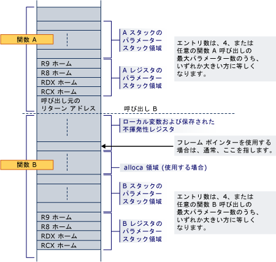

# スタック割り当て

関数のプロローグをローカル変数のスタック領域を割り当て、保存済みレジスタ、スタック パラメーター、およびパラメーターを登録します。

パラメーター領域は、スタックの下部に常に、(たとえ alloca が使用されます) は常に、リターン アドレスの横にある任意の関数の呼び出し中にするようにします。 少なくとも 4 つのエントリが含まれていますが、呼び出されるすべての関数が常にすべてのパラメーターを保持するのに十分な領域が必要です。 パラメーター自体がスタックに戻されない場合でも、登録パラメーターの領域が常に割り当てられることに注意してください。呼び出し先のすべてのパラメーター領域が割り当てられていることが保証されます。 自宅の住所がレジスタ引数の必要なは、呼び出された関数が引数リスト (va_list) または個々 の引数のアドレスを取得する必要がある場合に、連続した領域があるため。 この領域には、サンクの実行中に、デバッグ オプションとして、レジスタ引数を保存する便利な場所も用意されています (たとえば、簡単、引数、プロローグ コードでそのホーム アドレスに格納されている場合、デバッグ中に検索する)。 呼び出された関数が 4 未満のパラメーターを持つ場合でも、これら 4 つのスタックの場所は、呼び出された関数では、実質的が所有し、パラメーターのレジスタの値を保存するだけでなく、他の目的で呼び出された関数で使用できます。  したがって、呼び出し元可能性があります情報を保存できませんスタックのこの領域で、関数呼び出しで。

動的に割り当てられている領域 (alloca) 関数で場合、不揮発性レジスタは、スタックの固定部分のベースをマークするフレーム ポインターとして使用する必要があり、そのレジスタを保存して、プロローグで初期化する必要があります。 Alloca を使用すると、同じ呼び出し元から、同じ呼び出し先への呼び出しによって、そのレジスタ パラメーターの自宅の住所を異なる必要がありますに注意してください。

スタックには 16 バイトが維持されます常に (たとえば、リターン アドレスをプッシュした後)、プロローグ内し、で示される場合を除き、[関数型](../build/function-types.md)のフレームの関数の特定のクラス。

非リーフの A を関数呼び出しが B. 関数 A のプロローグを関数のスタック レイアウトの例 B が、スタックの一番下に必要なすべてのレジスタとスタック パラメーターの領域を割り当て済みを次に示します。 呼び出しは、リターン アドレスをプッシュし、B のプロローグは、ローカル変数、不揮発性レジスタ、および関数を呼び出すために必要な領域の領域を割り当てます。 B alloca を使用する場合は、ローカル変数/不揮発性レジスタ保存領域とパラメーターのスタック領域の間の領域が割り当てられます。

関数 B が別の関数を呼び出すと、リターン アドレスが RCX の自宅の住所のすぐ下にプッシュされます。

## 関連項目

[スタックの使用](../build/stack-usage.md)