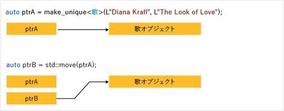

# 方法: unique_ptr インスタンスを作成して使用する
A [unique_ptr](../standard-library/unique-ptr-class.md)がそのポインターを共有していません。 別コピーできない`unique_ptr`関数に値渡しまたは作成するコピーを必要とするすべての C++ 標準ライブラリ アルゴリズムで使用されます。 `unique_ptr` ができるのは移動だけです。 この場合、メモリ リソースの所有権は別の `unique_ptr` に移動し、元の `unique_ptr` はそれ以降、所有権を失います。 複数の所有者がオブジェクトを所有するとプログラム ロジックが複雑になるため、所有者を 1 人に制限することをお勧めします。 したがって、プレーンな C++ オブジェクトにスマート ポインターが必要なときに使用`unique_ptr`、構築する場合と、`unique_ptr`を使用して、 [make_unique](../standard-library/memory-functions.md#make_unique)ヘルパー関数。  
  
 次の図では、2 つの `unique_ptr` のインスタンス間での所有権の移転を示します。  
  
   
  
 `unique_ptr` 定義された、 `<memory>` C++ 標準ライブラリのヘッダー。 生のポインターと同じくらい効率的と、C++ 標準ライブラリのコンテナーで使用できます。 追加`unique_ptr`C++ 標準ライブラリのコンテナーにインスタンスが効率的なのでの移動コンス トラクター、`unique_ptr`コピー操作の必要性を排除します。  
  
## 例  
 次の例では、`unique_ptr` インスタンスを作成し、関数間で渡す方法を示します。  
  
 [!code-cpp[stl_smart_pointers#210](../cpp/codesnippet/CPP/how-to-create-and-use-unique-ptr-instances_1.cpp)]  
  
 これらの例は、`unique_ptr` の基本的な機能として、移動はできるが、コピーはできないことを示しています。 「移動」は `unique_ptr` に所有権を移転し、元の `unique_ptr` をリセットします。  
  
## 例  
 次の例では、`unique_ptr` インスタンスを作成し、ベクター内で使用する方法を示します。  
  
 [!code-cpp[stl_smart_pointers#211](../cpp/codesnippet/CPP/how-to-create-and-use-unique-ptr-instances_2.cpp)]  
  
 ループの範囲で、`unique_ptr` が参照によって渡されることに注意してください。 ここで値によって渡そうとすると、`unique_ptr` コピー コンストラクターが削除されるため、コンパイラによってエラーがスローされます。  
  
## 例  
 次の例では、クラス メンバーである `unique_ptr` を初期化する方法を示しています。  
  
 [!code-cpp[stl_smart_pointers#212](../cpp/codesnippet/CPP/how-to-create-and-use-unique-ptr-instances_3.cpp)]  
  
## 例  
 使用することができます[make_unique](../standard-library/memory-functions.md#make_unique)を作成する、 `unique_ptr` 、配列に使用することはできませんが、`make_unique`配列の要素を初期化するためにします。  
  
 [!code-cpp[stl_smart_pointers#213](../cpp/codesnippet/CPP/how-to-create-and-use-unique-ptr-instances_4.cpp)]  
  
 例については、次を参照してください。 [make_unique](../standard-library/memory-functions.md#make_unique)です。  
  
## 関連項目  
 [スマート ポインター](../cpp/smart-pointers-modern-cpp.md)   
 [make_unique](../standard-library/memory-functions.md#make_unique)
