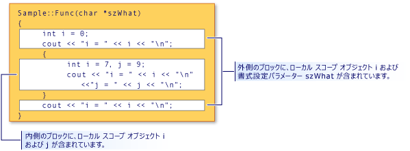

# <a name="scope-c"></a>スコープ (C)

クラス、関数、または変数などのプログラム要素を宣言するときにその名前のみ「表示」でき、プログラムの特定の部分で使用します。 名前が表示されるコンテキストを呼び出すその*スコープ*します。 たとえば、変数を宣言する`x`関数の内部`x`はのみその関数本体の内部に表示されます。 *ローカル スコープ*します。 同じ名前でその他の変数をプログラムでがあります。さまざまなスコープをされている限り、単一定義規則に違反しないし、エラーは発生しません。

自動の非静的変数のスコープに作成し、プログラム実行用メモリの破棄のときにも決定します。

スコープの 6 つの種類があります。

- **グローバル スコープ**グローバル名が、クラス、関数または名前空間の外部で宣言されているいずれか。 ただし、C++ でもこれらの名前は暗黙的なグローバル名前空間に存在します。 宣言されているファイルの末尾に、宣言の位置からグローバルな名前のスコープを拡張します。 グローバル名には、可視性の規則によって制御もされて[リンケージ](program-and-linkage-cpp.md)プログラムでは、他のファイルの名前が表示されているかどうかを決定します。

- **Namespace スコープ**内で宣言された名前、[名前空間](namespaces-cpp.md)、任意のクラスまたは列挙型の定義または関数のブロックの外部では名前空間の最後に宣言された位置から表示します。 名前空間は、異なるファイル間で複数のブロックが定義できます。

- **ローカル スコープ**関数またはパラメーターの名前も含め、ラムダ内で宣言された名前がローカル スコープがあります。 これらは、「ローカル」と呼ばれます。 のみの宣言のポイントから関数またはラムダ本体の末尾に表示されます。 ローカル スコープは、ある種のブロックのスコープは、この記事の後半で説明されている場合です。

- **クラス スコープ**クラス メンバーの名前があるクラスのスコープは、宣言の位置に関係なく、クラス定義全体を拡張します。 クラス メンバーのアクセシビリティは名前空間によって制御される、**パブリック**、**プライベート**、および**保護**キーワード。 パブリックまたはプロテクト メンバーにのみ、メンバー選択演算子を使用してアクセスできます (**します。** または**->**) またはメンバーへのポインター演算子 (**.**<strong>\*</strong>または**->** <strong>\*</strong>)。

- **ステートメントのスコープ**で宣言された名前、**の**、**場合**、**中**、または**スイッチ**が終わるまで、ステートメントが表示されている、ステートメント ブロックです。

- **関数スコープ**A[ラベル](labeled-statements.md)関数のスコープは、その宣言位置よりも前に、関数本体全体にわたって表示されることを意味します。 関数スコープなどのステートメントを記述できる`goto cleanup`する前に、`cleanup`ラベルが宣言されています。

## <a name="hiding-names"></a>名前の隠ぺい

囲まれたブロック内で名前を宣言すると、その名前が非表示になります。 次の図では、内側のブロックで `i` が再宣言されています。そのため、外側のブロック スコープでは `i` に関連付けられた変数が隠し変数になります。

ブロック スコープと名前が非表示

このプログラムの出力を次の図に示します。

```cpp
i = 0
i = 7
j = 9
i = 0
```

> [!NOTE]
> `szWhat` 引数は、この関数のスコープ内にあると見なされます。 したがって、この関数の外側のブロックで宣言されたものとして処理されます。

## <a name="hiding-class-names"></a>クラス名の非表示

関数、オブジェクト、変数、または列挙子を同じスコープ内で宣言することで、クラス名を非表示にできます。 ただし、クラス名もアクセスできますキーワードを使用するプレフィックスと**クラス**します。

```cpp
// hiding_class_names.cpp
// compile with: /EHsc
#include <iostream>
using namespace std;

// Declare class Account at global scope.
class Account
{
public:
    Account( double InitialBalance )
        { balance = InitialBalance; }
    double GetBalance()
        { return balance; }
private:
    double balance;
};

double Account = 15.37;            // Hides class name Account

int main()
{
    class Account Checking( Account ); // Qualifies Account as
                                       //  class name

    cout << "Opening account with balance of: "
         << Checking.GetBalance() << "\n";
}
//Output: Opening account with balance of: 15.37
```

> [!NOTE]
> 任意の場所、クラス名 (`Account`) を呼び出すときは、class キーワードは、グローバル スコープ変数 Account と区別するために使用する必要があります。 スコープ解決演算子 (::) の左側がクラス名の場合は、この規則が適用されません。 スコープ解決演算子の左側の名前は、常にクラス名と見なされます。

次の例は、型のオブジェクトへのポインターを宣言する方法を示します`Account`を使用して、**クラス**キーワード。

```cpp
class Account *Checking = new class Account( Account );
```

`Account` (かっこ内)、前のステートメントで初期化子内でグローバル スコープには型である**二重**します。

> [!NOTE]
> この例のように、識別子名を再使用するのは適切なプログラミング方法ではありません。

クラス オブジェクトの宣言と初期化については、次を参照してください。[クラス、構造、および共用体](../cpp/classes-and-structs-cpp.md)します。 使用方法について、**新しい**と**削除**フリー ストア演算子を参照してください[新しい演算子と delete 演算子](new-and-delete-operators.md)します。

## <a name="hiding-names-with-global-scope"></a>グローバル スコープの名前の隠ぺい

ブロック スコープで同じ名前を明示的に宣言することで、グローバル スコープを持つ名前を非表示にできます。 スコープ解決演算子を使用してグローバル スコープ名にアクセスできますが、(`::`)。

```cpp
#include <iostream>

int i = 7;   // i has global scope, outside all blocks
using namespace std;

int main( int argc, char *argv[] ) {
   int i = 5;   // i has block scope, hides i at global scope
   cout << "Block-scoped i has the value: " << i << "\n";
   cout << "Global-scoped i has the value: " << ::i << "\n";
}
```

```Output
Block-scoped i has the value: 5
Global-scoped i has the value: 7
```

## <a name="see-also"></a>関連項目

[基本的な概念](../cpp/basic-concepts-cpp.md)