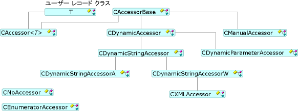

# アクセサーと行セット
[!INCLUDE[vs2017banner](../../assembler/inline/includes/vs2017banner.md)]

データを設定および取得するために、OLE DB テンプレートは [CAccessorRowset](../Topic/CAccessorRowset%20Class.md) クラスを通じてアクセサーと行セットを使用します。  このクラスは、異なる種類の複数のアクセスを扱うことができます。  
  
## アクセサーの種類  
 すべてのアクセサーは、[CAccessorBase](../../data/oledb/caccessorbase-class.md) から派生します。  `CAccessorBase` には、パラメーターと列バインディングの両方が用意されています。  
  
 アクセサーの種類を次の図に示します。  
  
   
アクセサー クラス  
  
-   [CAccessor](../Topic/CAccessor%20Class.md) このアクセサーは、デザイン時にデータベース ソースの構造を理解している場合に使用します。  `CAccessor` は、バッファーを含むデータベース レコードをデータ ソースに静的にバインドします。  
  
-   [CDynamicAccessor](../../data/oledb/cdynamicaccessor-class.md) このアクセサーは、デザイン時にデータベースの構造を理解していない場合に使用します。  `CDynamicAccessor` は、`IColumnsInfo::GetColumnInfo` を呼び出し、データベースの列情報を取得します。  このクラスは、アクセサーとバッファーを作成し、管理します。  
  
-   [CDynamicParameterAccessor](../../data/oledb/cdynamicparameteraccessor-class.md) このアクセサーは、不明なコマンドの種類を扱う場合に使用します。  コマンドを準備すると、プロバイダーが `ICommandWithParameters` をサポートしている場合に、`CDynamicParameterAccessor` は `ICommandWithParameters` インターフェイスからパラメーター情報を取得できます。  
  
-   [CDynamicStringAccessor](../../data/oledb/cdynamicstringaccessor-class.md)、[CDynamicStringAccessorA](../../data/oledb/cdynamicstringaccessora-class.md)、および [CDynamicStringAccessorW](../../data/oledb/cdynamicstringaccessorw-class.md) これらのアクセサーは、データベース スキーマに関する情報が不明な場合に使用します。  `CDynamicStringAccessorA` はデータを ANSI 文字列として取得し、`CDynamicStringAccessorW` はデータを Unicode 文字列として取得します。  
  
-   [CManualAccessor](../Topic/CManualAccessor%20Class.md) このクラスでは、プロバイダーが変換できるデータ型の場合、どのデータ型でも使用できます。  結果列とコマンド パラメーターの両方を処理します。  
  
 次の表に、OLE DB テンプレート アクセサーの各種類のサポートをまとめます。  
  
|アクセサーの種類|動的|パラメーターの処理|バッファー|複数のアクセサー|  
|--------------|--------|---------------|-----------|--------------|  
|`CAccessor`|No|Yes|User|Yes|  
|`CDynamicAccessor`|Yes|No|OLE DB テンプレート|No|  
|`CDynamicParameterAccessor`|Yes|Yes|OLE DB テンプレート|No|  
|`CDynamicStringAccessor[A,W]`|Yes|No|OLE DB テンプレート|No|  
|`CManualAccessor`|Yes|Yes|User|Yes|  
  
## 行セットの種類  
 OLE DB テンプレートは、3 種類の行セットをサポートします \(前の図を参照\)。[CRowset](../Topic/CRowset%20Class.md) で実装される単一行セット、[CBulkRowset](../Topic/CBulkRowset%20Class.md) で実装されるバルク行セット、および [CArrayRowset](../../data/oledb/carrayrowset-class.md) で実装される配列行セットです。  単一行セットは、`MoveNext` が呼び出されたときに単一の行ハンドルをフェッチします。  バルク行セットは、複数の行ハンドルをフェッチできます。  配列行セットは、配列構文を使用してアクセスできる行セットです。  
  
 行セットの種類を次の図に示します。  
  
   
行セット クラス  
  
 [スキーマ行セット](../../data/oledb/obtaining-metadata-with-schema-rowsets.md)は、データ ストアのデータにアクセスせずに、メタデータと呼ばれる、データ ストアに関する情報にアクセスします。  スキーマ行セットは、通常、データベースの構造がコンパイル時に不明な場合に使用します。スキーマ行セットは実行時に取得する必要があります。  
  
## 参照  
 [OLE DB コンシューマー テンプレート](../../data/oledb/ole-db-consumer-templates-cpp.md)