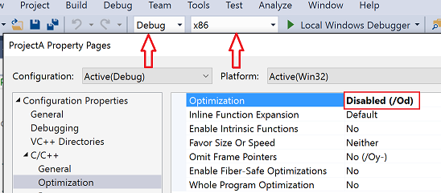
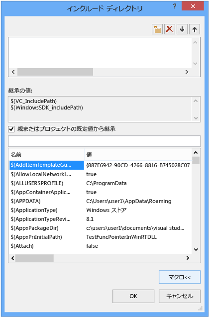
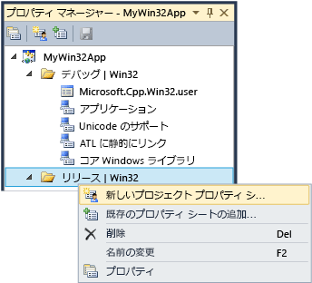

# <a name="working-with-project-properties"></a>プロジェクトのプロパティの操作
IDE では、プロジェクトをビルドするために必要なすべての情報として公開*プロパティ*です。 この情報には、アプリケーション名、DLL、LIB、EXE) などの拡張機能、コンパイラ オプション、リンカー オプション、デバッガーの設定、カスタム ビルド ステップ、およびその他の多くの要素が含まれています。 通常、使用して*プロパティ ページ*(**プロジェクト&#124;プロパティ**) を表示およびこれらのプロパティを変更します。 
  
 プロジェクトを作成するときに、システムは、さまざまなプロパティの値を割り当てます。 既定では多少種類により、プロジェクトとオプションのアプリケーション ウィザードで選択します。 たとえば、ATL プロジェクト MIDL ファイルに関連するプロパティが存在しない場合は、基本的なコンソール アプリケーションでします。 プロパティ ページで、[全般] ペインで、既定のプロパティのとおりです。  
  
   
  
 アプリケーション名など、一部のプロパティは、ターゲット プラットフォームまたはデバッグまたはリリース ビルドであるかどうかに関係なく、すべてのビルド バリエーションに適用されます。 ほとんどのプロパティは構成に依存します。 これは、コンパイラはどのような特定のプラットフォームで、プログラムを実行し、どのような特定のコンパイラが、正しいコードを生成するために使用するオプションを知る必要があるためです。 そのため、プロパティを設定するときにする構成とプラットフォームに新しい値を適用する必要がありますに注意を払う必要があります。 Win32 のデバッグ ビルドの場合にのみ適用、またはデバッグ ARM にも適用する必要がありますとデバッグ x64 しますか? たとえば、**最適化**、既定では、プロパティが**速度 (/O2)** リリース構成で、デバッグ構成で無効になっています。  
  
 プロパティ ページは、常に確認できと場合、必要に応じてを変更する構成とプラットフォーム プロパティの値に適用されるように設計されています。 次の図は、上部にあるリスト ボックスで、プロパティ ページを構成およびプラットフォーム情報を示します。 ときに、**最適化**プロパティがここでは、それのみに適用されます Win32 のデバッグ ビルドでは、アクティブな構成である場合は、赤の矢印で示すようにします。  
  
   
  
 次の図に、同じプロジェクトのプロパティ ページが、構成がリリースに変更されました。 [最適化] プロパティに別の値に注意してください。 また、アクティブな構成は、デバッグではまだことに注意してください。 ここでは、構成のプロパティを設定することができます。アクティブ状態である必要はありません。  
  
   
  
 プロジェクト システム自体は、ファイル形式と任意の種類のプロジェクトを作成するための規則を定義する MSBuild に基づいています。 MSBuild では、複数の構成およびプラットフォームでは、ビルドの複雑さの大部分を管理するが、そのしくみについて少し理解する必要があります。 これは、カスタム構成を定義または共有したり、複数のプロジェクトにインポートできるプロパティの再利用可能なセットを作成する場合に特に重要です。  
  
 プロジェクトのプロパティは、プロジェクト ファイル (*.vcxproj) で直接、またはその他の .xml ファイルまたは .props ファイルで、プロジェクト ファイルのインポートとこれが既定値を指定することは格納されます。 前述のように、同じ構成の同じプロパティ割り当てることができますの異なるファイルで別の値。 プロジェクトをビルドするときに、MSBuild エンジンは、プロジェクト ファイルと (後述) を適切に定義された順序でインポートされたすべてのファイルを評価します。 各ファイルが評価されると、そのファイルで定義されているすべてのプロパティ値は、既存の値をオーバーライドします。 指定されていない任意の値は、前に評価されたファイルから継承されます。 そのため、プロパティ ページ でプロパティを設定するときにも設定するには注意する重要なできます。 .Props ファイル内に"X"プロパティを設定するプロジェクト ファイルでプロパティが"Y"に設定されている場合、"Y"に設定されたプロパティで、プロジェクトを作成します。 同じプロパティが設定されている場合のプロジェクト項目の"Z"に .cpp ファイルなど、MSBuild エンジンは、"Z"の値を使用します。 詳細については、次を参照してください。[プロパティの継承](#bkmkPropertyInheritance)この記事で後述します。  
  
## <a name="build-configurations"></a>ビルド構成  
 構成では、名前が与えられているプロパティの任意のグループだけです。 Visual Studio はデバッグ構成とリリース構成を提供し、デバッグ ビルドまたはリリース ビルドに適したさまざまなプロパティを設定します。 使用することができます、 **Configuration Manager**ビルドのフレーバーを特定のグループのプロパティに便利な方法としてカスタム構成を定義します。 プロパティ マネージャーは、プロパティを持つ高度な作業で使用が、プロパティの構成を視覚化に役立つために、ここでについて説明します。 これからにアクセスする**ビュー&#124;プロパティ マネージャー**または**ビュー&#124;その他のウィンドウ&#124;プロパティ マネージャー**設定によってです。 プロジェクトの構成とプラットフォームの各ペアのノードがあります。 各ノードの下で、その構成のいくつか特定のプロパティを設定するプロパティ シート (.props ファイル) のノードです。  
  
   
  
 かどうか (上記の図を参照してください)、プロパティ ページで [全般] ペインに移動し、"を設定しないように""を使用して Unicode"ではなく文字セット プロパティを設定をクリックした**OK**、プロパティ マネージャーが表示されますありません**のUnicodeのサポート**が現在の構成のプロパティ シートが残っている他の構成。  
  
 プロパティ マネージャーやプロパティ シートの詳細については、次を参照してください。[再利用可能なプロパティ構成の作成](#bkmkPropertySheets)この記事で後述します。  
  
> [!TIP]
>  .User ファイルは、従来の機能と、正しく別にグループ化構成/プラットフォームのプロパティを保持するために削除することをお勧めします。  
  
## <a name="target-platforms"></a>ターゲット プラットフォーム  
 *ターゲット プラットフォーム*デバイスやオペレーティング システムで実行する実行可能ファイルの種類を示します。 複数のプラットフォーム用のプロジェクトをビルドすることができます。 C++ プロジェクトの使用可能なターゲット プラットフォームは、プロジェクトの種類によって異なります。これらが含まれますが、Win32、x64 に限定されない ARM、Android、および iOS です。     **X86**に見られるターゲット プラットフォーム**Configuration Manager**と同じ**Win32**ネイティブの C++ プロジェクトでします。 Win32 には、32 ビットの Windows ことを意味し、 **x64** 64 ビット Windows のことを意味します。 これら 2 つのプラットフォームの詳細については、次を参照してください。[を実行している 32 ビット アプリケーション](https://msdn.microsoft.com/library/windows/desktop/aa384249\(v=vs.85\).aspx)です。  
  
 **Any CPU**ターゲット プラットフォームの値で表示される**Configuration Manager**ネイティブの C++ プロジェクトに影響を与えませんは関係の C + + CLI とその他の .NET プロジェクトの種類。 詳細については、「[/CLRIMAGETYPE (CLR イメージのタイプの指定)](../build/reference/clrimagetype-specify-type-of-clr-image.md)」を参照してください。  
  
## <a name="property-pages"></a>プロパティ ページ  
 前述のように、Visual C プロジェクト システムがに基づいて[MSBuild](/visualstudio/msbuild/msbuild-properties)値が格納されていると、XML プロジェクト ファイルで、既定の .props および .targets ファイル。 Visual Studio 2015 でのこれらのファイル内にある **\Program Files (x86)\MSBuild\Microsoft.Cpp\v4.0\V140**です。 Visual Studio 2017 のこれらのファイル内にある **\\%program Files (x86)\\Microsoft Visual Studio\\2017\\_エディション_\\Common7\\IDE\\VC\\VCTargets**ここで、_エディション_がインストールされている Visual Studio のエディション。 プロパティは、独自のプロジェクトを追加するとすべてのカスタムの .props ファイルにも格納されます。 いないこれらのファイルを手動で編集して代わりに使用するプロパティ ページ、IDE で特に MSBuild の非常によく理解していない、継承に参加しているすべてのプロパティを変更するを強くお勧めします。  
  
 次の図は、Visual C++ プロジェクトのプロパティ ページを示しています。 左側のウィンドウで、**vc++ ディレクトリ * * * ルール*が選択されているし、右ペインにそのルールに関連付けられているプロパティが一覧表示します。 `$(...)`値と呼びます残念ながら*マクロ*です。 これらは*いない*C/C++ マクロが単にコンパイル時定数。 マクロは、後ほど、[プロパティ ページ マクロ](#bkmkPropertiesVersusMacros)この記事で後述する「)。  
  
   
  
> [!WARNING]
>  **共通プロパティ**以前のバージョンの Visual Studio での構成が削除されました。 プロジェクトへの参照を追加するを使用して、**参照の追加**マネージ言語と同じ方法でダイアログ。 参照してください[プロジェクト内の参照を管理する](/visualstudio/ide/managing-references-in-a-project)です。  
  
#### <a name="to-set-a-property-for-a-project"></a>プロジェクトのプロパティを設定するには  
  
1.  ほとんどのシナリオでは、カスタム プロパティ シートを作成しなくても、プロジェクト レベルのプロパティを設定できます。 メイン メニューで、次のように選択します。**プロジェクト&#124;プロパティ**、でプロジェクト ノードを右クリックまたは**ソリューション エクスプ ローラー**選択**プロパティ**です。  
  
2.  使用して、**構成**と**プラットフォーム**プロパティ グループは、変更を適用する必要がありますを指定するダイアログ ボックスの上部にあるボックスの一覧を表示します。 多くの場合**すべてのプラットフォーム**と**すべて構成**は最適な選択肢です。 一部の構成を複数選択のプロパティを設定するではその**プロパティ マネージャー**とし、ショートカット メニューを開き**プロパティ**です。  
  
 **プロパティ ページ** ダイアログ ボックスは、現在のプロジェクトに適用されるプロパティ ページのみを表示します。 たとえば、プロジェクトに .idl ファイルが含まれていない場合、MIDL プロパティ ページは表示されません。  
  
 プロパティ ページのプロパティを強調表示するキーを押すと**F1**対応するコンパイラやリンカー スイッチの詳細については、リファレンス トピックに移動します。  
  
 これらのトピックの詳細については、各プロパティ ページをご覧ください。  
  
-   [[全般] プロパティ ページ (プロジェクト)](../ide/general-property-page-project.md)  
  
-   [[全般] プロパティ ページ (ファイル)](../ide/general-property-page-file.md)  
  
-   [[コマンド ライン] プロパティ ページ](../ide/command-line-property-pages.md)  
  
-   [C++ デバッグ構成のプロジェクト設定](/visualstudio/debugger/project-settings-for-a-cpp-debug-configuration)  
  
-   [NMake プロパティ ページ](../ide/nmake-property-page.md)  
  
-   [[リンカー] プロパティ ページ](../ide/linker-property-pages.md)  
  
-   [[リソース] プロパティ ページ](../ide/resources-property-pages.md)  
  
-   [[MIDL] プロパティ ページ](../ide/midl-property-pages.md)  
  
-   [[Web 参照] プロパティ ページ](../ide/web-references-property-page.md)  
  
-   [[XML データ ジェネレーター ツール] プロパティ ページ](../ide/xml-data-generator-tool-property-page.md)  
  
## <a name="to-quickly-browse-and-search-all-properties"></a>簡単に参照およびすべてのプロパティを検索するには  
 **すべてのオプション**プロパティ ページ (下にある、**構成プロパティ&#124;C/C++** 内のノード、**プロパティ ページ** ダイアログ ボックス) を参照および検索する簡単な方法を提供現在のコンテキストで使用可能なプロパティです。 これには特別な検索ボックスと単純な構文が用意されており、結果をフィルター処理できます。  
  
 プレフィックスなし:  
 プロパティ名のみで検索 (大文字と小文字を区別しない部分文字列)。  
  
 '/' または '-' :  
 コンパイラ スイッチのみで検索 (大文字と小文字を区別しないプレフィックス)。  
  
 v:  
 値のみで検索 (大文字と小文字を区別しない部分文字列)。  
  
##  <a name="bkmkPropertiesVersusMacros"></a> プロパティ ページ マクロ  
 A*マクロ*コンパイル時定数を Visual Studio または MSBuild システムによって定義されている値またはユーザー定義の値を参照できます。 ディレクトリ パスなどのハードコーディングされた値の代わりにマクロを使用することで、コンピューター間や Visual Studio のバージョン間でより簡単にプロパティ設定を共有でき、プロジェクト設定がプロパティ継承に適切に参加できるようにします。 プロパティ エディターを使用すると、すべての使用可能なマクロの値を表示します。  
  
### <a name="predefined-macros"></a>定義済みマクロ  
 グローバル マクロ  
 プロジェクト構成のすべての項目に適用されます。 `$(name)` の構文を持ちます。 Visual Studio インストールのルート ディレクトリを格納するグローバル マクロの例は `$(VCInstallDir)` です。 グローバル マクロは、MSBuild の `PropertyGroup` に対応します。  
  
 項目マクロ  
 `%(name)` の構文を持ちます。 ファイルの場合、項目マクロはそのファイルのみに適用されます。たとえば、`%(AdditionalIncludeDirectories)` を使用して、特定のファイルだけに適用するインクルード ディレクトリを指定します。 この種類の項目マクロは、MSBuild の `ItemGroup` のメタデータに対応します。 プロジェクト構成のコンテキストで使用される場合、項目マクロは、特定の種類のすべてのファイルに適用されます。 たとえば、C/C++**プリプロセッサの定義**構成プロパティがかかることが、`%(PreprocessorDefinitions)`項目マクロをプロジェクト内のすべての .cpp ファイルに適用されます。 この種類の項目マクロは、MSBuild の `ItemDefinitionGroup` のメタデータに対応します。 詳細については、「[項目定義](/visualstudio/msbuild/item-definitions)」を参照してください。  
  
### <a name="user-defined-macros"></a>ユーザー定義マクロ  
 作成することができます*ユーザー定義マクロ*プロジェクト ビルドで変数として使用します。 たとえば、ユーザー定義のマクロを作成して、カスタム ビルド ステップまたはカスタム ビルド ツールに値を渡すことができます。 ユーザー定義マクロは、名前と値のペアです。 プロジェクト ファイルで使用して、 **$(***名前***)** 値にアクセスするための表記。  
  
 ユーザー定義マクロは、プロパティ シートに格納されます。 プロジェクトにプロパティ シートが含まれない場合、下の手順に従って 1 つを作成できます[再利用可能なプロパティ構成の作成](#bkmkPropertySheets)です。  
  
##### <a name="to-create-a-user-defined-macro"></a>ユーザー定義マクロを作成するには  
  
1.  **プロパティ マネージャー**ウィンドウ (メニュー バーで、次のように選択します**ビュー**、**プロパティ マネージャー**) プロパティ シート (名前の末尾が .user) のショートカット メニューを開き、を選択し、。プロパティ。 **プロパティ ページ**そのプロパティ シートのダイアログ ボックスが開きます。  
  
2.  ダイアログ ボックスの左のペインで選択**ユーザー マクロ**です。 右側のペインで、選択、**マクロの追加**を開く ボタン、**ユーザー マクロの追加** ダイアログ ボックス。  
  
3.  ダイアログ ボックスで、マクロの名前と値を指定します。 必要に応じて、選択、 **、環境変数にビルド環境でこのマクロを設定する**チェック ボックスをオンします。  
  
## <a name="property-editor"></a>プロパティ エディター  
 プロパティ エディターを使用して、特定の文字列プロパティを変更し、値としてマクロを選択できます。 プロパティ エディターにアクセスするには、プロパティ ページのプロパティを選択し、右側のドロップダウン矢印をクリックします。 ドロップダウン リストが含まれている場合**\<編集 >**、そのプロパティのプロパティ エディターを表示するようにクリックします。  
  
   
  
 プロパティ エディターで、選択、**マクロ**使用できるマクロとその現在の値を表示するボタンをクリックします。 次の図に、プロパティ エディターを**追加のインクルード ディレクトリ**後プロパティ、**マクロ**ボタンが選択されました。 ときに、**親またはプロジェクトの既定値から継承** チェック ボックスが選択されている、新しい値を追加して、現在継承されているすべての値に追加されます。 チェック ボックスをオフにすると、継承された値が新しい値に置き換えられます。 ほとんどの場合、チェック ボックスはオンのままにします。  
  
   
  
##  <a name="bkmkPropertySheets"></a> 再利用可能なプロパティ構成の作成  
 ユーザー単位またはコンピューター単位で "global" プロパティを設定できますが、お勧めしません。 使用することをお勧め代わりに、**プロパティ マネージャー**を作成する、*プロパティ シート*各種類のプロジェクトを再利用したり他のユーザーと共有できるようにする設定を保存します。 また、プロパティ シートは、他の種類のプロジェクトのプロパティ設定が誤って変更されることを防止します。 プロパティ シートがさらに詳しく説明されている[再利用可能なプロパティ構成の作成](#bkmkPropertySheets)です。  
  
> [!IMPORTANT]
>  **.user ファイルとそれが問題のある理由**  
>   
>  Visual Studio の過去のバージョンは、.user ファイル名拡張子は含まれておりでが配置されているグローバル プロパティ シートを使用、 \<userprofile > \AppData\Local\Microsoft\MSBuild\v4.0\ フォルダーです。 これらのファイルは、ユーザー単位、コンピューター単位でプロジェクト構成のプロパティを設定するため、現在はお勧めしていません。 このような "global" 設定は、特にビルド コンピューター上で複数のプラットフォームを対象とする場合にビルドに影響する可能性があります。 たとえば、MFC プロジェクトと Windows Phone プロジェクトの両方を持つ場合は、.user プロパティはいずれか 1 つに対して無効となります。 再利用可能なプロパティ シートは、より柔軟で堅牢です。  
>   
>  現在も .user ファイルは Visual Studio によってインストールされ、プロパティ継承に参加しますが、既定では空です。 それらへの参照を削除するのには、ベスト プラクティス**プロパティ マネージャー**プロジェクトがすべてのユーザーとは独立して動作するためには、コンピューターごとの設定これを SCC (ソース コードで適切な動作を確認してください。コントロール) の環境。  
  
 表示する**プロパティ マネージャー**、メニュー バーで、次のように選択します。**ビュー**、**その他のウィンドウ**、**プロパティ マネージャー**です。  
  
 一般的な頻繁に使用される一連の複数のプロジェクトに適用するプロパティがあれば、行うこともできます**プロパティ マネージャー** 、再利用可能な記録*プロパティ シート*これ慣例ファイル.props ファイル名拡張子。 プロパティを最初から設定しなくても済むように、そのシートを新しいプロジェクトに適用できます。 アクセスする**プロパティ マネージャー**、メニュー バーで、次のように選択します。**ビュー**、**プロパティ マネージャー**です。  
  
   
  
 各構成ノードの下には、その構成に適用する各プロパティ シートのノードでを参照してください。 システムでは、プロジェクトを作成するときに、アプリのウィザードで選択したオプションに基づいて値を設定するプロパティ シートを追加します。 任意のノードを右クリックし、そのノードに適用されるプロパティを表示するプロパティを選択します。 すべてのプロパティ シートでは、プロジェクトの「マスター」のプロパティ シート (ms.cpp.props) に自動的にインポートされ、プロパティ マネージャーに表示される順序で評価されます。 評価順序を変更することを行うことができます。 後で評価されるプロパティ シートには、以前で評価されるシート内の値よりも優先されます。  
  
 選択した場合**新しいプロジェクト プロパティ シート**しを選択して、たとえば、MyProps.props プロパティ シートの プロパティ ページ ダイアログ ボックスが表示されます。 これは MyProps プロパティ シートに適用されることに注意してください。行った変更は、プロジェクト ファイル (.vcxproj) ではなくシートに書き込まれます。  
  
 .vcxproj ファイルで同じプロパティが直接設定されている場合、プロパティ シートのプロパティはオーバーライドされます。  
  
 必要に応じて何度でもプロパティ シートをインポートできます。 ソリューション内の複数のプロジェクトが同じプロパティ シートから設定を継承することができ、プロジェクトは複数のシートを持つことができます。 プロパティ シート自体は別のプロパティ シートから設定を継承できます。  
  
 また、複数の構成に対して 1 つのプロパティ シートを作成できます。 これを行うには、各構成のプロパティ シートを作成、それらのいずれかのショートカット メニューを開き、選択**既存のプロパティ シートの追加**、し、その他のシートを追加します。 ただし、1 つの共通のプロパティ シートを使用する場合は、プロパティを設定するときにシートが適用されるすべての構成セットが取得されることや、IDE では指定されたプロパティ シートから継承されるプロジェクトまたは他のプロパティ シートが表示されないことに注意してください。  
  
 多くのプロジェクトを持つ大規模なソリューションでは、ソリューション レベルでプロパティ シートを作成すると便利な場合があります。 プロジェクトをソリューションに追加するときに使用**プロパティ マネージャー**をプロジェクトにそのプロパティ シートを追加します。 プロジェクト レベルでの必要に応じて、新規プロパティ シートを追加してプロジェクト固有の値を設定できます。  
  
> [!IMPORTANT]
>  既定では、.props ファイルはプロジェクト項目として作成されていないため、ソース管理に含まれません。 ソース管理に含める場合は、ソリューション項目として手動でファイルを追加できます。  
  
#### <a name="to-create-a-property-sheet"></a>プロパティ シートを作成するには  
  
1.  メニュー バーで、次のように選択します。**ビュー**、**プロパティ マネージャー**です。 **プロパティ マネージャー**が開きます。  
  
2.  プロパティ シートのスコープを定義するには、適用する項目を選択します。 これは、特定の構成または別のプロパティ シートです。 この項目のショートカット メニューを開き、選択**新しいプロジェクト プロパティ シート**です。 名前と場所を指定します。  
  
3.  **プロパティ マネージャー**新しいプロパティ シートを開き、含めるプロパティを設定するとします。  
  
##  <a name="bkmkPropertyInheritance"></a> プロパティの継承  
 プロジェクト プロパティは、レイヤー化されています。 各レイヤーは前のレイヤーの値を継承しますが、継承された値は、プロパティを明示的に設定することによりオーバーライドできます。 基本的な継承ツリーを次に示します。  
  
1.  MSBuild CPP ツールセットの既定の設定 (.vcxproj ファイルによってインポートされる ..\Program Files\MSBuild\Microsoft.Cpp\v4.0\Microsoft.Cpp.Default.props)  
  
2.  プロパティ シート  
  
3.  .vcxproj ファイル (既定値とプロパティ シートの設定をオーバーライド可能)。  
  
4.  項目メタデータ  
  
> [!TIP]
>  [プロパティ] ページで、プロパティで`bold`は現在のコンテキストで定義します。 通常フォントのプロパティが継承されます。  
  
 プロジェクト ファイル (.vcxproj) は、ビルド時に他のプロパティ シートをインポートします。 すべてのプロパティ シートがインポートされた後、プロジェクト ファイルが評価され、プロパティ値の最後の定義が使用されます。 指定したプロパティ値がどのように継承されているかを特定するために、拡張されたファイルを表示すると便利な場合があります。 拡張されたバージョンを表示するには、Visual Studio コマンド プロンプトで次のコマンドを入力します (プレースホルダー ファイル名を適宜変更してください)。  
  
 **msbuild /pp:** *temp* **.txt** *myapp* **.vcxproj**  
  
 拡張されたプロジェクト ファイルは大きく、MSBuild に詳しくない場合は理解するのが難しい可能性があります。 プロジェクト ファイルの基本的な構造を次に示します。  
  
1.  IDE では公開されていない基本的なプロジェクトのプロパティ。  
  
2.  ツールセットに依存しない一部の基本的なプロパティを定義する Microsoft.cpp.default.props のインポート。  
  
3.  グローバル構成プロパティ (として公開**PlatformToolset**と**プロジェクト**既定プロパティ、**構成概要**ページ。 これらのプロパティは、次の手順の Microsoft.cpp.props でインポートされるツールセットおよび組み込みプロパティ シートを決定します。  
  
4.  プロジェクトのほとんどの既定値を設定する Microsoft.cpp.props のインポート。  
  
5.  .user を含むすべてのプロパティ シートのインポート。 これらのプロパティ シートが上書きを除くすべての**PlatformToolset**と**プロジェクト**既定のプロパティです。  
  
6.  プロジェクト構成プロパティの残り。 これらの値は、プロパティ シートの設定をオーバーライドできます。  
  
7.  項目 (ファイル) とそのメタデータ。 これらは、他のプロパティやインポートの前に発生した場合でも、常に MSBuild 評価規則の最後の単語です。  
  
 詳細については、「[MSBuild プロパティ](/visualstudio/msbuild/msbuild-properties)」を参照してください。  
  
## <a name="adding-an-include-directory-to-the-set-of-default-directories"></a>既定のディレクトリ セットへのインクルード ディレクトリの追加  
 プロジェクトにインクルード ディレクトリを追加する場合、すべての既定のディレクトリをオーバーライドしないことが重要です。 たとえば、新しいパスを追加するディレクトリを追加するための正しい方法は、"C:\MyNewIncludeDir\"、し、 **$ (includepath)** プロパティの値にマクロです。  
  
## <a name="setting-environment-variables-for-a-build"></a>ビルドの環境変数の設定  
 Visual C++ コンパイラ (cl.exe) は、特定の環境変数、特に LIB、LIBPATH、PATH、および INCLUDE を認識します。 IDE で設定されているプロパティでビルドすると、 [vc++ ディレクトリ プロパティ ページ](../ide/vcpp-directories-property-page.md)をそれらの環境変数を設定するプロパティ ページを使用します。 LIB、LIBPATH、および INCLUDE の値が既に設定されている場合 (たとえば、開発者コマンド プロンプトによって)、それらは対応する MSBuild プロパティの値に置き換えられます。 その後、ビルドによって、VC++ ディレクトリの実行ファイル ディレクトリのプロパティの値が PATH に追加されます。 ユーザー定義マクロを作成し、チェック ボックスをオンしてユーザー定義の環境変数を設定することができます**、環境変数にビルド環境でこのマクロを設定する**です。  
  
## <a name="setting-environment-variables-for-a-debugging-session"></a>デバッグ セッションの環境変数の設定  
 プロジェクトの左側のウィンドウで**プロパティ ページ**] ダイアログ ボックスで、展開**構成プロパティ**し、[**デバッグ**です。 
  
 右側のウィンドウで次のように変更します。、**環境**または**マージ環境**プロジェクト設定とを選択し、 **OK**ボタンをクリックします。  

## <a name="modifying-properties-and-targets-without-changing-the-project-file"></a>プロジェクト ファイルを変更することがなくプロパティとターゲットの変更
プロジェクト ファイルを変更することがなく、プロジェクトのプロパティおよび MSBuild のコマンド プロンプトからターゲットをオーバーライドできます。 これは、一時的にまたは場合によっては、いくつかのプロパティを適用する場合に便利です。 MSBuild のある程度の知識が想定しています。 詳細については、次を参照してください。 [MSBUild](https://docs.microsoft.com/en-us/visualstudio/msbuild/msbuild)です。

> [!IMPORTANT]
> Visual Studio、または任意のテキスト エディターで、XML エディターを使用すると、.props または .targets ファイルを作成します。 使用しない、**プロパティ マネージャー**このシナリオでは、プロジェクト ファイルにプロパティが追加されるためです。

*プロジェクトのプロパティをオーバーライドします。*
- オーバーライドするプロパティを指定する .props ファイルを作成します。 
- コマンド プロンプトから: ForceImportBeforeCppTargets="C:\sources\my_props.props を設定"
 
*プロジェクトのターゲットをオーバーライドします。*
1) 実装または特定のターゲットの .targets ファイルを作成します。
2) コマンド プロンプトから: ForceImportAfterCppTargets を設定"C:\sources\my_target.targets"を =
 
/P: オプションを使用して、msbuild コマンドラインでいずれかのオプションを設定することもできます。

```cmd
> msbuild myproject.sln /p:ForceImportBeforeCppTargets="C:\sources\my_props.props" 
> msbuild myproject.sln /p:ForceImportAfterCppTargets="C:\sources\my_target.targets" 
```  

プロパティと、この方法でターゲットのオーバーライドは、ソリューション内のすべての .vcxproj ファイルを次の imports を追加すると同じです。

```cmd 
<Import Project=="C:\sources\my_props.props" />
<Import Project="$(VCTargetsPath)\Microsoft.Cpp.targets" />
<Import Project==" C:\sources\my_target.targets"" />
```  

## <a name="see-also"></a>関連項目  
 [Visual C プロジェクトの作成および管理する](../ide/creating-and-managing-visual-cpp-projects.md) [.vcxproj と .props ファイル構造](vcxproj-file-structure.md)[プロパティ ページの XML ファイル](property-page-xml-files.md)