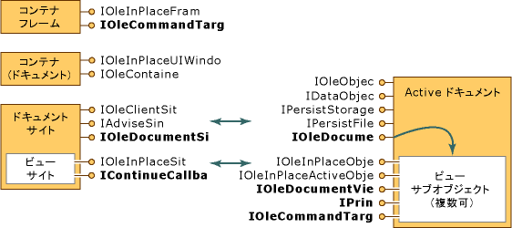

# Active ドキュメント コンテナー
[!INCLUDE[vs2017banner](../assembler/inline/includes/vs2017banner.md)]

Active ドキュメント コンテナーは、Microsoft Office バインダーまたは Internet Explorer など、一つのフレーム内の別のアプリケーションの種類のマルチ ドキュメントを使用できます。各ドキュメントの種類に対する複数のフレームを作成し、使用する代わりになります。  
  
 MFC は `COleDocObjectItem` クラスの Active ドキュメント コンテナーに完全にサポートされています。  MFC アプリケーション ウィザードの **複合ドキュメント サポート** ページの **Active ドキュメント コンテナー\(D\)** のチェック ボックスをオンにして Active ドキュメント コンテナーを作成するには、MFC アプリケーション ウィザードを使用できます。  詳細については、「[Active ドキュメント コンテナー アプリケーションの作成](../mfc/creating-an-active-document-container-application.md)」を参照してください。  
  
 アクティブ ドキュメント コンテナーの詳細については、参照します:  
  
-   [コンテナーの要件](#container_requirements)  
  
-   [ドキュメントのサイト オブジェクト](#document_site_objects)  
  
-   [ビューのサイト オブジェクト](#view_site_objects)  
  
-   [オブジェクトの構築](#frame_object)  
  
-   [ヘルプ メニューのマージ](../Topic/Help%20Menu%20Merging.md)  
  
-   [プログラムによる印刷](../mfc/programmatic-printing.md)  
  
-   [コマンドの対象](../mfc/message-handling-and-command-targets.md)  
  
##   コンテナーの要件  
 Active ドキュメント コンテナーのアクティブ ドキュメントのサポートは、インターフェイスの実装を意味します: また、あるオブジェクトのインターフェイスの使用に関する知識が必要です。  これは、アクティブ ドキュメント内の機能拡張インターフェイス自体を使用する方法をコンテナーもがあるアクティブ ドキュメントの拡張機能に適用します。  
  
 アクティブ文書を統合する Active ドキュメント コンテナーがあります:  
  
-   **IPersistStorage** インターフェイスを通じてオブジェクト ストレージの処理が有効になります。つまり、各アクティブ ドキュメントに `IStorage` のインスタンスを指定する必要があります。  
  
-   OLE ドキュメントの基本機能の埋め込みをサポートする「サイト」が小さくするドキュメントまたは埋め込み 1 レベルあたり 1\) が実装 **IOleClientSite** と **IAdviseSink**に表示します。  
  
-   埋め込みオブジェクトまたはアクティブ ドキュメントのサポート、埋め込み先編集の有効化。  コンテナーのサイト オブジェクトは `IOleInPlaceSite` を実装し、コンテナーのフレーム オブジェクトは **IOleInPlaceFrame**を提供する必要があります。  
  
-   `IOleDocumentSite` の機能を提供する実装にアクティブ ドキュメントの拡張をコンテナーがドキュメントと通信できるようにサポートします。  必要に応じて、コンテナーは印刷または保存などの単純なコマンドを受け取るようにアクティブ ドキュメント インターフェイス `IOleCommandTarget` と `IContinueCallback` を実装できます。  
  
 フレーム オブジェクト、ビュー オブジェクトとコンテナー オブジェクトには、オプションで [コマンドの対象](../mfc/message-handling-and-command-targets.md)"に説明されているように、特定のコマンドにディスパッチをサポートするように **IOleCommandTarget** を実装できます。  ビューとコンテナー オブジェクトもサポートするように `IPrint` と `IContinueCallback`を、[プログラムによる印刷](../mfc/programmatic-printing.md)"に説明されているように、プログラムによる印刷を実装できます。  
  
 次の図は、コンテナーとコンポーネントの間の概念的な関係 \(左\) と、アクティブ ドキュメントとビューを示します \(右側\)。  Active ドキュメントはストレージおよびデータを管理し、またはオプションでデータを表示します。  太字のインターフェイスは、アクティブ ドキュメントの参加に必要なアクティビティを; これらの太字と斜体は省略可能です。  他のインターフェイスは、すべてが必要です。  
  
   
  
 一つのビューだけをサポートするドキュメントが単一の具象クラス ビューとドキュメントのコンポーネントの両方 \(つまり、対応するインターフェイス\) を実装できます。  また、1 種類のビューだけを一度にサポートするコンテナーのサイトは単一の具体的なサイト クラスにドキュメントのサイトとビューのサイトを結合できます。  ただし、コンテナーのフレーム オブジェクトは個別のままで、アーキテクチャの完全なピクチャを付けるためにコンテナーのドキュメントのコンポーネントは、ここでは説明しています; これは Active ドキュメント コンテインメントのアーキテクチャの影響を受けません。  
  
##   ドキュメントのサイト オブジェクト  
 Active ドキュメント コンテインメントのアーキテクチャでは、ドキュメントのサイトは `IOleDocument` インターフェイスの追加を含む OLE ドキュメントのクライアント サイト オブジェクトと同じです:  
  
 `interface IOleDocumentSite : IUnknown`  
  
 `{`  
  
 `HRESULT ActivateMe(IOleDocumentView *pViewToActivate);`  
  
 `}`  
  
 ドキュメントのサイトで概念的には一つ以上のビュー「サイト」オブジェクトのコンテナーです。  各ビューにサイト オブジェクトはドキュメントのサイトで管理されているドキュメントの個々のビュー オブジェクトが関連付けられます。  コンテナーがドキュメントのサイトごとに一つのビューだけをサポートする場合は、単一の具象クラスを使用してドキュメントのサイトやビューのサイトを実装できます。  
  
##   ビューのサイト オブジェクト  
 コンテナーのサイト オブジェクトはドキュメントの特定のビューの表示領域を管理します。  `IOleInPlaceSite` 標準インターフェイスのサポートに加えて、ビューのサイトには、通常、プログラムによる印刷コントロールの `IContinueCallback` を実装します。`IContinueCallback`。これに対して、ビュー オブジェクトのクエリはどのオブジェクトにコンテナー実際に実装することで、\(メモになります\)。  
  
 複数のビューをサポートするコンテナーでは、ドキュメントのサイト内の複数のビューをサイト オブジェクトを作成できることが必要です。  これは `IOleInPlaceSite`して別のアクティブ化および非アクティブ化サービスを各ビューにそのまま表示されます。  
  
##   オブジェクトの構築  
 コンテナーのフレーム オブジェクトは、ほとんどの場合、OLE ドキュメントで埋め込み先編集の有効化、メニュー、およびツール バー ネゴシエーションを処理する、つまり 1 で使用されているフレームです。  ビュー オブジェクトに **IOleInPlaceSite::GetWindowContext**でも \(コンテナー オブジェクトへのアクセスを表すペイン レベルのツール バー交渉、および含まれるオブジェクトの列挙体を処理できる提供する\) コンテナー ドキュメントこのフレーム オブジェクトにアクセスできます。  
  
 Active ドキュメント コンテナーは `IOleCommandTarget`を追加して、フレームを生成できます。  このインターフェイスは、コンテナーが同じコマンドを送信するようになる方がアクティブ ドキュメントのユーザー インターフェイスに同じ方法で作成されたコマンドを受け取るようになります。**File New**、**開く**、**\[名前を付けて保存\]**、**印刷**など\) ; **コピーの編集**、**貼り付け**、**元に戻す**、アクティブ ドキュメントへのなど\)。  詳細については、「[コマンドの対象](../mfc/message-handling-and-command-targets.md)」を参照してください。  
  
## 参照  
 [Active ドキュメント コンテインメント](../mfc/active-document-containment.md)