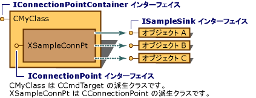

# コネクション ポイント
[!INCLUDE[vs2017banner](../assembler/inline/includes/vs2017banner.md)]

ここでは、MFC クラス `CCmdTarget` と `CConnectionPoint`を使用してコネクション ポイントを \(以前の OLE コネクション ポイントと呼ばれる\) を実装する方法について説明します。  
  
 これまで、Component Object Model \(COM\) は、オブジェクトがインターフェイスの機能を実装し、公開するようにした汎用機能 \(**IUnknown::QueryInterface**\) を定義しています。  ただし、オブジェクトの呼び出しで特定のインターフェイスに機能を公開するようにするための対応する機能は、定義されていません。  つまり、オブジェクト \(オブジェクトのインターフェイスへのポインター\) に対する入力ポインターがどのように処理されたまたは定義された COM、アウトゴーイング インターフェイス \(の明示的なモデルのオブジェクトが他のオブジェクトのインターフェイスに保持するポインター\) が定義されています。  COM は、コネクション ポイントと呼ばれるこの機能をサポートするモデルがあります。  
  
 接続の 2 つがあります。: ソースおよびシンクと呼ばれるインターフェイスを実装するオブジェクトというインターフェイスを呼び出すオブジェクト。  コネクション ポイントは、ソースに公開するインターフェイスです。  コネクション ポイントの公開によって、ソースはシンクが自身への接続を確立することができます \(ソース\)。  コネクション ポイント機構 \(**IConnectionPoint** インターフェイス\) を使用して、シンク インターフェイスへのポインターがソース オブジェクトに渡されます。  このポインターは、シンクの一連のメンバー関数の実装へのアクセスをソースを示します。  たとえば、シンクによって実装されるイベントを発生させるためにソースはシンクの実装の適切なメソッドを呼び出すことができます。  次の図に示す、コネクション ポイントを示します。  
  
   
コネクション ポイントの実装  
  
 MFC は [CConnectionPoint](../Topic/CConnectionPoint%20Class.md) と [CCmdTarget](../Topic/CCmdTarget%20Class.md) クラスのこのモデルを実装します。  **CConnectionPoint** の実装から派生クラスの他のオブジェクトにコネクション ポイントを公開するために使用される **IConnectionPoint** インターフェイス。  `CCmdTarget` 実装の派生クラスのオブジェクトを使用してコネクション ポイントをすべて列挙できるか、または特定のコネクション ポイントを検索 **IConnectionPointContainer** インターフェイス。  
  
 クラスで実装される各コネクション ポイントにコネクション ポイントを実装する接続のパーツを宣言する必要があります。  一つ以上のコネクション ポイントを実装すれば、またはクラスの一つのコネクション マップを宣言する必要があります。  コネクション マップは ActiveX コントロールでサポートされるコネクション ポイントのテーブルです。  
  
 次の例は、単純なコネクション マップと 1 桁のコネクション ポイントを示しています。  最初の例はコネクション マップとポイントを宣言します; 2 番目の例は、マップ、およびポイントを実装します。  `CMyClass`が `CCmdTarget`\-派生クラスである必要があります。  最初の例では、コードは **protected** セクションのクラス宣言で挿入されます:  
  
 [!code-cpp[NVC_MFCConnectionPoints#1](../mfc/codesnippet/CPP/connection-points_1.h)]  
  
 `BEGIN_CONNECTION_PART` と **END\_CONNECTION\_PART** マクロは、この特定のコネクション ポイントを実装する埋め込まれたなクラス、`XSampleConnPt` \(`CConnectionPoint`から派生される\) が宣言されます。  `CConnectionPoint` のメンバー関数をオーバーライドするか、または独自のメンバー関数を追加する場合は、この二つのマクロの中で宣言します。  たとえば、`CONNECTION_IID` マクロは、この二つのマクロの中にある場合 `CConnectionPoint::GetIID` のメンバー関数をオーバーライドします。  
  
 2 番目の例では、コントロールの実装ファイル \(.cpp ファイル\) に挿入されます。  このコードは、コネクション ポイントを含むコネクション マップ、`SampleConnPt`実装します:  
  
 [!code-cpp[NVC_MFCConnectionPoints#2](../mfc/codesnippet/CPP/connection-points_2.cpp)]  
  
 クラスが複数のコネクション ポイントがある場合は、`END_CONNECTION_MAP` の `BEGIN_CONNECTION_MAP` マクロとの間の `CONNECTION_PART` の追加マクロを挿入します。  
  
 最後に、クラスのコンストラクターの `EnableConnections` の呼び出しを追加します。  たとえば、次のようになります。  
  
 [!code-cpp[NVC_MFCConnectionPoints#3](../mfc/codesnippet/CPP/connection-points_3.cpp)]  
  
 このコードが挿入された場合、`CCmdTarget`\-派生クラスは **ISampleSink** インターフェイス用のコネクション ポイントを公開します。  次の図は、この例を示しています。  
  
   
MFC で実装されるコネクション ポイント  
  
 通常、コネクション ポイントは「マルチキャスティング」を同じインターフェイスに接続される複数のシンクにブロードキャストする機能をサポートします。  次の例のフラグメントでは、コネクション ポイントの各シンクを反復処理することによって、マルチキャスト方法を示します:  
  
 [!code-cpp[NVC_MFCConnectionPoints#4](../mfc/codesnippet/CPP/connection-points_4.cpp)]  
  
 この例では、呼び出しで `CConnectionPoint::GetConnections`への `SampleConnPt` のコネクション ポイントの接続の現在の設定を取得します。  次に、接続を反復処理し、すべてのアクティブな接続の **ISampleSink::SinkFunc** を呼び出します。  
  
## 参照  
 [MFC COM](../mfc/mfc-com.md)