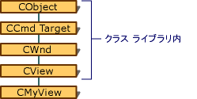

# メッセージ マップの派生

メッセージの処理、クラスのメッセージを確認中には、マップと、メッセージ マップ ストーリーの最後ではありません。 もしクラス`CMyView`(から派生した`CView`) メッセージに対応するエントリがありません

注意`CView`の基本クラス`CMyView`からさらに派生`CWnd`します。 したがって`CMyView`*は*、`CView`と*は*、`CWnd`します。 これらの各クラスは、独自のメッセージ マップがあります。 「A ビュー階層」以下では、クラスの階層関係を示しています。 図は、注意を`CMyView`オブジェクトが 3 つすべてのクラスの特性を持つ 1 つのオブジェクト。

 A ビュー階層

クラスで、メッセージを照合できない場合は、その`CMyView`のフレームワークのメッセージ マップも直接の基本クラスのメッセージ マップを検索します。 `BEGIN_MESSAGE_MAP`マクロをメッセージ マップの開始時は、その引数として 2 つのクラス名を指定します。

[!code-cpp[NVC_MFCMessageHandling#2](../mfc/codesnippet/cpp/derived-message-maps_1.cpp)]

最初の引数は、メッセージ マップが所属するクラスを名します。 2 番目の引数は、直接の基本クラスとの接続を提供します。-`CView`ここで、ため、フレームワークは、メッセージ マップをも検索できます。

基本クラスで提供されるメッセージ ハンドラー、派生クラスによって継承されます。 これは、仮想ハンドラーのすべてのメンバー関数を作成することがなく通常の仮想メンバー関数とよく似ています。

基本クラスのメッセージ マップのいずれかでハンドラーが見つからない場合は、メッセージの既定の処理が実行されます。 メッセージでは、コマンドは、フレームワークにより、次のコマンド ターゲットにルーティングします。 標準 Windows メッセージの場合、メッセージは、適切な既定のウィンドウ プロシージャに渡されます。

メッセージ マップの検索を高速化には、フレームワークは、同じメッセージが再び表示には、尤度での最近の一致をキャッシュします。 この結果は、未処理メッセージを効率よく framework プロセスです。 メッセージ マップより領域を効率よく実装仮想関数を使用するよりもします。

## 関連項目

[フレームワークのメッセージ マップ検索方法](../mfc/how-the-framework-searches-message-maps.md)

