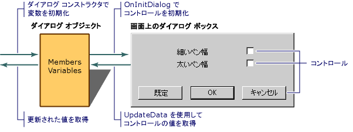

# ダイアログ データ エクスチェンジ
[!INCLUDE[vs2017banner](../assembler/inline/includes/vs2017banner.md)]

DDX 機構を使用すると、`OnInitDialog` ハンドラーまたはダイアログのコンストラクターのダイアログ オブジェクトのメンバー変数の初期値を正常に設定します。  ダイアログが表示される直前に、フレームワークの DDX 機構は、表示されるダイアログ ボックスのコントロールにダイアログ ボックス自体が `DoModal` または **作成**に応じて表示されるメンバー変数の値を転送します。  `CDialog` の `OnInitDialog` の既定の実装では、ダイアログ ボックスのコントロールを初期化するに `CWnd` クラスの `UpdateData` メンバー関数を呼び出します。  
  
 同じ機能がコントロールからメンバー変数にユーザーが OK ボタンをクリックして値を転送する \(または引数 **TRUE**で `UpdateData` のメンバー関数を呼び出すたびに\)。  ダイアログ データ検証の機能は検証規則を指定するデータ項目を検証します。  
  
 次の図は、ダイアログ データ エクスチェンジ \(DDX\) について説明します。  
  
   
ダイアログ データ エクスチェンジ  
  
 `UpdateData` は 渡された **BOOL** パラメーターで指定された二つの方向でも機能します。  変換を実行するには、`UpdateData` は `CDataExchange` オブジェクトを設定し、ダイアログ クラスの `CDialog``DoDataExchange` のメンバー関数のオーバーライドを呼び出します。  `DoDataExchange` は `CDataExchange`型の引数を受け取ります。  `UpdateData` に渡される `CDataExchange` オブジェクトは互換性の方向などの情報を定義する Swap のコンテキストを表します。  
  
 \(または、コード ウィザード `DoDataExchange`\) をオーバーライドする場合、データ メンバー \(コントロール\)、1 人の DDX の 1 種類の関数呼び出しを指定します。  DDX の各関数は、`UpdateData`を `DoDataExchange` に渡される `CDataExchange` の引数で指定されるコンテキストに基づいて両方向のデータ交換にわかっています。  
  
 MFC は互換性の種類に DDX の多くの機能を提供します。  次の例は、DDX の 2 種類の関数、および 1 個の DDV 関数が呼び出される `DoDataExchange` のオーバーライドを示します。:  
  
 [!code-cpp[NVC_MFCControlLadenDialog#49](../mfc/codesnippet/CPP/dialog-data-exchange_1.cpp)]  
  
 `DDX_` と `DDV_` の行がデータ マップです。  サンプルと DDX 示す DDV 関数はチェック ボックス コントロールとエディット ボックスのコントロールに対して、それぞれです。  
  
 ユーザーにモーダル ダイアログ ボックスを取り消すと、`OnCancel` のメンバー関数は、ダイアログ ボックスを終了し、`DoModal` は **IDCANCEL**値を返します。  この場合、データは、ダイアログ ボックスとダイアログ オブジェクト間で交換されません。  
  
## 参照  
 [ダイアログ データ エクスチェンジとダイアログ データ バリデーション](../mfc/dialog-data-exchange-and-validation.md)   
 [ダイアログ ボックスの有効期間](../mfc/life-cycle-of-a-dialog-box.md)   
 [ダイアログ データ バリデーション](../mfc/dialog-data-validation.md)