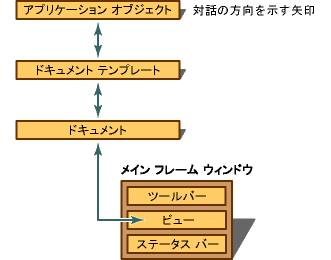

# ドキュメント、ビュー、フレームワーク
MFC フレームワークの中核にドキュメントとビューの概念があります。 ドキュメントは、ユーザーが編集セッションでやり取りするデータ オブジェクトです。 によって作成されて、`New`または**開く**コマンドを**ファイル**メニューし、通常、ファイルに保存します。 (MFC の標準ドキュメントでは、クラスから派生した**CDocument**はアクティブなドキュメント、および OLE 複合ドキュメントによって異なります)。ビューは、使用するユーザーは、ドキュメントを操作ウィンドウ オブジェクトです。  
  
 実行中のアプリケーションの主要なオブジェクトは次のとおりです。  
  
-   ドキュメントまたはドキュメント。  
  
     ドキュメント クラス (から派生した[CDocument](../mfc/reference/cdocument-class.md)) アプリケーションのデータを指定します。  
  
     OLE の機能をアプリケーションで使用すると場合から、ドキュメント クラスを派生させる[COleDocument](../mfc/reference/coledocument-class.md)または必要な機能の種類に応じて、派生クラスのいずれか。  
  
-   ビューまたはビュー。  
  
     ビュー クラス (から派生した[CView](../mfc/reference/cview-class.md))、ユーザーの「ウィンドウのデータにします」。 ビュー クラスでは、ユーザーのドキュメントのデータを認識し、やり取りを制御します。 場合によっては、データのビューを複数のドキュメントをする可能性があります。  
  
     派生してスクロールする場合は、 [CScrollView](../mfc/reference/cscrollview-class.md)です。 派生して、ビューにダイアログ テンプレート リソースに配置されるユーザー インターフェイスが、 [CFormView](../mfc/reference/cformview-class.md)です。 単純なテキスト データの使用またはそれから派生[CEditView](../mfc/reference/ceditview-class.md)です。 データ エントリ プログラムなどのフォーム ベースのデータ アクセス アプリケーションから派生[CRecordView](../mfc/reference/crecordview-class.md) (ODBC) 用です。 また使用可能なはクラス[CTreeView](../mfc/reference/ctreeview-class.md)、 [CListView](../mfc/reference/clistview-class.md)、および[CRichEditView](../mfc/reference/cricheditview-class.md)です。  
  
-   フレーム ウィンドウ  
  
     「ドキュメント フレーム ウィンドウ」内のビューに表示されます。 SDI アプリケーションで使用するドキュメント フレーム ウィンドウとは、また、アプリケーションの「メイン フレーム ウィンドウ」です。 MDI アプリケーションでは、ドキュメント ウィンドウは、メイン フレーム ウィンドウ内に表示される子ウィンドウをします。 派生のメイン フレーム ウィンドウ クラスには、スタイルと、ビューを含むフレーム ウィンドウの他の特性を指定します。 フレーム ウィンドウをカスタマイズする必要がある場合から派生[CFrameWnd](../mfc/reference/cframewnd-class.md) SDI アプリケーションのドキュメント フレーム ウィンドウをカスタマイズします。 派生[CMDIFrameWnd](../mfc/reference/cmdiframewnd-class.md)を MDI アプリケーションのメイン フレーム ウィンドウをカスタマイズします。 クラスを派生も[CMDIChildWnd](../mfc/reference/cmdichildwnd-class.md)をそれぞれ個別の種類のアプリケーションをサポートする MDI ドキュメント フレーム ウィンドウをカスタマイズします。  
  
-   ドキュメント テンプレートまたはテンプレート  
  
     ドキュメント テンプレートは、ドキュメント、ビュー、およびフレーム ウィンドウの作成を調整します。 クラスから派生する特定のドキュメント テンプレート クラス、 [CDocTemplate](../mfc/reference/cdoctemplate-class.md)を作成、および 1 つの種類のすべての開いているドキュメントを管理します。 ドキュメントの 1 つ以上の型をサポートするアプリケーションでは、複数のドキュメント テンプレートがあります。 クラスを使用して[関数](../mfc/reference/csingledoctemplate-class.md)SDI アプリケーション、またはクラスを使用して[CMultiDocTemplate](../mfc/reference/cmultidoctemplate-class.md) MDI アプリケーション用。  
  
-   アプリケーション オブジェクト  
  
     アプリケーション クラス (から派生した[CWinApp](../mfc/reference/cwinapp-class.md)) 上のオブジェクトのすべてを制御し、初期化やクリーンアップなどのアプリケーションの動作を指定します。 アプリケーションの 1 つのみのアプリケーション オブジェクトを作成し、アプリケーションでサポートするドキュメント型のドキュメント テンプレートを管理します。  
  
-   スレッド オブジェクト  
  
     アプリケーションが実行の個別のスレッドを作成する場合: 例については、バック グラウンドで計算を実行する — から派生したクラスを使用して、 [CWinThread](../mfc/reference/cwinthread-class.md)です。 [CWinApp](../mfc/reference/cwinapp-class.md)自体はから派生`CWinThread`アプリケーションで、プライマリ スレッドの実行 (またはメイン プロセス) を表します。 セカンダリ スレッドで MFC を使用することもできます。  
  
 実行中のアプリケーションでこれらのオブジェクトは、協調的なコマンドおよびその他のメッセージによって結合されて、ユーザー アクションに応答します。 1 つのアプリケーションのオブジェクトは、1 つまたは複数のドキュメント テンプレートを管理します。 それぞれのドキュメント テンプレートを作成および (アプリケーションが SDI または MDI のどちらか) に応じて 1 つまたは複数のドキュメントを管理します。 ユーザーは、表示して、フレーム ウィンドウ内に含まれるビューを使用してドキュメントを操作できます。 次の図は、SDI アプリケーションのこれらのオブジェクト間の関係を示しています。  
  
   
動作中の SDI アプリケーションのオブジェクト  
  
 この一連のトピックの残りの部分は、フレームワークのツール、MFC アプリケーション ウィザード、およびリソース エディターがこれらのオブジェクトを作成する方法、しくみ、および、プログラミングでの使用方法について説明します。 ドキュメント、ビュー、およびフレーム ウィンドウがで詳しく説明されている[ウィンドウ オブジェクト](../mfc/window-objects.md)と[ドキュメント/ビュー アーキテクチャ](../mfc/document-view-architecture.md)です。  
  
## 関連項目  
 [クラスを使用した Windows アプリケーションの作成](../mfc/using-the-classes-to-write-applications-for-windows.md)
