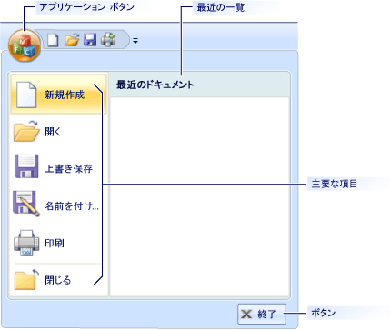

# 方法: アプリケーション ボタンをカスタマイズする
[!INCLUDE[vs2017banner](../assembler/inline/includes/vs2017banner.md)]

アプリケーション ボタンをクリックすると、コマンドのメニューが表示されます。  一般に、このメニューには、**\[開く\]**、**\[保存\]**、**\[印刷\]**、**\[終了\]** などのファイル関連のコマンドが表示されます。  
  
   
  
 アプリケーション ボタンをカスタマイズするには、**プロパティ** ウィンドウでアプリケーション ボタンを開き、そのプロパティを変更して、リボン コントロールをプレビューします。  
  
### プロパティ ウィンドウでアプリケーション ボタンを開くには  
  
1.  Visual Studio で、**\[表示\]** メニューの **\[リソース ビュー\]** をクリックします。  
  
2.  **\[リソース ビュー\]** でリボン リソースをダブルクリックして、デザイン サーフェイスに表示します。  
  
3.  デザイン サーフェイスで、アプリケーション ボタン メニューを右クリックし、**\[プロパティ\]** をクリックします。  
  
## アプリケーション ボタンのプロパティ  
 アプリケーション ボタンのプロパティの定義を次の表に示します。  
  
|プロパティ|定義|  
|-----------|--------|  
|**ボタン**|アプリケーション メニューの右下隅に表示される、最大 3 つのボタンのコレクションを含みます。|  
|**\[キャプション\]**|コントロールのテキストを指定します。  他のリボン要素とは異なり、アプリケーション ボタンにはキャプション テキストは表示されません。  代わりに、このテキストはユーザー補助のために使用されます。|  
|**\[HDPI Image\]**|高解像度 \(HDPI: High Dots Per Inch\) アプリケーション ボタン アイコンの識別子を指定します。  高解像度モニターでアプリケーションを実行すると、**\[Image\]** の代わりに **\[HDPI Image\]** が使用されます。|  
|**\[HDPI Large Images\]**|高解像度の大きいイメージの識別子を指定します。  高解像度モニターでアプリケーションを実行すると、**\[Large Images\]** の代わりに **\[HDPI Large Images\]** が使用されます。|  
|**\[HDPI Small Images\]**|高解像度の小さいイメージの識別子を指定します。  高解像度モニターでアプリケーションを実行すると、**\[Small Images\]** の代わりに **\[HDPI Small Images\]** が使用されます。|  
|**ID**|コントロールの識別子を指定します。|  
|**イメージ**|アプリケーション ボタン アイコンの識別子を指定します。  このアイコンは、アルファ透明度を持つ 32 ビットの 26 × 26 ビットマップです。  アイコンの透明部分は、アプリケーション ボタンをクリックしたとき、またはアプリケーション ボタンの上にマウス カーソルを置いたときにハイライト表示されます。|  
|**\[キー\]**|KeyTip ナビゲーションが有効な場合に表示される文字列を指定します。  KeyTip ナビゲーションは、Alt を押すと有効になります。|  
|**\[Large Images\]**|一連の 32 × 32 のアイコンを格納するイメージの識別子を指定します。  これらのアイコンは、\[Main Items\] のコレクション内のボタンによって使用されます。|  
|**\[Main Items\]**|アプリケーション メニューに表示されるメニュー項目のコレクションを含みます。|  
|**\[MRU Caption\]**|\[最近のリスト\] パネルに表示されるテキストを指定します。|  
|**\[Small Images\]**|一連の 16 × 16 のアイコンを格納するイメージの識別子を指定します。  これらのアイコンは、\[Buttons\] のコレクション内のボタンによって使用されます。|  
|**使用方法**|\[最近のリスト\] パネルを有効または無効にします。  アプリケーション メニューに \[最近のリスト\] が表示されます。|  
|**幅**|\[最近のリスト\] パネルの幅をピクセル単位で指定します。|  
  
 アプリケーション メニューは、デザイン サーフェイスには表示されません。  表示するには、リボンをプレビューするか、アプリケーションを実行する必要があります。  
  
#### リボン コントロールをプレビューするには  
  
-   **\[Ribbon エディター ツール バー\]** の **\[Ribbon のテスト\]** をクリックします。  
  
## 参照  
 [リボン デザイナー \(MFC\)](../mfc/ribbon-designer-mfc.md)