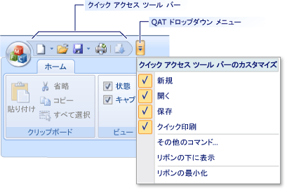

# 方法: クイック アクセス ツール バーをカスタマイズする
[!INCLUDE[vs2017banner](../assembler/inline/includes/vs2017banner.md)]

クイック アクセス ツール バー \(QAT: Quick Access Toolbar\) は、アプリケーション ボタンの横またはカテゴリ タブの下に表示されるコマンド セットを含むカスタマイズ可能なツール バーです。  次の図は、標準的なクイック アクセス ツール バーを示しています。  
  
   
  
 クイック アクセス ツール バーをカスタマイズするには、**プロパティ** ウィンドウでクイック アクセス ツール バーを開き、そのコマンドを変更して、リボン コントロールをプレビューします。  
  
### プロパティ ウィンドウでクイック アクセス ツール バーを開くには  
  
1.  Visual Studio で、**\[表示\]** メニューの **\[リソース ビュー\]** をクリックします。  
  
2.  **\[リソース ビュー\]** でリボン リソースをダブルクリックして、デザイン サーフェイスに表示します。  
  
3.  デザイン サーフェイスで、\[クイック アクセス ツール バー\] メニューを右クリックし、**\[プロパティ\]** をクリックします。  
  
## クイック アクセス ツール バーのプロパティ  
 クイック アクセス ツール バーのプロパティの定義を次の表に示します。  
  
|プロパティ|定義|  
|-----------|--------|  
|\[QAT の位置\]|アプリケーションの開始時のクイック アクセス ツール バーの位置を指定します。  指定できる位置は、リボン コントロールの **\[上\]** または **\[下\]** です。|  
|\[QAT 項目\]|クイック アクセス ツール バーで使用できるコマンドを指定します。|  
  
#### クイック アクセス ツール バーのコマンドを追加または削除するには  
  
1.  **プロパティ** ウィンドウで、**\[QAT 項目\]**をクリックし、省略記号ボタン **\(...\)** をクリックします。  
  
2.  **\[QAT 項目エディター\]** ダイアログ ボックスで、**\[追加\]** ボタンと **\[削除\]** ボタンを使用して、クイック アクセス ツール バーのコマンドの一覧を変更します。  
  
3.  クイック アクセス ツール バーと \[クイック アクセス ツール バー\] メニューの両方にコマンドを表示するには、コマンドの横のボックスをオンにします。  メニューにのみコマンドを表示する場合は、ボックスをオフにします。  
  
## リボンのプレビュー  
 クイック アクセス ツール バーのコマンドは、デザイン サーフェイスには表示されません。  コマンドを表示するには、リボンをプレビューするか、アプリケーションを実行する必要があります。  
  
#### リボン コントロールをプレビューするには  
  
-   **\[Ribbon エディター ツール バー\]** の **\[Ribbon のテスト\]** をクリックします。  
  
## 参照  
 [リボン デザイナー \(MFC\)](../mfc/ribbon-designer-mfc.md)