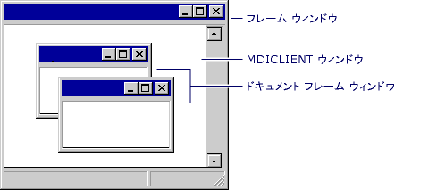

# MDI 子ウィンドウの管理

MDI メイン フレーム ウィンドウ (アプリケーションごとに 1 つ) には、クイック ウォッチ ウィンドウと呼ばれる特殊な子ウィンドウが含まれています。 [クイック ウォッチ] ウィンドウがメイン フレーム ウィンドウのクライアント領域を管理し、子ウィンドウ自体に含まれて: から派生して、ドキュメント ウィンドウ`CMDIChildWnd`します。 ドキュメント ウィンドウは、フレーム ウィンドウ自体 (MDI 子ウィンドウ) であるため、それぞれに子こともできます。 すべてのこれらのケースでは、親ウィンドウは、その子ウィンドウを管理し、いくつかのコマンドを転送します。

MDI フレーム ウィンドウは、フレーム ウィンドウは、クイック ウォッチ ウィンドウで、コントロール バーと共に再配置を管理します。 [クイック ウォッチ] ウィンドウで、さらに、すべての MDI 子フレーム ウィンドウを管理します。 次の図は、MDI フレーム ウィンドウ、クイック ウォッチ ウィンドウ、およびその子ドキュメント フレーム ウィンドウ間の関係を示します。

  
MDI フレーム ウィンドウと子ウィンドウ

MDI フレーム ウィンドウは、1 つを使用する必要がある場合も、現在の MDI 子ウィンドウと組み合わせては機能します。 MDI フレーム ウィンドウは、自分で処理する前に、MDI 子ウィンドウにコマンド メッセージを委任します。

## 方法については、するして操作を行います

- [ドキュメント フレーム ウィンドウの作成](../mfc/creating-document-frame-windows.md)

- [フレーム ウィンドウ スタイル](../mfc/frame-window-styles-cpp.md)

## 関連項目

[フレーム ウィンドウの使用](../mfc/using-frame-windows.md)

