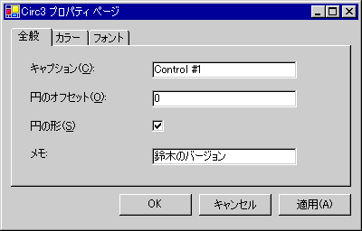

# MFC ActiveX コントロール : プロパティ ページ
[!INCLUDE[vs2017banner](../assembler/inline/includes/vs2017banner.md)]

ActiveX コントロールのユーザーは、プロパティ ページを使って、ActiveX コントロールのプロパティの表示や変更を行うことができます。  プロパティにアクセスするには、コントロールのプロパティ ダイアログ ボックスを開きます。このダイアログ ボックスには、カスタマイズされたグラフィカル インターフェイスを持つ 1 つ以上のプロパティ ページがあり、コントロール プロパティの表示や編集に使用されます。  
  
 ActiveX コントロール プロパティ ページは、2 とおりの方法で表示する:  
  
-   コントロールのプロパティ**OLEIVERB\_PROPERTIES**動詞 \(\) が呼び出されると、コントロールはコントロールのプロパティ ページを含むモーダルのプロパティ ダイアログ ボックスを開きます。  
  
-   コンテナーは、選択したコントロールのプロパティ ページを表示する独自のモードレス ダイアログ ボックスを表示できます。  
  
 プロパティ ダイアログ ボックス \(次の図に示す\) のプロパティ ページの切り替えの現在のプロパティ ページ、タブ、およびプロパティ ページのダイアログ ボックスを閉じるなどの一般的なタスクを実行する変更をキャンセルします。または、ActiveX コントロールに変更を適用するボタンのコレクションを表示するための領域で構成されます。  
  
   
Dialog Box プロパティ  
  
 ここでは、ActiveX コントロールのプロパティ ページを使用することに関するトピックについて説明します。  次にその例を示します。  
  
-   [ActiveX コントロールの既定のプロパティ ページの実装](#_core_implementing_the_default_property_page)  
  
-   [プロパティ ページにコントロールを追加できます。](#_core_adding_controls_to_a_property_page)  
  
-   [DoDataExchange 関数のカスタマイズ](#_core_customizing_the_dodataexchange_function)  
  
 ActiveX コントロールのプロパティ ページを使用する詳細については、次のトピックを参照します:  
  
-   [MFC ActiveX コントロール : カスタム プロパティ ページの追加](../mfc/mfc-activex-controls-adding-another-custom-property-page.md)  
  
-   [MFC ActiveX コントロール : ストック プロパティ ページの使用](../mfc/mfc-activex-controls-using-stock-property-pages.md)  
  
 ActiveX コントロール以外の MFC アプリケーションのプロパティ シートを使用する方法については、[プロパティ シート](../mfc/property-sheets-mfc.md)を参照してください。  
  
##   既定のプロパティ ページの実装  
 コントロール プロジェクトを作成するときに ActiveX コントロール ウィザードを使用して ActiveX コントロール ウィザードは [COlePropertyPage クラス](../mfc/reference/colepropertypage-class.md)から派生されるコントロールに既定のプロパティ ページ クラスが用意されています。  まず、このプロパティ ページは空白ですが、コントロール ダイアログ ボックス コントロールまたは設定を追加できます。  ActiveX コントロール ウィザードに 1 番目のプロパティ ページ クラスは既定で作成されるため、追加のプロパティ ページ クラスは、クラス ビューを使用して \(または `COlePropertyPage`から派生しました\) を作成する必要があります。  この手順の詳細については、「[MFC ActiveX コントロール : カスタム プロパティ ページの追加](../mfc/mfc-activex-controls-adding-another-custom-property-page.md)」を参照してください。  
  
 プロパティ ページを実装する場合 \(この場合の既定\) スリー ステップで行います。:  
  
#### プロパティ ページを実装するには  
  
1.  `COlePropertyPage`\-コントロール プロジェクトへの派生クラス\) を追加します。  プロジェクトが ActiveX コントロール ウィザードを使用して作成されている場合 \(この場合は、既定のプロパティ ページ クラスは既に存在します。  
  
2.  プロパティ ページのテンプレートにコントロールを追加するには、ダイアログ エディターを使用します。  
  
3.  `COlePropertyPage`の `DoDataExchange` 関数\-プロパティ ページ コントロールと ActiveX コントロール間のやり取り価値に派生クラスをカスタマイズします。  
  
 例として、次の手順では、単純なコントロール \(「Sample」とも呼ばれます\)。  サンプルでは、MFC ActiveX コントロール ウィザードを使用して作成し、ストック Caption プロパティが含まれています。  
  
##   プロパティ ページにコントロールを追加できます。  
  
#### コントロールのプロパティ ページを追加するには  
  
1.  開くコントロール プロジェクトを開き開いているリソース ビュー。  
  
2.  **ダイアログ** のディレクトリ アイコンをダブルクリックします。  
  
3.  **IDD\_PROPPAGE\_SAMPLE** ダイアログ ボックスを開きます。  
  
     ActiveX コントロール ウィザードは、ダイアログ ID の最後にプロジェクトの名前を、この場合、サンプル付けます。  
  
4.  ダイアログ ボックスの領域にツールボックスから選択したコントロールをドラッグ アンド ドロップします。  
  
5.  この例では、テキスト ラベルのキャプション: 「コントロール」 **IDC\_CAPTION** の識別子を持つエディット ボックスのコントロールで十分です。  
  
6.  変更を保存するには、ツール バーの **\[保存\]** をクリックします。  
  
 ユーザー インターフェイスが変更されたため、キャプション プロパティとエディット ボックスをリンクする必要があります。  これは、以降のセクションで `CSamplePropPage::DoDataExchange` 関数を編集してされます。  
  
##   DoDataExchange 関数のカスタマイズ  
 プロパティ ページの [CWnd::DoDataExchange](../Topic/CWnd::DoDataExchange.md) 関数は、コントロールのプロパティの実際の値とプロパティ ページ値をリンクすることができます。  リンクを作成するには、それぞれのコントロールのプロパティに適切なプロパティ ページ フィールドをマップする必要があります。  
  
 これらの割り当ては、プロパティ ページの **DDP\_** 関数を使用して実装されます。  **DDP\_** 関数は 1 点を除き、標準 MFC ダイアログで使用される **DDX\_** の関数と同様に動作します。  メンバー変数への参照に加えて、**DDP\_** 関数は、コントロール プロパティの名前を指定します。  次は、プロパティ ページの `DoDataExchange` 関数の一般的なエントリです。  
  
 [!code-cpp[NVC_MFC_AxUI#31](../mfc/codesnippet/CPP/mfc-activex-controls-property-pages_1.cpp)]  
  
 この関数は `DDP_TEXT` 関数を使用してキャプションとプロパティ ページの `m_caption` のメンバー変数を関連付けます。  
  
 プロパティ ページ コントロールを挿入してもらった後 **DDP\_Text** 関数を使用してプロパティ ページ、`IDC_CAPTION`と実際のコントロール プロパティ、キャプションの間のリンクは、上記のように設定する必要があります。  
  
 [プロパティ ページ](../mfc/reference/property-pages-mfc.md) は チェック ボックス、オプション ボタン、リスト ボックスなどの他のダイアログ コントロール型で使用できます。  次の表は、プロパティ ページ **DDP\_** セット全体で機能し、:  
  
### プロパティ ページの関数  
  
|関数名|リンクするために使用します。|  
|---------|--------------------|  
|`DDP_CBIndex`|コントロール プロパティを使用して、コンボ ボックスで選択された文字列のインデックス。|  
|`DDP_CBString`|コントロール プロパティを使用して、コンボ ボックスで選択された文字列。  選択された文字列はプロパティの値と同じ文字から始まっている必要がありますが、すべてが一致していなくてもかまいません。|  
|`DDP_CBStringExact`|コントロール プロパティを使用して、コンボ ボックスで選択された文字列。  選択された文字列とプロパティの文字列値が完全に一致している必要があります。|  
|`DDP_Check`|コントロール プロパティを持つチェック ボックス。|  
|`DDP_LBIndex`|コントロールのプロパティを含むリスト ボックスで選択された文字列のインデックス。|  
|`DDP_LBString`|コントロールのプロパティを含むリスト ボックスで選択された文字列。  選択された文字列はプロパティの値と同じ文字から始まっている必要がありますが、すべてが一致していなくてもかまいません。|  
|`DDP_LBStringExact`|コントロールのプロパティを含むリスト ボックスで選択された文字列。  選択された文字列とプロパティの文字列値が完全に一致している必要があります。|  
|`DDP_Radio`|コントロール プロパティを持つオプション ボタン。|  
|**DDP\_Text**|コントロールのプロパティを含むテキスト。|  
  
## 参照  
 [MFC ActiveX コントロール](../mfc/mfc-activex-controls.md)   
 [COlePropertyPage クラス](../mfc/reference/colepropertypage-class.md)