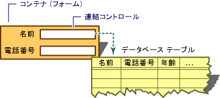

# MFC ActiveX コントロール : ActiveX コントロールにおけるデータ バインディングの使用
ActiveX コントロールのより強力な用途の 1 つは、データ バインディングは、データベース内の特定のフィールドにバインドするコントロールのプロパティを使用します。 ユーザーは、このバインド プロパティ内のデータを変更するとき、コントロールは、データベースとレコードのフィールドを更新する要求を通知します。 データベースでは、成功のコントロールまたは要求の失敗が通知します。  
  
 この記事では、制御側での処理について説明します。 データベースとの相互作用をデータ バインディングを実装することは、コントロール コンテナーの責任です。 このドキュメントの範囲を超えては、コンテナー内のデータベースとのやり取りを管理する方法です。 データ バインディング コントロールを準備する方法については、この記事の残りの部分で説明します。  
  
   
データ バインド コントロールの概念図  
  
 `COleControl`クラスには、データ バインディングを実装する簡単な手順を構成する 2 つのメンバー関数が用意されています。 最初の関数では、 [BoundPropertyRequestEdit](../mfc/reference/colecontrol-class.md#boundpropertyrequestedit)プロパティの値を変更するアクセス許可を要求するために使用します。 [BoundPropertyChanged](../mfc/reference/colecontrol-class.md#boundpropertychanged)プロパティの値が正常に変更された後に、2 番目の関数が呼び出されます。  
  
 ここでは、次のトピックについて説明します。  
  
-   [バインド可能なストック プロパティを作成します。](#vchowcreatingbindablestockproperty)  
  
-   [バインド可能な Get と Set メソッドを作成します。](#vchowcreatingbindablegetsetmethod)  
  
##   バインド可能なストック プロパティを作成します。  
 データ バインドのストック プロパティを作成することが必要になる可能性が高くなりますが、[バインド可能な get と set メソッド](#vchowcreatingbindablegetsetmethod)です。  
  
> [!NOTE]
>  ストック プロパティが、`bindable`と`requestedit`既定の属性です。  
  
#### プロパティの追加ウィザードを使用してバインド可能なストック プロパティを追加するには  
  
1.  使用してプロジェクトを開始、 [MFC ActiveX コントロール ウィザード](../mfc/reference/mfc-activex-control-wizard.md)です。  
  
2.  コントロールのインターフェイス ノードを右クリックします。  
  
     これは、ショートカット メニューを開きます。  
  
3.  ショートカット メニューから **[追加]** をクリックし、**プロパティの追加**です。  
  
4.  エントリのいずれかを選択、**プロパティ名**ドロップダウン リスト。 たとえば、選択**テキスト**です。  
  
     **テキスト**ストック プロパティ、**バインド可能な**と**requestedit**属性は既にチェックされています。  
  
5.  次のチェック ボックスをオン、 **IDL 属性** タブ: **displaybind**と**defaultbind**プロジェクトのプロパティ定義に属性を追加します。IDL ファイルです。 これらの属性は、コントロールをユーザーに表示されるように、ストック プロパティの既定のバインド可能なプロパティを作成します。  
  
 この時点で、コントロールは、データ ソースからデータを表示できますが、ユーザーは、データ フィールドを更新できません。 コントロールにもデータを更新するには、変更する場合、 `OnOcmCommand` [例](../mfc/mfc-activex-controls-subclassing-a-windows-control.md)関数を次のようになります。  
  
 [!code-cpp[NVC_MFC_AxData#1](../mfc/codesnippet/cpp/mfc-activex-controls-using-data-binding-in-an-activex-control_1.cpp)]  
  
 コントロールを登録した、プロジェクトをビルドすることができますようになりました。 ダイアログ ボックスでは、コントロールを挿入するときに、**データ フィールド**と**データソース**プロパティが追加されましたおよびデータ ソースと、コントロールに表示するフィールドを選択できるようになりました。  
  
##   バインド可能な Get と Set メソッドを作成します。  
 データ バインド メソッドの取得/設定だけでなく作成することも、[バインド可能なストック プロパティ](#vchowcreatingbindablestockproperty)です。  
  
> [!NOTE]
>  この手順では、Windows コントロールをサブクラス化をプロジェクトには ActiveX コントロールがあると仮定します。  
  
#### プロパティの追加ウィザードを使用してバインド可能な get と set メソッドを追加するには  
  
1.  コントロールのプロジェクトを読み込みます。  
  
2.  **コントロールの設定** ページで、サブクラスにコントロールのウィンドウ クラスを選択します。 たとえば、可能性があるサブクラス エディット コントロール。  
  
3.  コントロールのプロジェクトを読み込みます。  
  
4.  コントロールのインターフェイス ノードを右クリックします。  
  
     これは、ショートカット メニューを開きます。  
  
5.  ショートカット メニューから **[追加]** をクリックし、**プロパティの追加**です。  
  
6.  プロパティ名を入力、**プロパティ名**ボックス。 使用して`MyProp`この例です。  
  
7.  データ型を選択、**プロパティの型**ドロップダウン リスト ボックス。 使用して**短い**この例です。  
  
8.  **[実装型]** として、 **[Get/Set メソッド]** をクリックします。  
  
9. IDL 属性 タブから次のチェック ボックスをオン:**バインド可能な**、 **requestedit**、 **displaybind**、および**defaultbind**を追加するにはプロジェクトのプロパティの定義の属性です。IDL ファイルです。 これらの属性は、コントロールをユーザーに表示されるように、ストック プロパティの既定のバインド可能なプロパティを作成します。  
  
10. **[完了]** をクリックします。  
  
11. 本体を変更、`SetMyProp`関数の次のコードが含まれるようにします。  
  
     [!code-cpp[NVC_MFC_AxData#2](../mfc/codesnippet/cpp/mfc-activex-controls-using-data-binding-in-an-activex-control_2.cpp)]  
  
12. 渡されたパラメーター、`BoundPropertyChanged`と`BoundPropertyRequestEdit`関数は、プロパティのプロパティに id() 属性に渡されるパラメーターの dispid、します。IDL ファイルです。  
  
13. 変更、[例](../mfc/mfc-activex-controls-subclassing-a-windows-control.md)関数の次のコードが含まれているようにします。  
  
     [!code-cpp[NVC_MFC_AxData#1](../mfc/codesnippet/cpp/mfc-activex-controls-using-data-binding-in-an-activex-control_1.cpp)]  
  
14. 変更、`OnDraw`関数の次のコードが含まれるようにします。  
  
     [!code-cpp[NVC_MFC_AxData#3](../mfc/codesnippet/cpp/mfc-activex-controls-using-data-binding-in-an-activex-control_3.cpp)]  
  
15. ヘッダー ファイル、コントロール クラスのヘッダー ファイルのパブリック セクションには、メンバー変数への次の定義 (コンス トラクター) を追加します。  
  
     [!code-cpp[NVC_MFC_AxData#4](../mfc/codesnippet/cpp/mfc-activex-controls-using-data-binding-in-an-activex-control_4.h)]  
  
16. 次の行の最後の行を作成、`DoPropExchange`関数。  
  
     [!code-cpp[NVC_MFC_AxData#5](../mfc/codesnippet/cpp/mfc-activex-controls-using-data-binding-in-an-activex-control_5.cpp)]  
  
17. 変更、`OnResetState`関数の次のコードが含まれるようにします。  
  
     [!code-cpp[NVC_MFC_AxData#6](../mfc/codesnippet/cpp/mfc-activex-controls-using-data-binding-in-an-activex-control_6.cpp)]  
  
18. 変更、`GetMyProp`関数の次のコードが含まれるようにします。  
  
     [!code-cpp[NVC_MFC_AxData#7](../mfc/codesnippet/cpp/mfc-activex-controls-using-data-binding-in-an-activex-control_7.cpp)]  
  
 コントロールを登録した、プロジェクトをビルドすることができますようになりました。 ダイアログ ボックスでは、コントロールを挿入するときに、**データ フィールド**と**データソース**プロパティが追加されましたおよびデータ ソースと、コントロールに表示するフィールドを選択できるようになりました。  
  
## 関連項目  
 [MFC ActiveX コントロール](../mfc/mfc-activex-controls.md)   

