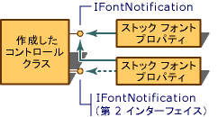

# MFC ActiveX コントロール: フォントの使用
ActiveX コントロールには、テキストが表示されている場合は、フォントのプロパティを変更することによってテキストの外観を変更するコントロールのユーザーを許可できます。 フォントのプロパティは、フォント オブジェクトとして実装され、2 種類のいずれかになります。 株価またはカスタムです。 ストック フォント プロパティはあらかじめ実装されているフォント プロパティの追加ウィザードを使用して追加することができます。 カスタム フォントのプロパティがあらかじめ実装されていないと、コントロールの開発者は、プロパティの動作と使用状況を判断します。  
  
 ここでは、次のトピックについて説明します。  
  
-   [ストック フォント プロパティを使用します。](#_core_using_the_stock_font_property)  
  
-   [コントロールのカスタム フォント プロパティを使用](#_core_implementing_a_custom_font_property)  
  
##   ストック フォント プロパティを使用します。  
 ストック フォント プロパティがクラスによってあらかじめ実装されて[COleControl](../mfc/reference/colecontrol-class.md)です。 さらに、標準のフォント プロパティ ページも使用、font オブジェクトの名前、サイズ、スタイルなどのさまざまな属性を変更するユーザーを許可できます。  
  
 フォント、オブジェクトにアクセス、 [GetFont](../mfc/reference/colecontrol-class.md#getfont)、 [SetFont](../mfc/reference/colecontrol-class.md#setfont)、および[InternalGetFont](../mfc/reference/colecontrol-class.md#internalgetfont)関数の`COleControl`します。 コントロールのユーザーが経由でのフォント オブジェクトへのアクセス、`GetFont`と`SetFont`取得/設定の他のプロパティと同じ方法で機能します。 Font オブジェクトへのアクセスが、コントロール内から必要な場合は、使用、`InternalGetFont`関数。  
  
 説明したよう[MFC ActiveX コントロール: プロパティ](../mfc/mfc-activex-controls-properties.md)、ストック プロパティの追加を簡単に、[プロパティの追加ウィザード](../ide/names-add-property-wizard.md)です。 フォント プロパティを選択し、プロパティの追加ウィザードが自動的にコントロールのディスパッチ マップにストック フォント エントリを挿入します。  
  
#### プロパティの追加ウィザードを使用して、ストック フォント プロパティを追加するには  
  
1.  コントロールのプロジェクトを読み込みます。  
  
2.  [クラス ビュー] で、コントロールのライブラリ ノードを展開します。  
  
3.  コントロールのインターフェイス ノード (ライブラリ ノードの 2 番目のノード) を右クリックし、ショートカット メニューを開きます。  
  
4.  ショートカット メニューから **[追加]** をクリックし、**プロパティの追加**です。  
  
     プロパティの追加ウィザードが開きます。  
  
5.  **プロパティ名**ボックスで、クリックして**フォント**です。  
  
6.  **[完了]** をクリックします。  
  
 プロパティの追加ウィザードでは、コントロール クラスの実装ファイル内にあるコントロールのディスパッチ マップに次の行を追加します。  
  
 [!code-cpp[NVC_MFC_AxFont#1](../mfc/codesnippet/cpp/mfc-activex-controls-using-fonts_1.cpp)]  
  
 さらに、プロパティの追加ウィザードでは、コントロールを次の行を追加します。IDL ファイル:  
  
 [!code-cpp[NVC_MFC_AxFont#2](../mfc/codesnippet/cpp/mfc-activex-controls-using-fonts_2.idl)]  
  
 ストックのキャプション プロパティは、ストック フォント プロパティ情報を使用して描画するテキストのプロパティの例を示します。 ストック フォント プロパティで使用するものと同様の手順を使用するコントロールへのストック キャプション プロパティを追加します。  
  
#### プロパティの追加ウィザードを使用して在庫のキャプション プロパティを追加するには  
  
1.  コントロールのプロジェクトを読み込みます。  
  
2.  [クラス ビュー] で、コントロールのライブラリ ノードを展開します。  
  
3.  コントロールのインターフェイス ノード (ライブラリ ノードの 2 番目のノード) を右クリックし、ショートカット メニューを開きます。  
  
4.  ショートカット メニューから **[追加]** をクリックし、**プロパティの追加**です。  
  
     プロパティの追加ウィザードが開きます。  
  
5.  **プロパティ名**ボックスで、クリックして**キャプション**です。  
  
6.  **[完了]** をクリックします。  
  
 プロパティの追加ウィザードでは、コントロール クラスの実装ファイル内にあるコントロールのディスパッチ マップに次の行を追加します。  
  
 [!code-cpp[NVC_MFC_AxFont#3](../mfc/codesnippet/cpp/mfc-activex-controls-using-fonts_3.cpp)]  
  
##   OnDraw 関数の変更  
 既定の実装`OnDraw`コントロールに表示されるすべてのテキストの Windows のシステム フォントを使用します。 つまり、変更する必要がある、`OnDraw`デバイス コンテキストに font オブジェクトを選択してコード。 これを行うには、呼び出す[それ](../mfc/reference/colecontrol-class.md#selectstockfont)を次の例のように、コントロールのデバイス コンテキストを渡します。  
  
 [!code-cpp[NVC_MFC_AxFont#4](../mfc/codesnippet/cpp/mfc-activex-controls-using-fonts_4.cpp)]  
  
 後に、`OnDraw`フォント オブジェクトを使用して関数が変更されて、コントロールのストック フォント プロパティの特性を持つコントロール内の任意のテキストが表示されます。  
  
##   コントロールのカスタム フォント プロパティを使用  
 ストック フォント プロパティだけでなく、ActiveX コントロールはカスタム フォントのプロパティを持つことができます。 カスタム フォント プロパティを追加する必要があります。  
  
-   プロパティの追加ウィザードを使用して、カスタムのフォント プロパティを実装します。  
  
-   [フォントの通知を処理](#_core_processing_font_notifications)です。  
  
-   [新しいフォント通知インターフェイスを実装する](#_core_implementing_a_new_font_notification_interface)です。  
  
###   カスタム フォント プロパティを実装します。  
 カスタム フォント プロパティを実装するのには、プロパティの追加ウィザードを使用するプロパティを追加し、コードにいくつかの変更を加えます。 次のセクションでは、ユーザー設定を追加する方法を説明する`HeadingFont`サンプル制御するプロパティです。  
  
##### プロパティの追加ウィザードを使用してカスタムのフォント プロパティを追加するには  
  
1.  コントロールのプロジェクトを読み込みます。  
  
2.  [クラス ビュー] で、コントロールのライブラリ ノードを展開します。  
  
3.  コントロールのインターフェイス ノード (ライブラリ ノードの 2 番目のノード) を右クリックし、ショートカット メニューを開きます。  
  
4.  ショートカット メニューから **[追加]** をクリックし、**プロパティの追加**です。  
  
     プロパティの追加ウィザードが開きます。  
  
5.  **プロパティ名**ボックスで、プロパティの名前を入力します。 この例では、使用**HeadingFont**です。  
  
6.  **[実装型]** として、 **[Get/Set メソッド]** をクリックします。  
  
7.  **プロパティの型**ボックスで、 **IDispatch\*** プロパティの型。  
  
8.  **[完了]** をクリックします。  
  
 プロパティの追加ウィザードを追加するコードを作成、`HeadingFont`カスタム プロパティを`CSampleCtrl`クラスと、サンプルです。IDL ファイルです。 `HeadingFont`取得/設定プロパティの型は、プロパティの追加ウィザードは、`CSampleCtrl`クラスのディスパッチ マップに含める、DISP_PROPERTY_EX_ID[DISP_PROPERTY_EX](../mfc/reference/dispatch-maps.md#disp_property_ex)マクロ エントリ。  
  
 [!code-cpp[NVC_MFC_AxFont#5](../mfc/codesnippet/cpp/mfc-activex-controls-using-fonts_5.cpp)]  
  
 DISP_PROPERTY_EX マクロ関連付けます、`HeadingFont`プロパティ名をそれに対応する`CSampleCtrl`Get し、Set メソッドをクラス`GetHeadingFont`と`SetHeadingFont`です。 プロパティ値の型が指定されてもです。この場合、VT_FONT です。  
  
 また、プロパティの追加ウィザードは、コントロール ヘッダー ファイルで宣言を追加 (です。H) の`GetHeadingFont`と`SetHeadingFont`機能し、コントロール実装ファイル内の関数テンプレートを追加します (です。CPP):  
  
 [!code-cpp[NVC_MFC_AxFont#6](../mfc/codesnippet/cpp/mfc-activex-controls-using-fonts_6.cpp)]  
  
 最後に、プロパティの追加ウィザードでは、コントロールを変更します。エントリを追加することで IDL ファイル、`HeadingFont`プロパティ。  
  
 [!code-cpp[NVC_MFC_AxFont#7](../mfc/codesnippet/cpp/mfc-activex-controls-using-fonts_7.idl)]  
  
### コントロールのコードの変更  
 追加したこと、`HeadingFont`プロパティ、コントロールを完全に新しいプロパティをサポートするコントロールのヘッダーと実装ファイルにいくつか変更を加える必要があります。  
  
 コントロールのヘッダー ファイル内 (です。H)、プロテクト メンバー変数の次の宣言を追加します。  
  
 [!code-cpp[NVC_MFC_AxFont#8](../mfc/codesnippet/cpp/mfc-activex-controls-using-fonts_8.h)]  
  
 コントロール実装ファイル内 (です。CPP)、次の操作を行います。  
  
-   初期化*取り上げた*コントロール コンス トラクターでします。  
  
     [!code-cpp[NVC_MFC_AxFont#9](../mfc/codesnippet/cpp/mfc-activex-controls-using-fonts_9.cpp)]  
  
-   フォントの既定の属性を含む静的 FONTDESC 構造体を宣言します。  
  
     [!code-cpp[NVC_MFC_AxFont#10](../mfc/codesnippet/cpp/mfc-activex-controls-using-fonts_10.cpp)]  
  
-   コントロールで`DoPropExchange`メンバー関数を呼び出しを追加して、`PX_Font`関数。 これは、初期化とカスタム フォント プロパティを永続化を提供します。  
  
     [!code-cpp[NVC_MFC_AxFont#11](../mfc/codesnippet/cpp/mfc-activex-controls-using-fonts_11.cpp)]  
  
-   コントロールを実装する完了`GetHeadingFont`メンバー関数。  
  
     [!code-cpp[NVC_MFC_AxFont#12](../mfc/codesnippet/cpp/mfc-activex-controls-using-fonts_12.cpp)]  
  
-   コントロールを実装する完了`SetHeadingFont`メンバー関数。  
  
     [!code-cpp[NVC_MFC_AxFont#13](../mfc/codesnippet/cpp/mfc-activex-controls-using-fonts_13.cpp)]  
  
-   コントロールの変更`OnDraw`メンバー関数を以前に選択したフォントを保持する変数を定義します。  
  
     [!code-cpp[NVC_MFC_AxFont#14](../mfc/codesnippet/cpp/mfc-activex-controls-using-fonts_14.cpp)]  
  
-   コントロールの変更`OnDraw`フォントが使用される場所に次の行を追加して、デバイス コンテキストにカスタム フォントを選択します。  
  
     [!code-cpp[NVC_MFC_AxFont#15](../mfc/codesnippet/cpp/mfc-activex-controls-using-fonts_15.cpp)]  
  
-   コントロールの変更`OnDraw`フォントを使用した後、次の行を追加することで、デバイス コンテキストに戻す前のフォントを選択するメンバー関数。  
  
     [!code-cpp[NVC_MFC_AxFont#16](../mfc/codesnippet/cpp/mfc-activex-controls-using-fonts_16.cpp)]  
  
 カスタムのフォント プロパティを実装すると、後に、標準のフォント プロパティ ページを実装するコントロール ユーザーがコントロールの現在のフォントを変更できるようにします。 標準のフォント プロパティ ページのプロパティ ページの ID を追加するには、BEGIN_PROPPAGEIDS マクロの後に、次の行を挿入します。  
  
 [!code-cpp[NVC_MFC_AxFont#17](../mfc/codesnippet/cpp/mfc-activex-controls-using-fonts_17.cpp)]  
  
 BEGIN_PROPPAGEIDS マクロのカウント パラメーターは、いずれかによっても増やす必要があります。 次の行に例を示します。  
  
 [!code-cpp[NVC_MFC_AxFont#18](../mfc/codesnippet/cpp/mfc-activex-controls-using-fonts_18.cpp)]  
  
 これらの変更が完了したら、追加の機能を組み込むプロジェクト全体を再構築します。  
  
###   フォントの通知の処理  
 ほとんどの場合、コントロールは、オブジェクトの特性、フォントが変更された際に知っておく必要があります。 フォントの各オブジェクトがのメンバー関数を呼び出すことによって変更するときに通知を提供できる、`IFontNotification`によって実装されるインターフェイス`COleControl`です。  
  
 通知の処理、コントロールは、ストック フォント プロパティを使用している場合、`OnFontChanged`のメンバー関数`COleControl`です。 カスタム フォントのプロパティを追加すると、同じ実装を使用することができます。 例では、前のセクションで、渡すことによってこれが (& a)*トラクター*初期化するときに、*取り上げた*メンバー変数。  
  
   
複数のフォント オブジェクト インターフェイスの実装  
  
 両方のフォント オブジェクトが同じ実装を使用している前の図では、純色の線を表示する`IFontNotification`です。 これにより、どのフォントが変更を区別する場合は問題が発生する可能性があります。  
  
 コントロールのフォント オブジェクトの通知を区別するために 1 つの方法はの別々 の実装を作成する、`IFontNotification`コントロール内の各フォント オブジェクト インターフェイスです。 この手法では、文字列、または最近変更されたフォントを使用する文字列のみを更新することで、描画コードを最適化することができます。 次のセクションでは、2 番目のフォント プロパティを別の通知インターフェイスを実装するために必要な手順を示します。 2 番目のフォント プロパティを想定する、`HeadingFont`前のセクションで追加されたプロパティ。  
  
###   新しいフォント通知インターフェイスを実装します。  
 2 つまたは複数のフォントの通知を区別するには、コントロールで使用される各フォントの新しい通知インターフェイスを実装する必要があります。 次のセクションでは、コントロールのヘッダーと実装ファイルを変更することで新しいフォント通知インターフェイスを実装する方法について説明します。  
  
### ヘッダー ファイルへの追加  
 コントロールのヘッダー ファイル内 (です。H) では、クラス宣言に、次の行を追加します。  
  
 [!code-cpp[NVC_MFC_AxFont#19](../mfc/codesnippet/cpp/mfc-activex-controls-using-fonts_19.h)]  
  
 これの実装を作成、`IPropertyNotifySink`と呼ばれるインターフェイス`HeadingFontNotify`です。 この新しいインターフェイスには、呼び出されたメソッドが含まれています。`OnChanged`です。  
  
### 実装ファイルへの追加  
 見出しのフォントでコントロールのコンス トラクター) を初期化するコードで次のように変更します。 (& a)*トラクター*する (& a)*m_xHeadingFontNotify*です。 次のコードを追加し、します。  
  
 [!code-cpp[NVC_MFC_AxFont#20](../mfc/codesnippet/cpp/mfc-activex-controls-using-fonts_20.cpp)]  
  
 `AddRef`と`Release`内のメソッド、`IPropertyNotifySink`インターフェイスの追跡、ActiveX コントロール オブジェクトの参照カウントします。 コントロールは、インターフェイス ポインターへのアクセスを取得する場合、コントロールは`AddRef`参照カウントをインクリメントします。 呼び出し、ポインターを持つコントロールが完了したら、 `Release`、同様の方法`GlobalFree`グローバル メモリ ブロックを解放するために呼び出す可能性があります。 このインターフェイスの参照カウントがゼロになる、インターフェイスの実装を解放することができます。 この例では、`QueryInterface`へのポインターを返します、`IPropertyNotifySink`特定のオブジェクトのインターフェイスです。 この関数は、ActiveX コントロールをサポートするインターフェイスを決定するオブジェクトを照会できます。  
  
 これらの変更が行われた後、プロジェクトにプロジェクトをリビルドし、インターフェイスをテストするテスト コンテナーを使用します。 Test Container にアクセスする方法について詳しくは、「 [テスト コンテナーでのプロパティとイベントのテスト](../mfc/testing-properties-and-events-with-test-container.md) 」をご覧ください。  
  
## 関連項目  
 [MFC ActiveX コントロール](../mfc/mfc-activex-controls.md)   
 [MFC ActiveX コントロール: ActiveX コントロールにおけるピクチャの使用](../mfc/mfc-activex-controls-using-pictures-in-an-activex-control.md)   
 [MFC ActiveX コントロール: ストック プロパティ ページの使用](../mfc/mfc-activex-controls-using-stock-property-pages.md)

