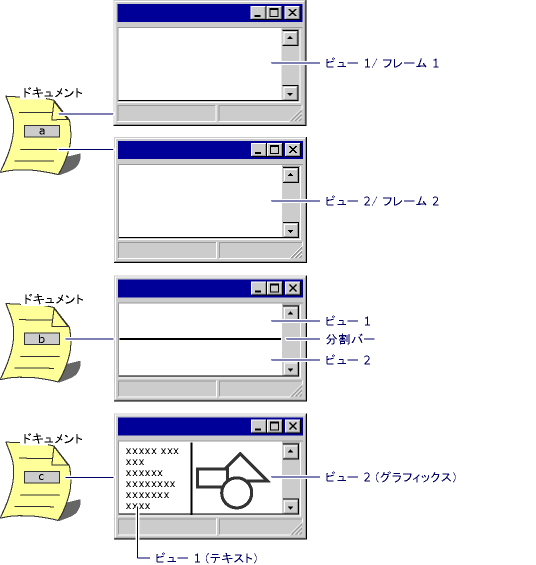

# 複数のドキュメント タイプ、ビュー、フレーム ウィンドウ
ドキュメント、そのビュー、およびそのフレーム ウィンドウの間の標準的な関係については、「 [ドキュメントおよびビューの作成](../mfc/document-view-creation.md)」を参照してください。 アプリケーションの多くが、ドキュメントごとに 1 つのビューと 1 つのフレーム ウィンドウを備えた、1 つのドキュメント タイプをサポートしますが (1 つのドキュメント タイプのドキュメントを複数開くことはできます)、 アプリケーションによっては、こうした 1 つ以上の既定値の変更が必要になる場合があります。  
  
## 詳しくは次のトピックをクリックしてください。  
  
-   [Multiple document types](#_core_multiple_document_types)  
  
-   [Multiple views](#_core_multiple_views)  
  
-   [Multiple frame windows](#_core_multiple_frame_windows)  
  
-   [分割ウィンドウ](#_core_splitter_windows)  
  
##   Multiple Document Types  
 MFC のアプリケーション ウィザードで作成されるドキュメント クラスは 1 つですが、 場合によっては、複数のドキュメント タイプのサポートが必要になることがあります。 たとえば、アプリケーションでワークシート ドキュメントとグラフ ドキュメントが必要になる可能性があります。 各ドキュメント タイプは、独自のドキュメント クラスと、おそらくは独自のビュー クラスで表されます。 ユーザーが [ファイル] メニューの [新規作成] を選択すると、サポートされているドキュメント タイプの一覧がダイアログ ボックスに表示されます。 その後、ユーザーが選択したタイプのドキュメントが作成されます。 ドキュメント タイプはそれぞれ、自身のドキュメント テンプレート オブジェクトで管理されます。  
  
 追加のドキュメント クラスの作成については、「 [クラスの追加](../ide/adding-a-class-visual-cpp.md)」を参照してください。 [CDocument](../mfc/reference/cdocument-class.md) を派生元のクラス タイプとして選択し、必要なドキュメント情報を指定します。 次に、新しいクラスのデータを実装します。  
  
 追加したドキュメント クラスをフレームワークに認識させるには、アプリケーション クラスでオーバーライドした [InitInstance](../mfc/reference/cwinapp-class.md#adddoctemplate) に、 [AddDocTemplate](../mfc/reference/cwinapp-class.md#initinstance) への呼び出しをもう 1 つ追加します。 詳細については、 [ドキュメント テンプレート](../mfc/document-templates-and-the-document-view-creation-process.md)に関するページを参照してください。  
  
##   Multiple Views  
 多くのドキュメントに必要なビューは 1 つだけですが、1 つのドキュメントに対して複数のビューをサポートすることもできます。 複数のビューを実装できるように、ドキュメント オブジェクトにはそのビューのリストが保持されます。また、ビューを追加および削除するためのメンバー関数のほか、ドキュメントのデータが変更されたときに複数のビューが認識できるようにするための [UpdateAllViews](../mfc/reference/cdocument-class.md#updateallviews) メンバー関数も用意されています。  
  
 MFC は、1 つのドキュメントに対して複数のビューを必要とする 3 つの一般的なユーザー インターフェイスをサポートしています。 その 3 つのモデルを次に示します。  
  
-   同じクラスの複数のビュー オブジェクトが、それぞれ個別の MDI ドキュメント フレーム ウィンドウに表示されるモデル。  
  
     ドキュメントでは 2 番目のフレーム ウィンドウの作成をサポートできます。 ユーザーが [新規ウィンドウ] を選択すると、2 番目のフレーム ウィンドウが開き、同じドキュメントのビューが表示されます。この 2 つのフレームを使うと、同じドキュメントの異なる部分を同時に表示できます。 フレームワークは、ドキュメントにアタッチされている最初のフレーム ウィンドウとビューを複製することで、MDI アプリケーションの [ウィンドウ] メニューにある [新規ウィンドウ] をサポートします。  
  
-   同じクラスの複数のビュー オブジェクトが、同じドキュメント フレーム ウィンドウに表示されるモデル。  
  
     分割ウィンドウは 1 つのドキュメント ウィンドウのビュー空間を分割して、そのドキュメントの個別のビューを複数作成します。 フレームワークによって、同じビュー クラスから複数のビュー オブジェクトが作成されます。 詳細については、「 [分割ウィンドウ](#_core_splitter_windows)」を参照してください。  
  
-   異なるクラスの複数のビュー オブジェクトが、1 つのフレーム ウィンドウに表示されるモデル。  
  
     このモデルでは、分割ウィンドウのバリエーションである、複数のビューが 1 つのフレーム ウィンドウを共有します。 このビューはさまざまなクラスから構築され、それぞれのビューで、同じドキュメントを異なる方法を使って表示できます。 たとえば、あるビューでは通常モードでワード プロセッサの文書が表示され、別のビューではその文書がアウトライン モードで表示されます。 分割コントロールを使用すると、ユーザーはビューの相対的なサイズを調整できます。  
  
 次の図は、a、b、c の 3 つに分けて、前述の 3 つのユーザー インターフェイス モデルを順に示しています。  
  
   
マルチ ビューによるユーザー インターフェイス  
  
 「 [分割ウィンドウ](../mfc/reference/csplitterwnd-class.md)」で説明されているように、フレームワークでは、[新規ウィンドウ] コマンドの実装と [CSplitterWnd](#_core_splitter_windows)クラスの提供により、これらのモデルを用意します。 その他のモデルを実装するには、これを開始点として使用できます。 ビュー、フレーム ウィンドウ、分割ウィンドウのさまざまな構成を示すサンプル プログラムについては、「 [MFC サンプル](../visual-cpp-samples.md)」を参照してください。  
  
 `UpdateAllViews`の詳細については、 [MFC リファレンス](../mfc/reference/cview-class.md) の *CView* に関するトピックと、 [SCRIBBLE サンプル](../visual-cpp-samples.md)を参照してください。  
  
##   Multiple Frame Windows  
 MDI アプリケーション用の [ウィンドウ] メニューの [新規ウィンドウ] を使うと、同じのドキュメントに 2 番目のフレーム ウィンドウを作成できます。 詳細については、マルチ ビューによるユーザー インターフェイスの図の最初のモデルを参照してください。  
  
##   Splitter Windows  
 分割ウィンドウでは、ウィンドウを 2 つ以上のスクロール可能なペインに分割できます。 ウィンドウ フレームのスクロール バーの横にある分割コントロール ("分割ボックス") を使用すると、ペインの相対的なサイズを調整できます。 各ペインは、同じドキュメントのビューです。 「動的」分割ウィンドウで、ビューは、同じクラスのとおりマルチ ビューによるユーザー インターフェイスの図の b 部分です。 "静的な" 分割ウィンドウでは、各ビューのクラスが異なっていてもかまいません。 どちらの分割ウィンドウも、 [CSplitterWnd](../mfc/reference/csplitterwnd-class.md)クラスでサポートされています。  
  
 動的な分割ウィンドウは、同じクラスの複数のビューで構成され、ウィンドウを複数のペインに分割できるため、各ペインをスクロールすることで、同じドキュメントの別の部分を表示できます。 また、ウィンドウの分割を解除して、追加したビューを削除することもできます。 [SCRIBBLE サンプル](../visual-cpp-samples.md) で追加した分割ウィンドウは 1 つの例です。 このトピックでは、動的分割ウィンドウを作成する方法について説明しています。 マルチ ビューによるユーザー インターフェイスの図の b の部分では、動的分割ウィンドウが表示されます。  
  
 異なるクラスのビューを含む静的分割ウィンドウを作成するには、まず、ウィンドウを目的別のペインに分割します。 たとえば、Visual C++ ビットマップ エディターでは、イメージ ウィンドウに 2 つのペインが横に並んで表示されます。 左ペインには、等倍のビットマップ イメージが表示されます。 右ペインには、同じビットマップの拡大イメージまたは縮小イメージが表示されます。 各ペインは "分割バー" で分けられており、このバーをドラッグすることで、ペインの相対的サイズを変更できます。 静的な分割ウィンドウは、図のマルチ ビューによるユーザー インターフェイスの c 部分に表示されます。  
  
 詳細については、 [MFC リファレンス](../mfc/reference/csplitterwnd-class.md) の *CSplitterWnd* に関するトピックと、 [MFC サンプル](../visual-cpp-samples.md)を参照してください。  
  
## 参照  
 [ドキュメント/ビュー アーキテクチャ](../mfc/document-view-architecture.md)

