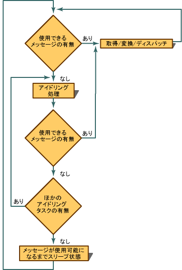

# OnIdle メンバー関数
[!INCLUDE[vs2017banner](../assembler/inline/includes/vs2017banner.md)]

Windows メッセージが処理されていないと、フレームワークは [CWinApp](../mfc/reference/cwinapp-class.md) のメンバー関数 [OnIdle](../Topic/CWinApp::OnIdle.md) を呼び出します \(MFC ライブラリの"で説明されている\)。  
  
 バックグラウンド タスクを実行 `OnIdle` オーバーライド。  既定のバージョンは、ツール バー ボタンのようなユーザー インターフェイス オブジェクトの状態を更新し、操作中にフレームワークによって作成される一時オブジェクトのクリーンアップを実行します。  次の図は、キューにメッセージがない場合、メッセージ ループが `OnIdle` を呼び出す方法について説明します。  
  
   
メッセージ ループ  
  
 アイドル ループで実行できる機能の詳細については [アイドル ループ処理](../Topic/Idle%20Loop%20Processing.md)を参照します。  
  
## 参照  
 [CWinApp : アプリケーション クラス](../Topic/CWinApp:%20The%20Application%20Class.md)