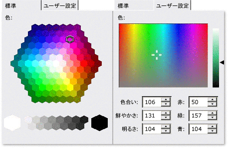

# <a name="cmfccolorpickerctrl-class"></a>CMFCColorPickerCtrl クラス
`CMFCColorPickerCtrl`クラスは、色の選択に使用されるコントロールの機能を提供します。  
  
## <a name="syntax"></a>構文  
  
```  
class CMFCColorPickerCtrl : public CButton  
```  
  
## <a name="members"></a>メンバー  
  
### <a name="public-constructors"></a>パブリック コンストラクター  
  
|名前|説明|  
|----------|-----------------|  
|[CMFCColorPickerCtrl::CMFCColorPickerCtrl](#cmfccolorpickerctrl)|`CMFCColorPickerCtrl` オブジェクトを構築します。|  
  
### <a name="public-methods"></a>パブリック メソッド  
  
|名前|説明|  
|----------|-----------------|  
|[CMFCColorPickerCtrl::GetColor](#getcolor)|ユーザーが選択した色を取得します。|  
|[CMFCColorPickerCtrl::GetHLS](#gethls)|ユーザーが選択した色の色合い、明るさ、および鮮やかさの値を取得します。|  
|[CMFCColorPickerCtrl::GetHue](#gethue)|ユーザーが選択した色の色相要素を取得します。|  
|[CMFCColorPickerCtrl::GetLuminance](#getluminance)|ユーザーが選択した色の輝度要素を取得します。|  
|[CMFCColorPickerCtrl::GetSaturation](#getsaturation)|ユーザーが選択した色の飽和度要素を取得します。|  
|[CMFCColorPickerCtrl::SelectCellHexagon](#selectcellhexagon)|RGB 色の指定された要素または指定されたセル六角形によって定義された色を現在の色を設定します。|  
|[CMFCColorPickerCtrl::SetColor](#setcolor)|指定された、RGB 色の値を現在の色を設定します。|  
|[CMFCColorPickerCtrl::SetHLS](#sethls)|指定された HLS 色の値を現在の色を設定します。|  
|[CMFCColorPickerCtrl::SetHue](#sethue)|現在選択されている色の色合いを変更します。|  
|[CMFCColorPickerCtrl::SetLuminance](#setluminance)|現在選択されている色の輝度コンポーネントを変更します。|  
|[CMFCColorPickerCtrl::SetLuminanceBarWidth](#setluminancebarwidth)|カラー ピッカー コントロールの輝度バーの幅を設定します。|  
|[CMFCColorPickerCtrl::SetOriginalColor](#setoriginalcolor)|選択した最初の色を設定します。|  
|[CMFCColorPickerCtrl::SetPalette](#setpalette)|現在のカラー パレットを設定します。|  
|[CMFCColorPickerCtrl::SetSaturation](#setsaturation)|現在選択されている色の彩度を変更します。|  
|[CMFCColorPickerCtrl::SetType](#settype)|表示するカラー ピッカー コントロールの種類を設定します。|  
  
### <a name="protected-methods"></a>プロテクト メソッド  
  
|名前|説明|  
|----------|-----------------|  
|[CMFCColorPickerCtrl::DrawCursor](#drawcursor)|選択した色をポイントするカーソルが表示される前に、フレームワークによって呼び出されます。|  
  
## <a name="remarks"></a>コメント  
 六角色パレットから標準色が選択されており、輝度バーからカスタムの色が選択されている色が赤/緑/青表記または色合い/satuaration/輝度表記を使用して指定された場所。  
  
 次の図ではいくつか`CMFCColorPickerCtrl`オブジェクト。  
  
   
  
 `CMFCColorPickerCtrl`スタイルの 2 つのペアをサポートします。 16 進数と HEX_GREYSCALE のスタイルは、標準的な色の選択に適しています。 ピッカーと明るさのスタイルに適したカスタム色を選択します。  
  
 組み込むには、次の手順を実行、`CMFCColorPickerCtrl`ダイアログ ボックスへの制御。  
  
1.  使用する場合、 **ClassWizard**、ダイアログ ボックスのテンプレートに新しいボタン コントロールを挿入 (ため、`CMFCColorPickerCtrl`からクラスを継承、`CButton`クラス)。  
  
2.  ダイアログ ボックス クラスに新しいボタン コントロールに関連付けられているメンバー変数を挿入します。 変数の型を変更し、`CButton`に`CMFCColorPickerCtrl`です。  
  
3.  挿入、 `WM_INITDIALOG`  ダイアログ ボックス クラスのメッセージ ハンドラー。 ハンドラーに、型、パレット、およびの初期の選択した色を設定、`CMFCColorPickerCtrl`コントロール。  
  
## <a name="example"></a>例  
 次の例は、構成する方法を示します、`CMFCColorPickerCtrl`オブジェクトのさまざまなメソッドを使用して、`CMFCColorPickerCtrl`クラスです。 この例は、ピッカー コントロールの種類を設定する方法と、色、色合い、明るさ、および鮮やかさを設定する方法を示します。 この例は、[新しいコントロール サンプル](../../visual-cpp-samples.md)です。  
  
 [!code-cpp[NVC_MFC_NewControls#4](../../mfc/reference/codesnippet/cpp/cmfccolorpickerctrl-class_1.h)]  
[!code-cpp[NVC_MFC_NewControls#5](../../mfc/reference/codesnippet/cpp/cmfccolorpickerctrl-class_2.cpp)]  
  
## <a name="inheritance-hierarchy"></a>継承階層  
 [CObject](../../mfc/reference/cobject-class.md)  
  
 [CCmdTarget](../../mfc/reference/ccmdtarget-class.md)  
  
 [CWnd](../../mfc/reference/cwnd-class.md)  
  
 [CButton](../../mfc/reference/cbutton-class.md)  
  
 [CMFCColorPickerCtrl](../../mfc/reference/cmfccolorpickerctrl-class.md)  
  
## <a name="requirements"></a>必要条件  
 **ヘッダー:** afxcolorpickerctrl.h  
  
##  <a name="cmfccolorpickerctrl"></a>CMFCColorPickerCtrl::CMFCColorPickerCtrl  
 `CMFCColorPickerCtrl` オブジェクトを構築します。  
  
```  
CMFCColorPickerCtrl();
```  
  
### <a name="return-value"></a>戻り値  
  
### <a name="remarks"></a>コメント  
  
##  <a name="drawcursor"></a>CMFCColorPickerCtrl::DrawCursor  
 選択した色をポイントするカーソルが表示される前に、フレームワークによって呼び出されます。  
  
```  
virtual void DrawCursor(
    CDC* pDC,  
    const CRect& rect);
```  
  
### <a name="parameters"></a>パラメーター  
 [入力] `pDC`  
 デバイス コンテキストへのポインター。  
  
 [入力] `rect`  
 選択した色の周りの四角形の領域を指定します。  
  
### <a name="remarks"></a>コメント  
 選択した色をポイントする、カーソルの形状を変更する必要がある場合は、このメソッドをオーバーライドします。  
  
##  <a name="getcolor"></a>CMFCColorPickerCtrl::GetColor  
 ユーザーが選択した色を取得します。  
  
```  
COLORREF GetColor() const;  
```  
  
### <a name="return-value"></a>戻り値  
 選択した色の RGB 値。  
  
### <a name="remarks"></a>コメント  
  
##  <a name="gethls"></a>CMFCColorPickerCtrl::GetHLS  
 ユーザーが選択した色の色合い、明るさ、および鮮やかさの値を取得します。  
  
```  
void GetHLS(
    double* hue,  
    double* luminance,  
    double* saturation);
```  
  
### <a name="parameters"></a>パラメーター  
 [出力] `hue`  
 色合い情報を受け取る double 型の変数へのポインター。  
  
 [出力] `luminance`  
 輝度情報を受け取る double 型の変数へのポインター。  
  
 [出力] `saturation`  
 鮮やかさの情報を受け取る double 型の変数へのポインター。  
  
### <a name="remarks"></a>コメント  
  
##  <a name="gethue"></a>CMFCColorPickerCtrl::GetHue  
 ユーザーが選択した色の色相要素を取得します。  
  
```  
double GetHue() const;  
```  
  
### <a name="return-value"></a>戻り値  
 選択した色の色相要素。  
  
### <a name="remarks"></a>コメント  
  
##  <a name="getluminance"></a>CMFCColorPickerCtrl::GetLuminance  
 ユーザーが選択した色の輝度要素を取得します。  
  
```  
double GetLuminance() const;  
```  
  
### <a name="return-value"></a>戻り値  
 選択した色の輝度コンポーネントです。  
  
### <a name="remarks"></a>コメント  
  
##  <a name="getsaturation"></a>CMFCColorPickerCtrl::GetSaturation  
 ユーザーが選択した色の鮮やかさの値を取得します。  
  
```  
double GetSaturation() const;  
```  
  
### <a name="return-value"></a>戻り値  
 選択された色の彩度。  
  
### <a name="remarks"></a>コメント  
  
##  <a name="selectcellhexagon"></a>CMFCColorPickerCtrl::SelectCellHexagon  
 RGB 色の指定された要素または指定されたセル六角形によって定義された色を現在の色を設定します。  
  
```  
void SelectCellHexagon(
    BYTE R,  
    BYTE G,  
    BYTE B);

 
BOOL SelectCellHexagon(
    int x,  
    int y);
```  
  
### <a name="parameters"></a>パラメーター  
 [入力] `R`  
 色の赤のコンポーネント。  
  
 [入力] `G`  
 緑色のコンポーネント。  
  
 [入力] `B`  
 青のコンポーネント。  
  
 [入力] `x`  
 セル六角形をポイントすると、カーソルの x 座標。  
  
 [入力] `y`  
 セル六角形をポイントすると、カーソルの y 座標。  
  
### <a name="return-value"></a>戻り値  
 このメソッドの 2 番目のオーバー ロードを常に返します`FALSE`です。  
  
### <a name="remarks"></a>コメント  
 現在の色を色の選択コントロールに対応する色にこのメソッドのセットの最初のオーバー ロードには、赤、緑、および青の色要素に対して指定されました。  
  
 このメソッドの 2 番目のオーバー ロードでは、指定したカーソル位置によってポイントされているセル六角形の色に現在の色を設定します。  
  
##  <a name="setcolor"></a>CMFCColorPickerCtrl::SetColor  
 指定された、RGB 色の値を現在の色を設定します。  
  
```  
void SetColor(COLORREF Color);
```  
  
### <a name="parameters"></a>パラメーター  
 [入力] `Color`  
 色の RGB 値。  
  
### <a name="remarks"></a>コメント  
  
##  <a name="sethls"></a>CMFCColorPickerCtrl::SetHLS  
 指定された HLS 色の値を現在の色を設定します。  
  
```  
void SetHLS(
    double hue,  
    double luminance,  
    double saturation,  
    BOOL bInvalidate=TRUE);
```  
  
### <a name="parameters"></a>パラメーター  
 [入力] `hue`  
 色合いの値。  
  
 [入力] `luminance`  
 輝度値です。  
  
 [入力] `saturation`  
 鮮やかさの値。  
  
 [入力] `bInvalidate`  
 `TRUE`ウィンドウを強制的に新しい色; に直ちに更新するにはそれ以外の場合、`FALSE`です。 既定値は、`TRUE` です。  
  
### <a name="remarks"></a>コメント  
  
##  <a name="sethue"></a>CMFCColorPickerCtrl::SetHue  
 現在選択されている色の色合いを変更します。  
  
```  
void SetHue(double Hue);
```  
  
### <a name="parameters"></a>パラメーター  
 [入力] `Hue`  
 色合いの値。  
  
### <a name="remarks"></a>コメント  
  
##  <a name="setluminance"></a>CMFCColorPickerCtrl::SetLuminance  
 現在選択されている色の明るさを変更します。  
  
```  
void SetLuminance(double Luminance);
```  
  
### <a name="parameters"></a>パラメーター  
 [入力] `Luminance`  
 輝度値です。  
  
### <a name="remarks"></a>コメント  
  
##  <a name="setluminancebarwidth"></a>CMFCColorPickerCtrl::SetLuminanceBarWidth  
 カラー ピッカー コントロールの輝度バーの幅を設定します。  
  
```  
void SetLuminanceBarWidth(int w);
```  
  
### <a name="parameters"></a>パラメーター  
 [入力] `w`  
 輝度バーの幅はピクセル単位で測定されます。  
  
### <a name="remarks"></a>コメント  
 オンになっている輝度バーのサイズを変更するには、このメソッドを使用して、**カスタム**カラー ピッカー コントロールのタブです。 `w`輝度バーの幅を指定します。 幅の値には、4 分の 3 つのクライアント領域の幅を超えている場合は無視されます。  
  
##  <a name="setoriginalcolor"></a>CMFCColorPickerCtrl::SetOriginalColor  
 選択した最初の色を設定します。  
  
```  
void SetOriginalColor(COLORREF ref);
```  
  
### <a name="parameters"></a>パラメーター  
 [入力] `ref`  
 色の RGB 値。  
  
### <a name="remarks"></a>コメント  
 カラー ピッカー コントロールが初期化されたときに、このメソッドを呼び出します。  
  
##  <a name="setpalette"></a>CMFCColorPickerCtrl::SetPalette  
 現在のカラー パレットを設定します。  
  
```  
void SetPalette(CPalette* pPalette);
```  
  
### <a name="parameters"></a>パラメーター  
 [入力] `pPalette`  
 カラー パレットへのポインター。  
  
### <a name="remarks"></a>コメント  
 カラー パレットは、カラー ピッカー コントロールでは、表示される色の配列を定義します。  
  
##  <a name="setsaturation"></a>CMFCColorPickerCtrl::SetSaturation  
 現在選択されている色の彩度を変更します。  
  
```  
void SetSaturation(double Saturation);
```  
  
### <a name="parameters"></a>パラメーター  
 [入力] `Saturation`  
 鮮やかさの値。  
  
### <a name="remarks"></a>コメント  
  
##  <a name="settype"></a>CMFCColorPickerCtrl::SetType  
 表示するカラー ピッカー コントロールの種類を設定します。  
  
```  
void SetType(COLORTYPE colorType);
```  
  
### <a name="parameters"></a>パラメーター  
 [入力] `colorType`  
 カラー ピッカー コントロールの種類。  
  
 種類が定義されている、`CMFCColorPickerCtrl::COLORTYPE`列挙します。 種類は`LUMINANCE`、 `PICKER`、`HEX`と`HEX_GREYSCALE`です。 既定の型は `PICKER` です。  
  
### <a name="remarks"></a>コメント  
 カラー ピッカー コントロールの種類を指定するには、Windows のコントロールが作成される前に、このメソッドを呼び出します。  
  
## <a name="see-also"></a>参照  
 [階層図](../../mfc/hierarchy-chart.md)   
 [クラス](../../mfc/reference/mfc-classes.md)   
 [CMFCColorDialog クラス](../../mfc/reference/cmfccolordialog-class.md)
