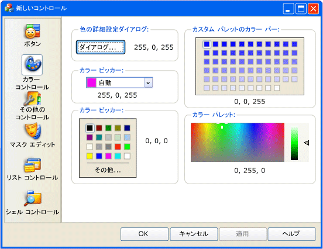
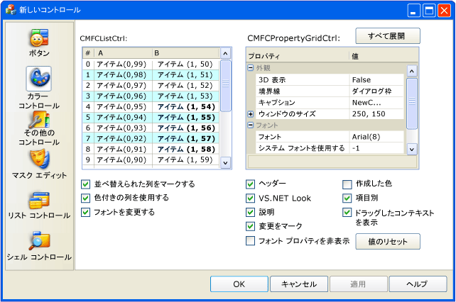

# <a name="cmfcpropertysheet-class"></a>CMFCPropertySheet クラス
`CMFCPropertySheet` クラスは、各プロパティ ページがページ タブ、ツール バー ボタン、ツリー コントロールのノード、またはリスト項目で示されるプロパティ シートをサポートします。  
  
## <a name="syntax"></a>構文  
  
```  
class CMFCPropertySheet : public CPropertySheet  
```  
  
## <a name="members"></a>メンバー  
  
### <a name="public-constructors"></a>パブリック コンストラクター  
  
|名前|説明|  
|----------|-----------------|  
|[CMFCPropertySheet::CMFCPropertySheet](#cmfcpropertysheet)|`CMFCPropertySheet` オブジェクトを構築します。|  
|`CMFCPropertySheet::~CMFCPropertySheet`|デストラクターです。|  
  
### <a name="public-methods"></a>パブリック メソッド  
  
|名前|説明|  
|----------|-----------------|  
|[Cmfcpropertysheet::addpage](#addpage)|プロパティ シートにページを追加します。|  
|[CMFCPropertySheet::AddPageToTree](#addpagetotree)|ツリー コントロールに新しいプロパティ ページを追加します。|  
|[CMFCPropertySheet::AddTreeCategory](#addtreecategory)|ツリー コントロールに新しいノードを追加します。|  
|[CMFCPropertySheet::EnablePageHeader](#enablepageheader)|カスタム ヘッダーを描画する領域を各ページの上部に確保します。|  
|[CMFCPropertySheet::GetHeaderHeight](#getheaderheight)|現在のヘッダーの高さを取得します。|  
|[CMFCPropertySheet::GetLook](#getlook)|現在のプロパティ シートの外観を指定する列挙値を取得します。|  
|[CMFCPropertySheet::GetNavBarWidth](#getnavbarwidth)|ナビゲーション バーの幅をピクセル単位で取得します。|  
|[CMFCPropertySheet::GetTab](#gettab)|現在のプロパティ シート コントロールをサポートする内部タブ コントロール オブジェクトを取得します。|  
|`CMFCPropertySheet::GetThisClass`|ポインターを取得する、framework によって使用される、 [CRuntimeClass](../../mfc/reference/cruntimeclass-structure.md)このクラス型に関連付けられているオブジェクト。|  
|[CMFCPropertySheet::InitNavigationControl](#initnavigationcontrol)|現在のプロパティ シート コントロールの外観を初期化します。|  
|[CMFCPropertySheet::OnActivatePage](#onactivatepage)|プロパティ ページが有効になったときにフレームワークによって呼び出されます。|  
|[CMFCPropertySheet::OnDrawPageHeader](#ondrawpageheader)|カスタム プロパティ ページのヘッダーを描画するためにフレームワークによって呼び出されます。|  
|`CMFCPropertySheet::OnInitDialog`|処理、 [WM_INITDIALOG](/windows/desktop/dlgbox/wm-initdialog)メッセージ。 (上書き[cpropertysheet::oninitdialog](../../mfc/reference/cpropertysheet-class.md#oninitdialog))。|  
|[CMFCPropertySheet::OnRemoveTreePage](#onremovetreepage)|ツリー コントロールからプロパティ ページを削除するためにフレームワークによって呼び出されます。|  
|`CMFCPropertySheet::PreTranslateMessage`|ディスパッチされる前に、ウィンドウ メッセージを変換する、 [TranslateMessage](/windows/desktop/api/winuser/nf-winuser-translatemessage)と[DispatchMessage](/windows/desktop/api/winuser/nf-winuser-dispatchmessage) Windows 関数。 (`CPropertySheet::PreTranslateMessage` をオーバーライドします)。|  
|[CMFCPropertySheet::RemoveCategory](#removecategory)|ツリー コントロールからノードを削除します。|  
|[CMFCPropertySheet::RemovePage](#removepage)|プロパティ シートからプロパティ ページを削除します。|  
|[CMFCPropertySheet::SetIconsList](#seticonslist)|Outlook ウィンドウのナビゲーション コントロールで使用されるイメージの一覧を指定します。|  
|[:Setlook](#setlook)|プロパティ シートの外観を指定します。|  
  
## <a name="remarks"></a>Remarks  
 `CMFCPropertySheet` クラスは、プロパティ シート (タブ ダイアログ ボックスとも呼ばれます) を表します。 `CMFCPropertySheet` クラスは、さまざまな方法でプロパティ ページを表示できます。  
  
 アプリケーションで `CMFCPropertySheet` クラスを使用するには、次の手順を実行します。  
  
1.  `CMFCPropertySheet` クラスから派生クラスを作成し、名前 (CMyPropertySheet など) を付けます。  
  
2.  構築、 [CMFCPropertyPage](../../mfc/reference/cmfcpropertypage-class.md)各プロパティ ページのオブジェクト。  
  
3.  呼び出す、 [:setlook](#setlook) CMyPropertySheet コンス トラクターのメソッド。 このメソッドのパラメーターで、プロパティ ページの表示方法として、プロパティ シートの上部または左側のタブ、Microsoft OneNote プロパティ シート スタイルのタブ、Microsoft Outlook ツール バー コントロールのボタン、ツリー コントロールのノード、プロパティ シートの左側の項目リストのいずれかを指定します。  
  
4.  Microsoft Outlook ツール バーのスタイルのプロパティ シートを作成する場合、 [CMFCPropertySheet::SetIconsList](#seticonslist)イメージ リストをプロパティ ページを関連付けるメソッド。  
  
5.  呼び出す、 [cmfcpropertysheet::addpage](#addpage)各プロパティ ページのメソッド。  
  
6.  `CMFCPropertySheet` コントロールを作成し、その `DoModal` メソッドを呼び出します。  
  
## <a name="illustrations"></a>図  
 次の図は、埋め込みの Microsoft Outlook ツール バー スタイルのプロパティ シートを示しています。 プロパティ シートの左側に Outlook ツール バーが表示されます。  
  
   
  
 次の図を含むプロパティ シートを示しています、 [CMFCPropertyGridCtrl クラス](../../mfc/reference/cmfcpropertygridctrl-class.md)オブジェクト。 このオブジェクトは、標準のコモン コントロール スタイルのプロパティ シートです。  
  
   
  
 次の図は、ツリー コントロール スタイルのプロパティ シートを示しています。  
  
   
  
## <a name="inheritance-hierarchy"></a>継承階層  
 [CObject](../../mfc/reference/cobject-class.md)  
  
 [CCmdTarget](../../mfc/reference/ccmdtarget-class.md)  
  
 [CWnd](../../mfc/reference/cwnd-class.md)  
  
 [CPropertySheet](../../mfc/reference/cpropertysheet-class.md)  
  
 [CMFCPropertySheet](../../mfc/reference/cmfcpropertysheet-class.md)  
  
## <a name="requirements"></a>要件  
 **ヘッダー:** afxpropertysheet.h  
  
##  <a name="addpage"></a>  Cmfcpropertysheet::addpage  
 プロパティ シートにページを追加します。  
  
```  
void AddPage(CPropertyPage* pPage);
```  
  
### <a name="parameters"></a>パラメーター  
 [in]*pPage*  
 ページ オブジェクトへのポインター。 このパラメーターは、NULL にすることはできません。  
  
### <a name="remarks"></a>Remarks  
 このメソッドは、プロパティ シートの一番右のタブとして、指定したプロパティ ページを追加します。 そのため、このメソッドを使用して、左から右の順序でページを追加します。  
  
 Microsoft Outlook のスタイルがプロパティ シートにある場合、フレームワークは、プロパティ シートの左側にあるナビゲーション ボタンの一覧を表示します。 このメソッドは、プロパティ ページを追加、リストに対応するボタンを追加します。 プロパティ ページを表示するには、その対応するボタンをクリックします。 プロパティ シートのスタイルの詳細については、次を参照してください。 [:setlook](#setlook)します。  
  
##  <a name="addpagetotree"></a>  CMFCPropertySheet::AddPageToTree  
 ツリー コントロールに新しいプロパティ ページを追加します。  
  
```  
void AddPageToTree(
    CMFCPropertySheetCategoryInfo* pCategory,  
    CMFCPropertyPage* pPage,  
    int nIconNum=-1,  
    int nSelIconNum=-1);
```  
  
### <a name="parameters"></a>パラメーター  
 [in]*pCategory*  
 親ツリー ノード、または NULL に指定したページを最上位のノードに関連付けるへのポインター。 呼び出す、 [CMFCPropertySheet::AddTreeCategory](#addtreecategory)このポインターを取得します。  
  
 [in]*pPage*  
 プロパティ ページのオブジェクトへのポインター。  
  
 [in]*nIconNum*  
 アイコン、またはアイコンを使用しない場合は-1 の 0 から始まるインデックス。 ページが選択されていないときは、ツリー コントロールのプロパティ ページの横にある、アイコンが表示されます。 既定値は -1 です。  
  
 [in]*nSelIconNum*  
 アイコン、またはアイコンを使用しない場合は-1 の 0 から始まるインデックス。 ページを選択すると、ツリー コントロールのプロパティ ページの横にアイコンが表示されます。 既定値は -1 です。  
  
### <a name="remarks"></a>Remarks  
 このメソッドは、ツリー コントロールのリーフとしてプロパティ ページを追加します。 プロパティ ページを追加するには、作成、`CMFCPropertySheet`オブジェクトを呼び出し、 [:setlook](#setlook)メソッドを*検索*パラメーターに設定`CMFCPropertySheet::PropSheetLook_Tree`、し、このメソッドを使用して、プロパティ ページを追加.  
  
##  <a name="addtreecategory"></a>  CMFCPropertySheet::AddTreeCategory  
 ツリー コントロールに新しいノードを追加します。  
  
```  
CMFCPropertySheetCategoryInfo* AddTreeCategory(
    LPCTSTR lpszLabel,  
    int nIconNum=-1,  
    int nSelectedIconNum=-1,  
    const CMFCPropertySheetCategoryInfo* pParentCategory=NULL);
```  
  
### <a name="parameters"></a>パラメーター  
 [in]*lpszLabel*  
 ノードの名前。  
  
 [in]*nIconNum*  
 アイコン、またはアイコンを使用しない場合は-1 の 0 から始まるインデックス。 ページが選択されていないときは、ツリー コントロールのプロパティ ページの横にある、アイコンが表示されます。 既定値は -1 です。  
  
 [in]*nSelectedIconNum*  
 アイコン、またはアイコンを使用しない場合は-1 の 0 から始まるインデックス。 ページを選択すると、ツリー コントロールのプロパティ ページの横にアイコンが表示されます。 既定値は -1 です。  
  
 [in]*pParentCategory*  
 親ツリー ノード、または NULL に指定したページを最上位のノードに関連付けるへのポインター。 このパラメーターを設定、 [CMFCPropertySheet::AddTreeCategory](#addtreecategory)メソッド。  
  
### <a name="return-value"></a>戻り値  
 ツリー コントロールで新しいノードへのポインター。  
  
### <a name="remarks"></a>Remarks  
 ツリー コントロールにカテゴリとも呼ばれる、新しいノードを追加するのにには、このメソッドを使用します。 ノードを追加するには、作成、`CMFCPropertySheet`オブジェクトを呼び出す、 [:setlook](#setlook)メソッドを*検索*パラメーターに設定`CMFCPropertySheet::PropSheetLook_Tree`、し、このメソッドを使用して、ノードを追加します。  
  
 このメソッドの戻り値を使用して、後続の呼び出しで[CMFCPropertySheet::AddPageToTree](#addpagetotree)と[CMFCPropertySheet::AddTreeCategory](#addtreecategory)します。  
  
##  <a name="cmfcpropertysheet"></a>  CMFCPropertySheet::CMFCPropertySheet  
 `CMFCPropertySheet` オブジェクトを構築します。  
  
```  
CMFCPropertySheet(
    UINT nIDCaption,  
    CWnd* pParentWnd=NULL,  
    UINT iSelectPage=0);

CMFCPropertySheet(
    LPCTSTR pszCaption,  
    CWnd* pParentWnd=NULL,  
    UINT iSelectPage=0);
```  
  
### <a name="parameters"></a>パラメーター  
 [in]*pszCaption*  
 プロパティ シートのタイトルを含む文字列。 Nll は指定できません。  
  
 [in]*nIDCaption*  
 プロパティ シートのキャプションを表すリソース ID。  
  
 [in]*pParentWnd*  
 プロパティ シート、または NULL の場合は、親ウィンドウは、アプリケーションのメイン ウィンドウの親ウィンドウへのポインター。 既定値は、NULL です。  
  
 [in]*iSelectPage*  
 最上位のプロパティ ページの 0 から始まるインデックス。 既定値は 0 です。  
  
### <a name="remarks"></a>Remarks  
 詳細については、パラメーターを参照してください、[呼び出します](../../mfc/reference/cpropertysheet-class.md#cpropertysheet)コンス トラクター。  
  
##  <a name="enablepageheader"></a>  CMFCPropertySheet::EnablePageHeader  
 カスタム ヘッダーを描画する領域を各ページの上部に確保します。  
  
```  
void EnablePageHeader(int nHeaderHeight);
```  
  
### <a name="parameters"></a>パラメーター  
 [in]*nHeaderHeight*  
 ピクセル単位でヘッダーの高さ。  
  
### <a name="remarks"></a>Remarks  
 値を使用する、 *nHeaderHeight*カスタム ヘッダーを描画するためにパラメーターを上書きする、 [CMFCPropertySheet::OnDrawPageHeader](#ondrawpageheader)メソッド。  
  
##  <a name="getheaderheight"></a>  CMFCPropertySheet::GetHeaderHeight  
 現在のヘッダーの高さを取得します。  
  
```  
int GetHeaderHeight() const;  
```  
  
### <a name="return-value"></a>戻り値  
 ピクセル単位でヘッダーの高さ。  
  
### <a name="remarks"></a>Remarks  
 呼び出す、 [CMFCPropertySheet::EnablePageHeader](#enablepageheader)メソッドがこのメソッドを呼び出す前にします。  
  
##  <a name="getlook"></a>  CMFCPropertySheet::GetLook  
 現在のプロパティ シートの外観を指定する列挙値を取得します。  
  
```  
PropSheetLook GetLook() const;  
```  
  
### <a name="return-value"></a>戻り値  
 プロパティ シートの外観を指定する列挙値の 1 つ。 使用可能な値の一覧は、の「解説」で列挙型のテーブルを参照してください。 [:setlook](#setlook)します。  
  
##  <a name="getnavbarwidth"></a>  CMFCPropertySheet::GetNavBarWidth  
 ナビゲーション バーの幅を取得します。  
  
```  
int GetNavBarWidth() const;  
```  
  
### <a name="return-value"></a>戻り値  
 軸スクロール バーの幅 (ピクセル単位)。  
  
##  <a name="gettab"></a>  CMFCPropertySheet::GetTab  
 現在のプロパティ シート コントロールをサポートする内部タブ コントロール オブジェクトを取得します。  
  
```  
CMFCTabCtrl& GetTab() const;  
```  
  
### <a name="return-value"></a>戻り値  
 内部のタブ コントロール オブジェクト。  
  
### <a name="remarks"></a>Remarks  
 ナビゲーション ボタン、または一連のタブ付きページのリスト、ツリー コントロールなどのさまざまなスタイルで表示されるように、プロパティ シートを設定できます。  
  
 このメソッドを呼び出す前に呼び出す、 [:setlook](#setlook)プロパティ シート コントロールの外観を設定します。 呼び出して、 [CMFCPropertySheet::InitNavigationControl](#initnavigationcontrol)内部タブ コントロール オブジェクトを初期化します。 タブ コントロール オブジェクトを取得し、そのオブジェクトを使用して、プロパティ シートで、タブを使用するには、このメソッドを使用します。  
  
 このメソッドは、プロパティ シート コントロールに表示される Microsoft OneNote のスタイルが設定されていない場合、デバッグ モードでアサートします。  
  
##  <a name="initnavigationcontrol"></a>  CMFCPropertySheet::InitNavigationControl  
 現在のプロパティ シート コントロールの外観を初期化します。  
  
```  
virtual CWnd* InitNavigationControl();
```  
  
### <a name="return-value"></a>戻り値  
 プロパティ シート コントロールのウィンドウへのポインター。  
  
### <a name="remarks"></a>Remarks  
 プロパティ シート コントロールは、一連のタブ付きページ、ツリー コントロール、またはナビゲーション ボタンの一覧など、いくつかの異なる形式で表示できます。 使用して、 [:setlook](#setlook)プロパティ シート コントロールの外観を指定します。  
  
##  <a name="onactivatepage"></a>  CMFCPropertySheet::OnActivatePage  
 プロパティ ページが有効になったときにフレームワークによって呼び出されます。  
  
```  
virtual void OnActivatePage(CPropertyPage* pPage);
```  
  
### <a name="parameters"></a>パラメーター  
 [in]*pPage*  
 Enabled プロパティ ページを表すプロパティ ページ オブジェクトへのポインター。  
  
### <a name="remarks"></a>Remarks  
 既定では、このメソッドは、有効なプロパティ ページをスクロールして表示を確認します。 現在のプロパティ シートのスタイルに Microsoft Outlook のウィンドウが含まれている場合、このメソッドは、チェックされた状態を対応する Outlook ボタンを設定します。  
  
##  <a name="ondrawpageheader"></a>  CMFCPropertySheet::OnDrawPageHeader  
 カスタム プロパティ ページのヘッダーを描画するためにフレームワークによって呼び出されます。  
  
```  
virtual void OnDrawPageHeader(
    CDC* pDC,  
    int nPage,  
    CRect rectHeader);
```  
  
### <a name="parameters"></a>パラメーター  
 [in]*pDC*  
 デバイス コンテキストへのポインター。  
  
 [in]*n ページ レイアウト*  
 プロパティの 0 から始まるページ番号。  
  
 [in]*rectHeader*  
 ヘッダーを描画する場所を指定する外接する四角形。  
  
### <a name="remarks"></a>Remarks  
 既定では、このメソッドは何もしません。 このメソッドをオーバーライドする場合、 [CMFCPropertySheet::EnablePageHeader](#enablepageheader)メソッドの前に、フレームワークは、このメソッドを呼び出します。  
  
##  <a name="onremovetreepage"></a>  CMFCPropertySheet::OnRemoveTreePage  
 ツリー コントロールからプロパティ ページを削除するためにフレームワークによって呼び出されます。  
  
```  
virtual BOOL OnRemoveTreePage(CPropertyPage* pPage);
```  
  
### <a name="parameters"></a>パラメーター  
 [in]*pPage*  
 削除するプロパティ ページを表すプロパティ ページ オブジェクトへのポインター。  
  
### <a name="return-value"></a>戻り値  
 このメソッドが成功した場合は TRUE。それ以外の場合、FALSE です。  
  
##  <a name="removecategory"></a>  CMFCPropertySheet::RemoveCategory  
 ツリー コントロールからノードを削除します。  
  
```  
void RemoveCategory(CMFCPropertySheetCategoryInfo* pCategory);
```  
  
### <a name="parameters"></a>パラメーター  
 [in]*pCategory*  
 削除するカテゴリ (ノード) へのポインター。  
  
### <a name="remarks"></a>Remarks  
 呼ばれるカテゴリでは、ツリー コントロールから、ノードを削除するのにには、このメソッドを使用します。 使用して、 [CMFCPropertySheet::AddTreeCategory](#addtreecategory)にツリー コントロール ノードを追加するメソッド。  
  
##  <a name="removepage"></a>  CMFCPropertySheet::RemovePage  
 プロパティ シートからプロパティ ページを削除します。  
  
```  
void RemovePage(CPropertyPage* pPage);
void RemovePage(int nPage);
```  
  
### <a name="parameters"></a>パラメーター  
 [in]*pPage*  
 削除するプロパティ ページを表す page オブジェクトのプロパティへのポインター。 Nll は指定できません。  
  
 [in]*n ページ レイアウト*  
 削除するページの 0 から始まるインデックス。  
  
### <a name="remarks"></a>Remarks  
 このメソッドは、指定したプロパティ ページを削除し、その関連付けられているウィンドウを破棄します。 オブジェクトのプロパティ ページ、 *pPage*パラメーターを指定するまでは破棄されません、 [CMFCPropertySheet](../../mfc/reference/cmfcpropertysheet-class.md)ウィンドウが閉じられます。  
  
##  <a name="seticonslist"></a>  CMFCPropertySheet::SetIconsList  
 Outlook ウィンドウのナビゲーション コントロールで使用されるイメージの一覧を指定します。  
  
```  
BOOL SetIconsList(
    UINT uiImageListResID,  
    int cx,  
    COLORREF clrTransparent=RGB(255, 0, 255));
void SetIconsList(HIMAGELIST hIcons);
```  
  
### <a name="parameters"></a>パラメーター  
 [in]*uiImageListResID*  
 イメージ リストのリソース ID。  
  
 [in]*cx*  
 ピクセル単位でイメージ リストのアイコンの幅。  
  
 [in]*clrTransparent*  
 イメージの透明色。 この色には、イメージの部分は透明になります。 既定値は、マゼンタ、RGB(255,0,255) です。  
  
 [in]*hIcons*  
 既存のイメージ リストへのハンドル。  
  
### <a name="return-value"></a>戻り値  
 最初のメソッドでオーバー ロードの構文では、true の場合このメソッドが成功した場合それ以外の場合、FALSE です。  
  
### <a name="remarks"></a>Remarks  
 プロパティ シートは、Microsoft Outlook のスタイルでは、フレームワークは、プロパティ シートの左側にある Outlook ウィンドウのコントロールと呼ばれる、ナビゲーション ボタンの一覧を表示します。 このメソッドを使用すると、Outlook のウィンドウ コントロールで使用されるイメージのリストを設定できます。  
  
 このメソッドをサポートする方法の詳細については、次を参照してください。 [CImageList::Create](../../mfc/reference/cimagelist-class.md#create)と[CImageList::Add](../../mfc/reference/cimagelist-class.md#add)します。 プロパティ シートのスタイルを設定する方法の詳細については、次を参照してください。 [:setlook](#setlook)します。  
  
##  <a name="setlook"></a>  :Setlook  
 プロパティ シートの外観を指定します。  
  
```  
void SetLook(
    PropSheetLook look,  
    int nNavControlWidth=100);
```  
  
### <a name="parameters"></a>パラメーター  
 [in]*検索*  
 プロパティ シートの外観を指定する列挙値の 1 つ。 プロパティ シートの既定のスタイルは`CMFCPropertySheet::PropSheetLook_Tabs`します。 詳細については、このトピックの「解説」セクションの表を参照してください。  
  
 [in]*nNavControlWidth*  
 ピクセル単位で、ナビゲーション コントロールの幅。 既定値は 100 です。  
  
### <a name="remarks"></a>Remarks  
 既定以外のスタイルのプロパティ シートを表示するには、プロパティ シート ウィンドウを作成する前に、このメソッドを呼び出します。  
  
 次の表で指定する列挙値の一覧、*検索*パラメーター。  
  
|[値]|説明|  
|-----------|-----------------|  
|`CMFCPropertySheet::PropSheetLook_Tabs`|(既定値)各プロパティ ページのタブが表示されます。 タブは、プロパティ シートの上部にある表示され、1 つの行に格納できるその他のタブがある場合は、積み上げられます。|  
|`CMFCPropertySheet::PropSheetLook_OutlookBar`|プロパティ シートの左側にある、Microsoft Outlook バーのスタイルのナビゲーション ボタンの一覧を表示します。 リスト内の各ボタンは、プロパティ ページに対応します。 フレームワークでは、一覧の表示領域に収まるより多くのボタンがある場合、スクロール バーの矢印が表示されます。|  
|`CMFCPropertySheet::PropSheetLook_Tree`|プロパティ シートの左側にツリー コントロールを表示します。 ツリー コントロールの各親または子ノードは、プロパティ ページに対応します。 フレームワークでは、ツリー コントロールの表示領域に収まるよりも多くのノードがある場合、スクロール バーの矢印が表示されます。|  
|`CMFCPropertySheet::PropSheetLook_OneNoteTabs`|Microsoft OneNote の各プロパティ ページのスタイル、タブを表示します。 フレームワークは、プロパティ シートの上部にあるタブを表示し、スクロール バーの矢印はよりもその他のタブがある場合、1 つの行に収まりませんがします。|  
|`CMFCPropertySheet::PropSheetLook_List`|プロパティ シートの左側にある一覧を表示します。 各リスト項目は、プロパティ ページに対応します。 フレームワークでは、一覧の表示領域に収まるリスト項目がある場合、スクロール バーの矢印が表示されます。|  
  
## <a name="see-also"></a>関連項目  
 [階層図](../../mfc/hierarchy-chart.md)   
 [クラス](../../mfc/reference/mfc-classes.md)   
 [CMFCPropertyPage クラス](../../mfc/reference/cmfcpropertypage-class.md)   
 [CMFCOutlookBar クラス](../../mfc/reference/cmfcoutlookbar-class.md)
