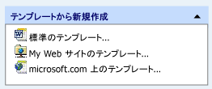

# <a name="cmfctaskspanetaskgroup-class"></a>CMFCTasksPaneTaskGroup クラス
`CMFCTasksPaneTaskGroup`クラスは、ヘルパー クラスによって使用される、 [CMFCTasksPane](../../mfc/reference/cmfctaskspane-class.md)コントロール。 `CMFCTasksPaneTaskGroup` 型のオブジェクトは *タスク グループ*を表します。 タスク グループは、閉じるボタンがある独立したボックスにフレームワークによって表示される項目の一覧です。 このボックスには、オプションのキャプション (グループ名) があります。 グループが閉じると、タスクの一覧は表示されません。  
  
## <a name="syntax"></a>構文  
  
```  
class CMFCTasksPaneTaskGroup : public CObject  
```  
  
## <a name="members"></a>メンバー  
  
### <a name="public-constructors"></a>パブリック コンストラクター  
  
|名前|説明|  
|----------|-----------------|  
|[CMFCTasksPaneTaskGroup::CMFCTasksPaneTaskGroup](#cmfctaskspanetaskgroup)|`CMFCTasksPaneTaskGroup` オブジェクトを構築します。|  
|`CMFCTasksPaneTaskGroup::~CMFCTasksPaneTaskGroup`|デストラクターです。|  
  
### <a name="public-methods"></a>パブリック メソッド  
  
|名前|説明|  
|----------|-----------------|  
|[CMFCTasksPaneTaskGroup::SetACCData](#setaccdata)|現在のタスク グループのアクセシビリティ データを決定します。|  
  
### <a name="data-members"></a>データ メンバー  
  
|名前|説明|  
|----------|-----------------|  
|[CMFCTasksPaneTaskGroup::m_bIsBottom](#m_bisbottom)|タスク グループが作業ウィンドウ コントロールの下部に揃えられているかどうかを判断します。|  
|[CMFCTasksPaneTaskGroup::m_bIsCollapsed](#m_biscollapsed)|タスク グループが折りたたまれているかどうかを判断します。|  
|[CMFCTasksPaneTaskGroup::m_bIsSpecial](#m_bisspecial)|タスク グループがあるかどうかを判断*特殊です。* フレームワークは、別の色で特別なキャプションを表示します。|  
|[CMFCTasksPaneTaskGroup::m_lstTasks](#m_lsttasks)|タスクの内部リストが含まれています。|  
|[CMFCTasksPaneTaskGroup::m_rect](#m_rect)|グループ キャプションの外接する四角形を指定します。|  
|[CMFCTasksPaneTaskGroup::m_rectGroup](#m_rectgroup)|グループの外接する四角形を指定します。|  
|[CMFCTasksPaneTaskGroup::m_strName](#m_strname)|グループの名前を指定します。|  
  
## <a name="remarks"></a>コメント  
 次の図は、展開されたタスク グループを示しています。  
  
   
  
 次の図は、折りたたまれたタスク グループを示しています。  
  
   
  
 次の図は、キャプションのないタスク グループを示しています。  
  
   
  
 次の図は、2 つのタスク グループを示します。 最初のタスク グループはマークされている、特殊なを設定して、`m_bIsSpecial`フラグを`TRUE`、2 番目のタスク グループは特殊ではありません。 最初のタスク グループのキャプションには、2 番目のタスク グループよりも暗い方法に注意してください。  
  
   
  
## <a name="inheritance-hierarchy"></a>継承階層  
 [CObject](../../mfc/reference/cobject-class.md)  
  
 [CMFCTasksPaneTaskGroup](../../mfc/reference/cmfctaskspanetaskgroup-class.md)  
  
## <a name="requirements"></a>要件  
 **ヘッダー:** afxTasksPane.h  
  
##  <a name="cmfctaskspanetaskgroup"></a>  CMFCTasksPaneTaskGroup::CMFCTasksPaneTaskGroup  
 `CMFCTasksPaneTaskGroup` オブジェクトを構築します。  
  
```  
CMFCTasksPaneTaskGroup(
    LPCTSTR lpszName,  
    BOOL bIsBottom,  
    BOOL bIsSpecial=FALSE,  
    BOOL bIsCollapsed=FALSE,  
    CMFCTasksPanePropertyPage* pPage=NULL,  
    HICON hIcon=NULL);
```  
  
### <a name="parameters"></a>パラメーター  
 `lpszName`  
 グループ キャプションのグループの名前を指定します。  
  
 `bIsBottom`  
 グループは作業ウィンドウ コントロールの下部に配置されているかどうかを指定します。  
  
 `bIsSpecial`  
 として、グループを指定するかどうかを示す*特別な*され、異なる色でグループのキャプションが塗りつぶされますかどうかにそのため、します。  
  
 `bIsCollapsed`  
 グループが折りたたまれているかどうかを指定します。  
  
 `pPage`  
 このタスク グループが属するプロパティ ページを指定します。  
  
 `hIcon`  
 グループ キャプションに表示されるアイコンを指定します。  
  
### <a name="remarks"></a>コメント  
  
##  <a name="m_bisbottom"></a>  CMFCTasksPaneTaskGroup::m_bIsBottom  
 タスク グループが作業ウィンドウ コントロールの下部に揃えられているかどうかを判断します。  
  
```  
BOOL m_bIsBottom;  
```  
  
### <a name="remarks"></a>コメント  
 1 つのグループは、作業ウィンドウ コントロールの下部に配置できます。 このタスク グループが最後に追加する必要があります。 詳細については、次を参照してください。 [cmfctaskspane::addgroup](../../mfc/reference/cmfctaskspane-class.md#addgroup)です。  
  
##  <a name="m_biscollapsed"></a>  CMFCTasksPaneTaskGroup::m_bIsCollapsed  
 タスク グループが折りたたまれているかどうかを判断します。  
  
```  
BOOL m_bIsCollapsed;  
```  
  
### <a name="remarks"></a>コメント  
 有効にするにまたはを呼び出すことによって、タスク ウィンドウでグループを折りたたむ機能を無効にすることができます[:enablegroupcollapse](../../mfc/reference/cmfctaskspane-class.md#enablegroupcollapse)です。  
  
##  <a name="m_bisspecial"></a>  CMFCTasksPaneTaskGroup::m_bIsSpecial  
 タスク グループがあるかどうかを判断*特別な*され、それぞれ異なる色で特殊なタスク グループのキャプションを識別する必要があるかどうか。  
  
```  
BOOL m_bIsSpecial;  
```  
  
### <a name="remarks"></a>コメント  
 アプリケーションが Windows XP のビジュアル テーマを使用するかどうかと`m_bIsSpecial`は`FALSE`、フレームワークによって`DrawThemeBackground`で、`EBP_NORMALGROUPBACKGROUND`フラグ。 場合`m_bIsSpecial`は`TRUE`、フレームワークによって`DrawThemeBackground`で、`EBP_SPECIALGROUPBACKGROUND`フラグ。  
  
##  <a name="m_lsttasks"></a>  CMFCTasksPaneTaskGroup::m_lstTasks  
 タスクの内部リストが含まれています。  
  
```  
CObList m_lstTasks;  
```  
  
### <a name="remarks"></a>コメント  
 この一覧に、呼び出す[cmfctaskspane::addtask](../../mfc/reference/cmfctaskspane-class.md#addtask)です。  
  
##  <a name="m_rect"></a>  CMFCTasksPaneTaskGroup::m_rect  
 グループ キャプションの外接する四角形を指定します。  
  
```  
CRect m_rect;  
```  
  
### <a name="remarks"></a>コメント  
 この値は、フレームワークによって自動的に計算されます。  
  
##  <a name="m_rectgroup"></a>  CMFCTasksPaneTaskGroup::m_rectGroup  
 グループの外接する四角形を指定します。  
  
```  
CRect m_rectGroup;  
```  
  
### <a name="remarks"></a>コメント  
 この値は、フレームワークによって自動的に計算されます。  
  
##  <a name="m_strname"></a>  CMFCTasksPaneTaskGroup::m_strName  
 グループの名前を指定します。  
  
```  
CString m_strName;  
```  
  
### <a name="remarks"></a>コメント  
 この値が空の場合は、グループ キャプションは表示されず、グループを折りたたみ可能にすることはできません。  
  
##  <a name="setaccdata"></a>  CMFCTasksPaneTaskGroup::SetACCData  
 現在のタスク グループのアクセシビリティ データを決定します。  
  
```  
virtual BOOL SetACCData(
    CWnd* pParent,  
    CAccessibilityData& data);
```  
  
### <a name="parameters"></a>パラメーター  
 [入力] `pParent`  
 現在のタスク グループの親ウィンドウを表します。  
  
 [出力] `data`  
 型のオブジェクト`CAccessibilityData`の現在のタスク グループのユーザー補助データに設定されます。  
  
### <a name="return-value"></a>戻り値  
 `TRUE` 場合、`data`パラメーターが正常に設定された状態の現在のタスク グループのユーザー補助データで、それ以外の`FALSE`します。  
  
## <a name="see-also"></a>関連項目  
 [階層図](../../mfc/hierarchy-chart.md)   
 [クラス](../../mfc/reference/mfc-classes.md)   
 [CMFCTasksPane クラス](../../mfc/reference/cmfctaskspane-class.md)   
 [CMFCTasksPaneTask クラス](../../mfc/reference/cmfctaskspanetask-class.md)   
 [CMFCOutlookBar クラス](../../mfc/reference/cmfcoutlookbar-class.md)   
 [CObject クラス](../../mfc/reference/cobject-class.md)
