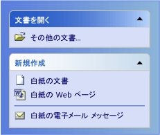

# <a name="cmfctaskspanetaskgroup-class"></a>CMFCTasksPaneTaskGroup クラス
`CMFCTasksPaneTaskGroup`クラスで使用されるヘルパー クラスであり、 [CMFCTasksPane](../../mfc/reference/cmfctaskspane-class.md)コントロールです。 `CMFCTasksPaneTaskGroup` 型のオブジェクトは *タスク グループ*を表します。 タスク グループは、閉じるボタンがある独立したボックスにフレームワークによって表示される項目の一覧です。 このボックスには、オプションのキャプション (グループ名) があります。 グループが閉じると、タスクの一覧は表示されません。  
  
## <a name="syntax"></a>構文  
  
```  
class CMFCTasksPaneTaskGroup : public CObject  
```  
  
## <a name="members"></a>メンバー  
  
### <a name="public-constructors"></a>パブリック コンストラクター  
  
|名前|説明|  
|----------|-----------------|  
|[CMFCTasksPaneTaskGroup::CMFCTasksPaneTaskGroup](#cmfctaskspanetaskgroup)|`CMFCTasksPaneTaskGroup` オブジェクトを構築します。|  
|`CMFCTasksPaneTaskGroup::~CMFCTasksPaneTaskGroup`|デストラクターです。|  
  
### <a name="public-methods"></a>パブリック メソッド  
  
|名前|説明|  
|----------|-----------------|  
|[CMFCTasksPaneTaskGroup::SetACCData](#setaccdata)|現在のタスク グループのユーザー補助データを決定します。|  
  
### <a name="data-members"></a>データ メンバー  
  
|名前|説明|  
|----------|-----------------|  
|[CMFCTasksPaneTaskGroup::m_bIsBottom](#m_bisbottom)|タスク グループはタスク ペインのコントロールの下部に配置されているかどうかを決定します。|  
|[CMFCTasksPaneTaskGroup::m_bIsCollapsed](#m_biscollapsed)|タスク グループが折りたたまれているかどうかを決定します。|  
|[CMFCTasksPaneTaskGroup::m_bIsSpecial](#m_bisspecial)|タスク グループがあるかどうかを判断*特殊です。* フレームワークは、別の色で特別なキャプションを表示します。|  
|[CMFCTasksPaneTaskGroup::m_lstTasks](#m_lsttasks)|タスクの内部の一覧が含まれています。|  
|[CMFCTasksPaneTaskGroup::m_rect](#m_rect)|グループのキャプションの外接する四角形を指定します。|  
|[CMFCTasksPaneTaskGroup::m_rectGroup](#m_rectgroup)|グループの外接する四角形を指定します。|  
|[CMFCTasksPaneTaskGroup::m_strName](#m_strname)|グループの名前を指定します。|  
  
## <a name="remarks"></a>コメント  
 次の図は、展開されたタスク グループを示しています。  
  
   
  
 次の図は、折りたたまれたタスク グループを示しています。  
  
   
  
 次の図は、キャプションのないタスク グループを示しています。  
  
   
  
 次の図は、2 つのタスク グループを示します。 最初のタスク グループは、特別な設定マーク、`m_bIsSpecial`フラグを`TRUE`、2 番目のタスク グループは特別ではありません。 最初のタスク グループのキャプションの&2; 番目のタスク グループよりも暗い方法に注意してください。  
  
   
  
## <a name="inheritance-hierarchy"></a>継承階層  
 [CObject](../../mfc/reference/cobject-class.md)  
  
 [CMFCTasksPaneTaskGroup](../../mfc/reference/cmfctaskspanetaskgroup-class.md)  
  
## <a name="requirements"></a>要件  
 **ヘッダー:** afxTasksPane.h  
  
##  <a name="cmfctaskspanetaskgroup"></a>CMFCTasksPaneTaskGroup::CMFCTasksPaneTaskGroup  
 `CMFCTasksPaneTaskGroup` オブジェクトを構築します。  
  
```  
CMFCTasksPaneTaskGroup(
    LPCTSTR lpszName,  
    BOOL bIsBottom,  
    BOOL bIsSpecial=FALSE,  
    BOOL bIsCollapsed=FALSE,  
    CMFCTasksPanePropertyPage* pPage=NULL,  
    HICON hIcon=NULL);
```  
  
### <a name="parameters"></a>パラメーター  
 `lpszName`  
 グループのキャプションでグループの名前を指定します。  
  
 `bIsBottom`  
 グループはタスク ペインのコントロールの下部に配置されているかどうかを指定します。  
  
 `bIsSpecial`  
 グループとして指定されているかどうかを指定*特別な*異なる色でグループのキャプションが塗りつぶされたかどうかにこのようにとします。  
  
 `bIsCollapsed`  
 グループが折りたたまれているかどうかを指定します。  
  
 `pPage`  
 このタスク グループに属している、プロパティ ページを指定します。  
  
 `hIcon`  
 グループのキャプションに表示するアイコンを指定します。  
  
### <a name="remarks"></a>コメント  
  
##  <a name="m_bisbottom"></a>CMFCTasksPaneTaskGroup::m_bIsBottom  
 タスク グループはタスク ペインのコントロールの下部に配置されているかどうかを決定します。  
  
```  
BOOL m_bIsBottom;  
```  
  
### <a name="remarks"></a>コメント  
 1 つのグループは、作業ウィンドウ コントロールの下に配置できます。 このタスク グループは、最後に追加する必要があります。 詳細については、次を参照してください。 [CMFCTasksPane::AddGroup](../../mfc/reference/cmfctaskspane-class.md#addgroup)します。  
  
##  <a name="m_biscollapsed"></a>CMFCTasksPaneTaskGroup::m_bIsCollapsed  
 タスク グループが折りたたまれているかどうかを決定します。  
  
```  
BOOL m_bIsCollapsed;  
```  
  
### <a name="remarks"></a>コメント  
 有効にするかを呼び出すことによって、タスク ウィンドウでグループを折りたたむ機能を無効にする[CMFCTasksPane::EnableGroupCollapse](../../mfc/reference/cmfctaskspane-class.md#enablegroupcollapse)します。  
  
##  <a name="m_bisspecial"></a>CMFCTasksPaneTaskGroup::m_bIsSpecial  
 タスク グループがあるかどうかを判断*特別な*異なる色で特殊なタスク グループのキャプションを指定するかどうか。  
  
```  
BOOL m_bIsSpecial;  
```  
  
### <a name="remarks"></a>コメント  
 アプリケーションが Windows XP のテーマを使用していると`m_bIsSpecial`は`FALSE`、フレームワークによって`DrawThemeBackground`で、`EBP_NORMALGROUPBACKGROUND`フラグ。 場合`m_bIsSpecial`は`TRUE`、フレームワークによって`DrawThemeBackground`で、`EBP_SPECIALGROUPBACKGROUND`フラグ。  
  
##  <a name="m_lsttasks"></a>CMFCTasksPaneTaskGroup::m_lstTasks  
 タスクの内部の一覧が含まれています。  
  
```  
CObList m_lstTasks;  
```  
  
### <a name="remarks"></a>コメント  
 この一覧に、呼び出す[CMFCTasksPane::AddTask](../../mfc/reference/cmfctaskspane-class.md#addtask)します。  
  
##  <a name="m_rect"></a>CMFCTasksPaneTaskGroup::m_rect  
 グループのキャプションの外接する四角形を指定します。  
  
```  
CRect m_rect;  
```  
  
### <a name="remarks"></a>コメント  
 この値は、フレームワークによって自動的に計算されます。  
  
##  <a name="m_rectgroup"></a>CMFCTasksPaneTaskGroup::m_rectGroup  
 グループの外接する四角形を指定します。  
  
```  
CRect m_rectGroup;  
```  
  
### <a name="remarks"></a>コメント  
 この値は、フレームワークによって自動的に計算されます。  
  
##  <a name="m_strname"></a>CMFCTasksPaneTaskGroup::m_strName  
 グループの名前を指定します。  
  
```  
CString m_strName;  
```  
  
### <a name="remarks"></a>コメント  
 この値が空の場合は、グループのキャプションは表示されず、グループを折りたたむことができません。  
  
##  <a name="setaccdata"></a>CMFCTasksPaneTaskGroup::SetACCData  
 現在のタスク グループのユーザー補助データを決定します。  
  
```  
virtual BOOL SetACCData(
    CWnd* pParent,  
    CAccessibilityData& data);
```  
  
### <a name="parameters"></a>パラメーター  
 [入力] `pParent`  
 現在のタスク グループの親ウィンドウを表します。  
  
 [出力] `data`  
 型のオブジェクト`CAccessibilityData`の現在のタスク グループのユーザー補助データが格納されています。  
  
### <a name="return-value"></a>戻り値  
 `TRUE`場合、`data`パラメーターが正常に現在のタスク グループのユーザー補助データに指定されているそれ以外の場合、`FALSE`です。  
  
## <a name="see-also"></a>関連項目  
 [階層図](../../mfc/hierarchy-chart.md)   
 [クラス](../../mfc/reference/mfc-classes.md)   
 [CMFCTasksPane クラス](../../mfc/reference/cmfctaskspane-class.md)   
 [CMFCTasksPaneTask クラス](../../mfc/reference/cmfctaskspanetask-class.md)   
 [あります。](../../mfc/reference/cmfcoutlookbar-class.md)   
 [CObject クラス](../../mfc/reference/cobject-class.md)

