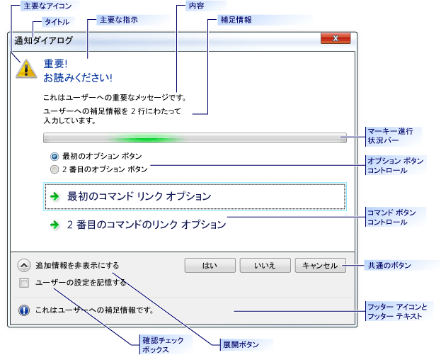

# CTaskDialog クラス
[!INCLUDE[vs2017banner](../../assembler/inline/includes/vs2017banner.md)]

メッセージ ボックスのような機能を持つだけでなく、ユーザーに対する追加情報も表示できる、ポップアップ ダイアログ ボックスです。  `CTaskDialog` には、ユーザーから情報を収集するための機能も用意されています。  
  
## 構文  
  
```  
class CTaskDialog : public CObject  
```  
  
## メンバー  
  
### コンストラクター  
  
|||  
|-|-|  
|[CTaskDialog::CTaskDialog](../Topic/CTaskDialog::CTaskDialog.md)|`CTaskDialog` オブジェクトを構築します。|  
  
### メソッド  
  
|||  
|-|-|  
|[CTaskDialog::AddCommandControl](../Topic/CTaskDialog::AddCommandControl.md)|`CTaskDialog` にコマンド ボタン コントロールを追加します。|  
|[CTaskDialog::AddRadioButton](../Topic/CTaskDialog::AddRadioButton.md)|`CTaskDialog` にオプション ボタンを追加します。|  
|[CTaskDialog::ClickCommandControl](../Topic/CTaskDialog::ClickCommandControl.md)|コマンド ボタン コントロールまたはコモン ボタンをプログラムからクリックします。|  
|[CTaskDialog::ClickRadioButton](../Topic/CTaskDialog::ClickRadioButton.md)|プログラムによってオプション ボタンをクリックします。|  
|[CTaskDialog::DoModal](../Topic/CTaskDialog::DoModal.md)|`CTaskDialog` を表示します。|  
|[CTaskDialog::GetCommonButtonCount](../Topic/CTaskDialog::GetCommonButtonCount.md)|使用可能なコモン ボタンの数を取得します。|  
|[CTaskDialog::GetCommonButtonFlag](../Topic/CTaskDialog::GetCommonButtonFlag.md)|標準 Windows ボタンを、`CTaskDialog` クラスに関連付けられたコモン ボタン型に変換します。|  
|[CTaskDialog::GetCommonButtonId](../Topic/CTaskDialog::GetCommonButtonId.md)|`CTaskDialog` クラスに関連付けられたコモン ボタン型の 1 つを、標準 Windows ボタンに変換します。|  
|[CTaskDialog::GetOptions](../Topic/CTaskDialog::GetOptions.md)|この `CTaskDialog` のオプション フラグを返します。|  
|[CTaskDialog::GetSelectedCommandControlID](../Topic/CTaskDialog::GetSelectedCommandControlID.md)|選択されたコマンド ボタン コントロールを返します。|  
|[CTaskDialog::GetSelectedRadioButtonID](../Topic/CTaskDialog::GetSelectedRadioButtonID.md)|選択されたオプション ボタンを返します。|  
|[CTaskDialog::GetVerificationCheckboxState](../Topic/CTaskDialog::GetVerificationCheckboxState.md)|確認のチェック ボックスの状態を取得します。|  
|[CTaskDialog::IsCommandControlEnabled](../Topic/CTaskDialog::IsCommandControlEnabled.md)|コマンド ボタン コントロールまたはコモン ボタンが有効かどうかを調べます。|  
|[CTaskDialog::IsRadioButtonEnabled](../Topic/CTaskDialog::IsRadioButtonEnabled.md)|オプション ボタンが有効かどうかを調べます。|  
|[CTaskDialog::IsSupported](../Topic/CTaskDialog::IsSupported.md)|アプリケーションが実行されているコンピューターで `CTaskDialog` がサポートされているかどうかを判断します。|  
|[CTaskDialog::LoadCommandControls](../Topic/CTaskDialog::LoadCommandControls.md)|ストリング テーブルのデータを使用して、コマンド ボタン コントロールを追加します。|  
|[CTaskDialog::LoadRadioButtons](../Topic/CTaskDialog::LoadRadioButtons.md)|ストリング テーブルのデータを使用して、オプション ボタンを追加します。|  
|[CTaskDialog::NavigateTo](../Topic/CTaskDialog::NavigateTo.md)|フォーカスを別の `CTaskDialog` に移動します。|  
|[CTaskDialog::OnCommandControlClick](../Topic/CTaskDialog::OnCommandControlClick.md)|ユーザーがコマンド ボタン コントロールをクリックしたときに、フレームワークによってこのメソッドが呼び出されます。|  
|[CTaskDialog::OnCreate](../Topic/CTaskDialog::OnCreate.md)|`CTaskDialog` が作成されると、フレームワークによってこのメソッドが呼び出されます。|  
|[CTaskDialog::OnDestroy](../Topic/CTaskDialog::OnDestroy.md)|`CTaskDialog` を破棄する直前に、フレームワークによってこのメソッドが呼び出されます。|  
|[CTaskDialog::OnExpandButtonClick](../Topic/CTaskDialog::OnExpandButtonClick.md)|ユーザーが展開ボタンをクリックしたときに、フレームワークによってこのメソッドが呼び出されます。|  
|[CTaskDialog::OnHelp](../Topic/CTaskDialog::OnHelp.md)|ユーザーがヘルプを表示するときに、フレームワークによってこのメソッドが呼び出されます。|  
|[CTaskDialog::OnHyperlinkClick](../Topic/CTaskDialog::OnHyperlinkClick.md)|ユーザーがハイパーリンクをクリックしたときに、フレームワークによってこのメソッドが呼び出されます。|  
|[CTaskDialog::OnInit](../Topic/CTaskDialog::OnInit.md)|`CTaskDialog` が初期化されたときに、フレームワークによってこのメソッドが呼び出されます。|  
|[CTaskDialog::OnNavigatePage](../Topic/CTaskDialog::OnNavigatePage.md)|ユーザーが `CTaskDialog` 上のコントロールに関連してフォーカスを移動したときに、フレームワークによってこのメソッドが呼び出されます。|  
|[CTaskDialog::OnRadioButtonClick](../Topic/CTaskDialog::OnRadioButtonClick.md)|ユーザーがオプション ボタン コントロールをクリックしたときに、フレームワークによってこのメソッドが呼び出されます。|  
|[CTaskDialog::OnTimer](../Topic/CTaskDialog::OnTimer.md)|タイマーの時間が経過したときに、フレームワークによってこのメソッドが呼び出されます。|  
|[CTaskDialog::OnVerificationCheckboxClick](../Topic/CTaskDialog::OnVerificationCheckboxClick.md)|ユーザーが確認のチェック ボックスをオンまたはオフにしたときに、フレームワークによってこのメソッドが呼び出されます。|  
|[CTaskDialog::RemoveAllCommandControls](../Topic/CTaskDialog::RemoveAllCommandControls.md)|`CTaskDialog` のコマンド コントロールをすべて削除します。|  
|[CTaskDialog::RemoveAllRadioButtons](../Topic/CTaskDialog::RemoveAllRadioButtons.md)|`CTaskDialog` のオプション ボタンをすべて削除します。|  
|[CTaskDialog::SetCommandControlOptions](../Topic/CTaskDialog::SetCommandControlOptions.md)|`CTaskDialog` のコマンド ボタン コントロールを更新します。|  
|[CTaskDialog::SetCommonButtonOptions](../Topic/CTaskDialog::SetCommonButtonOptions.md)|コモン ボタンのサブセットを更新して有効にし、UAC 昇格を要求します。|  
|[CTaskDialog::SetCommonButtons](../Topic/CTaskDialog::SetCommonButtons.md)|`CTaskDialog` にコモン ボタンを追加します。|  
|[CTaskDialog::SetContent](../Topic/CTaskDialog::SetContent.md)|`CTaskDialog` のコンテンツを更新します。|  
|[CTaskDialog::SetDefaultCommandControl](../Topic/CTaskDialog::SetDefaultCommandControl.md)|既定のコマンド ボタン コントロールを指定します。|  
|[CTaskDialog::SetDefaultRadioButton](../Topic/CTaskDialog::SetDefaultRadioButton.md)|既定のオプション ボタンを指定します。|  
|[CTaskDialog::SetDialogWidth](../Topic/CTaskDialog::SetDialogWidth.md)|`CTaskDialog` の幅を調整します。|  
|[CTaskDialog::SetExpansionArea](../Topic/CTaskDialog::SetExpansionArea.md)|`CTaskDialog` の展開領域を更新します。|  
|[CTaskDialog::SetFooterIcon](../Topic/CTaskDialog::SetFooterIcon.md)|`CTaskDialog` のフッター アイコンを更新します。|  
|[CTaskDialog::SetFooterText](../Topic/CTaskDialog::SetFooterText.md)|`CTaskDialog` のフッターのテキストを更新します。|  
|[CTaskDialog::SetMainIcon](../Topic/CTaskDialog::SetMainIcon.md)|`CTaskDialog` のメイン アイコンを更新します。|  
|[CTaskDialog::SetMainInstruction](../Topic/CTaskDialog::SetMainInstruction.md)|`CTaskDialog` のメインの命令を更新します。|  
|[CTaskDialog::SetOptions](../Topic/CTaskDialog::SetOptions.md)|`CTaskDialog` のオプションを構成します。|  
|[CTaskDialog::SetProgressBarMarquee](../Topic/CTaskDialog::SetProgressBarMarquee.md)|`CTaskDialog` のマーキー バーを構成し、それをダイアログ ボックスに追加します。|  
|[CTaskDialog::SetProgressBarPosition](../Topic/CTaskDialog::SetProgressBarPosition.md)|プログレス バーの位置を調整します。|  
|[CTaskDialog::SetProgressBarRange](../Topic/CTaskDialog::SetProgressBarRange.md)|プログレス バーの範囲を調整します。|  
|[CTaskDialog::SetProgressBarState](../Topic/CTaskDialog::SetProgressBarState.md)|プログレス バーの状態を設定し、それを `CTaskDialog` に表示します。|  
|[CTaskDialog::SetRadioButtonOptions](../Topic/CTaskDialog::SetRadioButtonOptions.md)|オプション ボタンを有効または無効にします。|  
|[CTaskDialog::SetVerificationCheckbox](../Topic/CTaskDialog::SetVerificationCheckbox.md)|確認のチェック ボックスをオンの状態に設定します。|  
|[CTaskDialog::SetVerificationCheckboxText](../Topic/CTaskDialog::SetVerificationCheckboxText.md)|確認のチェック ボックスの右側にテキストを設定します。|  
|[CTaskDialog::SetWindowTitle](../Topic/CTaskDialog::SetWindowTitle.md)|`CTaskDialog` のタイトルを設定します。|  
|[CTaskDialog::ShowDialog](../Topic/CTaskDialog::ShowDialog.md)|`CTaskDialog` を作成して表示します。|  
|[CTaskDialog::TaskDialogCallback](../Topic/CTaskDialog::TaskDialogCallback.md)|さまざまな Windows メッセージへの応答として、フレームワークによって呼び出されます。|  
  
### データ メンバー  
  
|||  
|-|-|  
|`m_aButtons`|`CTaskDialog` 用のコマンド ボタン コントロールの配列。|  
|`m_aRadioButtons`|`CTaskDialog` 用のオプション ボタン コントロールの配列。|  
|`m_bVerified`|確認のチェック ボックスがオンになっている場合は `TRUE`、オンになっていない場合は `FALSE`。|  
|`m_footerIcon`|`CTaskDialog` のフッター内のアイコン。|  
|`m_hWnd`|`CTaskDialog` のウィンドウに対するハンドル。|  
|`m_mainIcon`|`CTaskDialog` のメイン アイコン。|  
|`m_nButtonDisabled`|無効にするコモン ボタンを指定するマスク。|  
|`m_nButtonElevation`|UAC 昇格を必要とするコモン ボタンを指定するマスク。|  
|`m_nButtonId`|選択されたコマンド ボタン コントロールの ID。|  
|`m_nCommonButton`|`CTaskDialog` に表示されるコモン ボタンを指定するマスク。|  
|`m_nDefaultCommandControl`|`CTaskDialog` が表示されるときに選択されるコマンド ボタン コントロールの ID。|  
|`m_nDefaultRadioButton`|`CTaskDialog` が表示されるときに選択されるオプション ボタン コントロールの ID。|  
|`m_nFlags`|`CTaskDialog` のオプションを指定するマスク。|  
|`m_nProgressPos`|プログレス バーの現在の位置。  この値の有効値の範囲は `m_nProgressRangeMin` ～ `m_nProgressRangeMax` です。|  
|`m_nProgressRangeMax`|プログレス バーの最大値。|  
|`m_nProgressRangeMin`|プログレス バーの最小値。|  
|`m_nProgressState`|プログレス バーの状態。  詳細については、「[CTaskDialog::SetProgressBarState](../Topic/CTaskDialog::SetProgressBarState.md)」を参照してください。|  
|`m_nRadioId`|選択されたオプション ボタン コントロールの ID。|  
|`m_nWidth`|`CTaskDialog` の幅 \(ピクセル単位\)。|  
|`m_strCollapse`|`CTaskDialog` で展開された情報が非表示になっているときに展開ボックスの右側に表示される文字列。|  
|`m_strContent`|`CTaskDialog` のコンテンツ文字列。|  
|`m_strExpand`|`CTaskDialog` で展開された情報が表示されているときに展開ボックスの右側に表示される文字列。|  
|`m_strFooter`|`CTaskDialog` のフッター。|  
|`m_strInformation`|`CTaskDialog` の展開された情報。|  
|`m_strMainInstruction`|`CTaskDialog` のメインの命令。|  
|`m_strTitle`|`CTaskDialog` のタイトル。|  
|`m_strVerification`|`CTaskDialog` で確認のチェック ボックスの右側に表示される文字列。|  
  
## 解説  
 `CTaskDialog` クラスは、標準 Windows メッセージ ボックスに置き換わるものであり、ユーザーから情報を収集する新しいコントロールなどの追加機能を備えています。  このクラスは、[!INCLUDE[vs_dev10_long](../../build/includes/vs_dev10_long_md.md)] の MFC ライブラリ内にあります。  `CTaskDialog` を使用できるのは、[!INCLUDE[wiprlhext](../../c-runtime-library/reference/includes/wiprlhext_md.md)] 以降です。  それより前のバージョンの Windows では、`CTaskDialog` オブジェクトを表示できません。  現在のユーザーがタスク ダイアログ ボックスを表示できるかどうかを実行時に判別するには、`CTaskDialog::IsSupported` を使用します。  標準 Windows メッセージ ボックスは、[!INCLUDE[vs_dev10_long](../../build/includes/vs_dev10_long_md.md)] でも引き続きサポートされています。  
  
 `CTaskDialog` を使用できるのは、Unicode ライブラリを使用してアプリケーションをビルドするときのみです。  
  
 `CTaskDialog` には、2 つのコンストラクターがあります。  1 つのコンストラクターでは、2 個のコマンド ボタンと最大 6 個の標準ボタン コントロールを指定できます。  `CTaskDialog` の作成後に、さらに多くのコマンド ボタンを追加することができます。  もう 1 つのコンストラクターでは、コマンド ボタンはサポートされていませんが、標準ボタン コントロールを無制限に追加できます。  コンストラクターの詳細については、「[CTaskDialog::CTaskDialog](../Topic/CTaskDialog::CTaskDialog.md)」を参照してください。  
  
 次の図は、一部のコントロールの位置を示す `CTaskDialog` のサンプルです。  
  
   
CTaskDialog のサンプル  
  
## 必要条件  
 **最低限必要なオペレーティング システム:** [!INCLUDE[wiprlhext](../../c-runtime-library/reference/includes/wiprlhext_md.md)]  
  
 **ヘッダー:** afxtaskdialog.h  
  
## 参照  
 [クラス](../Topic/MFC%20Classes.md)   
 [CObject クラス](../Topic/CObject%20Class.md)   
 [階層図](../../mfc/hierarchy-chart.md)   
 [チュートリアル: アプリケーションへの CTaskDialog の追加](../../mfc/walkthrough-adding-a-ctaskdialog-to-an-application.md)