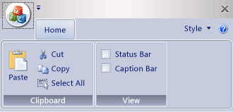
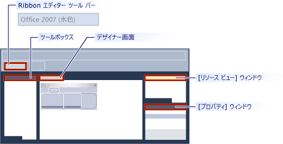
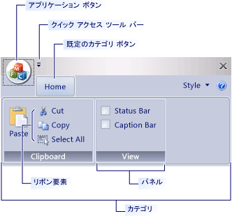

# リボン デザイナー (MFC)
[!INCLUDE[vs2017banner](../assembler/inline/includes/vs2017banner.md)]

リボン デザイナーを使用すると、MFC アプリケーションでリボンを作成してカスタマイズできます。  リボンは、複数のコマンドを 1 つの論理グループにまとめたユーザー インターフェイス \(UI\) 要素です。  これらのグループは、ウィンドウの上部に水平に並んで表示されるタブに別々に表示されます。  リボンは、メニュー バーとツール バーの代わりに表示されます。  リボンは、アプリケーションの使用性を大幅に向上させます。  詳細については、「[リボン](http://go.microsoft.com/fwlink/?LinkId=129233)」を参照してください。  リボンを次の図に示します。  
  
   
  
 Visual Studio の旧バージョンでは、リボンを作成するために [CMFCRibbonBar クラス](../mfc/reference/cmfcribbonbar-class.md)などの MFC リボン クラスを使用するコードを記述する必要がありました。  [!INCLUDE[vs_dev10_long](../build/includes/vs_dev10_long_md.md)] のリボン デザイナーには、リボンを作成するための別の方法が用意されています。 最初に、リボンをリソースとして作成およびカスタマイズします。  次に、リボン リソースを MFC アプリケーションのコードから読み込みます。  リボン リソースと MFC リボン クラスを同時に使用することもできます。  たとえば、リボン リソースを作成しておき、実行時にコードを使用して要素を追加できます。  
  
## リボン デザイナーについて  
 リボン デザイナーは、リボンをリソースとして作成および保存します。  リボン リソースを作成すると、リボン デザイナーによって次の 3 つの操作が行われます。  
  
-   プロジェクト リソース定義スクリプト \(\*.rc\) にエントリを追加する。  次の例では、`IDR_RIBBON` はリボン リソースを識別する一意の名前、`RT_RIBBON_XML` はリボン リソースの種類、`ribbon.mfcribbon-ms` はリソース ファイルの名前です。  
  
    ```  
    IDR_RIBBON             RT_RIBBON_XML                      "res\\ribbon.mfcribbon-ms"  
    ```  
  
-   コマンド ID の定義を resource.h に追加する。  
  
    ```  
    #define IDR_RIBBON            307  
    ```  
  
-   リボンのボタン、コントロール、および属性を定義する XML コードを含むリボン リソース ファイル \(\*.mfcribbon\-ms\) を作成する。  リボン デザイナーで行ったリボンの変更は、リソース ファイルに XML として保存されます。  次のコード例は、\*.mfcribbon\-ms ファイルの内容の一部を示しています。  
  
    ```  
    <RIBBON_BAR>  
      <ELEMENT_NAME>RibbonBar</ELEMENT_NAME>  
      <IMAGE>  
        <ID>  
          <NAME>IDB_BUTTONS</NAME>  
          <VALUE>113</VALUE>  
        </ID> …  
    ```  
  
 MFC アプリケーションでリボン リソースを使用するには、[CMFCRibbonBar::LoadFromResource](../Topic/CMFCRibbonBar::LoadFromResource.md) を呼び出してリボン リソースを読み込みます。  
  
## リボン デザイナーを使用したリボンの作成  
 リボン リソースを MFC プロジェクトに追加する方法は 2 つあります。  
  
-   MFC アプリケーションを作成し、リボンを作成するように MFC プロジェクト ウィザードを構成する。  詳細については、「[チュートリアル: MFC によるリボン アプリケーションの作成](../mfc/walkthrough-creating-a-ribbon-application-by-using-mfc.md)」を参照してください。  
  
-   既存の MFC プロジェクトにリボン リソースを作成し、それを読み込む。  詳細については、「[チュートリアル: MFC Scribble アプリケーションの更新 \(パート 1\)](../mfc/walkthrough-updating-the-mfc-scribble-application-part-1.md)」を参照してください。  
  
 プロジェクトに手動でコード化されたリボンが既に存在する場合でも、MFC には既存のリボンをリボン リソースに変換するために使用できる機能が用意されています。  詳細については、「[方法: 既存の MFC リボンをリボン リソースに変換する](../mfc/how-to-convert-an-existing-mfc-ribbon-to-a-ribbon-resource.md)」を参照してください。  
  
> [!NOTE]
>  リボンはダイアログ ベースのアプリケーションには作成できません。  詳細については、「[\[アプリケーションの種類\] \(MFC アプリケーション ウィザード\)](../Topic/Application%20Type,%20MFC%20Application%20Wizard.md)」を参照してください。  
  
## リボンのカスタマイズ  
 リボン デザイナーでリボンを開くには、リソース ビューでリボン リソースをダブルクリックします。  デザイナーでは、リボン、アプリケーション ボタン、またはクイック アクセス ツール バーに対する要素の追加、削除、およびカスタマイズを実行できます。  さらに、イベント \(ボタン クリック イベントやメニュー イベントなど\) をアプリケーション内のメソッドにリンクできます。  
  
 リボン デザイナーのさまざまなコンポーネントを次の図に示します。  
  
   
  
-   **ツールボックス:** デザイナー画面にドラッグできるコントロールが含まれます。  
  
-   **デザイナー画面:** リボン リソースの視覚表現が含まれます。  
  
-   **プロパティ ウィンドウ:** デザイナー画面で選択されている項目の属性を一覧表示します。  
  
-   **リソース ビュー ウィンドウ:** プロジェクト内のリボン リソースを含むリソースを表示します。  
  
-   **リボン エディター ツール バー:** リボンのプレビューやビジュアル テーマの変更を実行できるコマンドが含まれます。  
  
 次のトピックでは、リボン デザイナーの機能の使用方法について説明します。  
  
-   [方法: アプリケーション ボタンをカスタマイズする](../mfc/how-to-customize-the-application-button.md)  
  
-   [方法: クイック アクセス ツール バーをカスタマイズする](../mfc/how-to-customize-the-quick-access-toolbar.md)  
  
-   [方法: リボン コントロールとイベント ハンドラーを追加する](../mfc/how-to-add-ribbon-controls-and-event-handlers.md)  
  
-   [方法: MFC アプリケーションからリボン リソースを読み込む](../mfc/how-to-load-a-ribbon-resource-from-an-mfc-application.md)  
  
## リボン要素の定義  
   
  
-   **アプリケーション ボタン:** リボンの左上隅に表示されるボタン。  アプリケーション ボタンは \[ファイル\] メニューの代わりに表示され、リボンが最小化されている場合でも表示されます。  このボタンをクリックすると、コマンド リストを含むメニューが表示されます。  
  
-   **クイック アクセス ツール バー:** 使用頻度が高いコマンドを表示する、小型のカスタマイズ可能なツール バー。  
  
-   **カテゴリ:**: リボン タブの内容を表す論理的なグループ。  
  
-   **カテゴリの既定のボタン:** リボンを最小化したときにリボンに表示されるボタン。  このボタンをクリックすると、カテゴリがメニューとして再表示されます。  
  
-   **パネル:** 関連するコントロールのグループを表示するリボン バーの領域。  すべてのリボン カテゴリには、1 つ以上のリボン パネルが含まれます。  
  
-   **リボン要素:** パネル内のコントロール \(ボタンやコンボ ボックスなど\)。  リボンにホストできるさまざまなコントロールを確認するには、「[RibbonGadgets Sample: Ribbon Gadgets Application \(RibbonGadgets サンプル : Ribbon Gadgets アプリケーション\)](../top/visual-cpp-samples.md)」を参照してください。  
  
## 参照  
 [ユーザー インターフェイス要素](../mfc/user-interface-elements-mfc.md)   
 [Working with Resource Files](../mfc/working-with-resource-files.md)