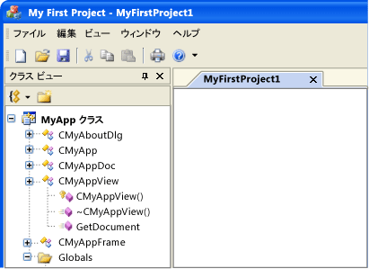
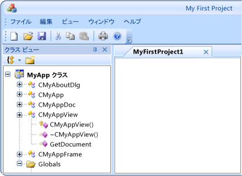

# <a name="visualization-manager"></a>ビジュアル マネージャー

ビジュアル マネージャーは、アプリケーション全体の外観を制御するオブジェクトです。 1 つのクラスとして機能、アプリケーションのすべての描画コードを配置することができます。 MFC ライブラリには、いくつかのビジュアル マネージャーが含まれています。 アプリケーションのカスタム ビューを作成する場合、独自のビジュアル マネージャーを作成することもできます。 次の図は、異なるビジュアル マネージャーが有効にすると、同じアプリケーションを示してください。

 MyApp CMFCVisualManagerWindows ビジュアル マネージャーを使用します。

 MyApp CMFCVisualManagerVS2005 ビジュアル マネージャーを使用します。

 MyApp CMFCVisualManagerOfficeXP ビジュアル マネージャーを使用します。

 MyApp CMFCVisualManagerOffice2003 ビジュアル マネージャーを使用します。

 MyApp CMFCVisualManagerOffice2007 ビジュアル マネージャーを使用します。

既定では、ビジュアル マネージャーは、いくつかの GUI 要素の描画コードを保持します。 カスタムの UI 要素を提供するには、ビジュアル マネージャーの関連の描画メソッドをオーバーライドする必要があります。 これらのメソッドの一覧で、次を参照してください。 [CMFCVisualManager クラス](../mfc/reference/cmfcvisualmanager-class.md)します。 カスタムの外観を提供するオーバーライドできるメソッドで始まるすべてのメソッド`OnDraw`します。

アプリケーションがある 1 つだけ`CMFCVisualManager`オブジェクト。 アプリケーションのビジュアル マネージャーへのポインターを取得するには、静的関数を呼び出す[CMFCVisualManager::GetInstance](../mfc/reference/cmfcvisualmanager-class.md#getinstance)します。 すべてのビジュアル マネージャーが継承するので`CMFCVisualManager`、`CMFCVisualManager::GetInstance`メソッドのカスタム ビジュアル マネージャーを作成する場合でも、適切なビジュアル マネージャーにポインターが取得されます。

カスタム ビジュアル マネージャーを作成する場合は、既に存在するビジュアル マネージャーから派生する必要があります。 既定のクラスから派生する`CMFCVisualManager`します。 ただしより、アプリケーションに必要なものを表している場合は、さまざまなビジュアル マネージャーを使用できます。 使用する場合など、`CMFCVisualManagerOffice2007`ビジュアルのマネージャーが区切り記号を検索する方法を変更するときだけからカスタム クラスを派生させることが`CMFCVisualManagerOffice2007`します。 このシナリオでの区切り記号を描画するためのメソッドのみを上書きする必要があります。

アプリケーションの特定のビジュアル マネージャーを使用する 2 つの可能な方法はあります。 呼び出す方法の 1 つは、 [cmfcvisualmanager::setdefaultmanager](../mfc/reference/cmfcvisualmanager-class.md#setdefaultmanager)メソッドをパラメーターとして適切なビジュアル マネージャーを渡します。 次のコード例は、の使用方法を示しています、`CMFCVisualManagerVS2005`このメソッドを使用してビジュアル マネージャー。

```cpp
CMFCVisualManager::SetDefaultManager (RUNTIME_CLASS (CMFCVisualManagerVS2005));
```

アプリケーションでは、ビジュアル マネージャーを使用するその他の方法は、手動で作成します。 すべてのレンダリングに、この新しいビジュアル マネージャーをアプリケーションで使用されます。 ただし、1 つだけありますので`CMFCVisualManager`アプリケーション、オブジェクトの新しいものを作成する前に、現在のビジュアル マネージャーを削除する必要があります。 次の例では、`CMyVisualManager`から派生したカスタム ビジュアル マネージャーは、`CMFCVisualManager`します。 次のメソッドは、インデックスに基づいて、アプリケーションを表示するビジュアル マネージャーが使用される変更されます。

```cpp
void CMyApp::SetSkin (int index)
{
    if (CMFCVisualManager::GetInstance() != NULL)
    {
        delete CMFCVisualManager::GetInstance();
    }

    switch (index)
    {
    case DEFAULT_STYLE:
        // The following statement creates a new CMFCVisualManager
        CMFCVisualManager::GetInstance();
        break;

    case CUSTOM_STYLE:
        new CMyVisualManager;
        break;

    default:
        CMFCVisualManager::GetInstance();
        break;
    }

    CMFCVisualManager::GetInstance()->RedrawAll();
}
```

## <a name="see-also"></a>関連項目

[ユーザー インターフェイス要素](../mfc/user-interface-elements-mfc.md)<br/>
[CMFCVisualManager クラス](../mfc/reference/cmfcvisualmanager-class.md)
