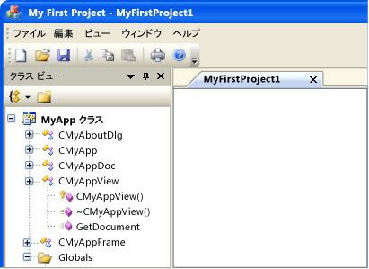

# <a name="visualization-manager"></a>ビジュアル マネージャー
ビジュアル マネージャーは、アプリケーション全体の外観を制御するオブジェクトです。 1 つのクラスとして機能、アプリケーションのすべての描画コードを配置することができます。 MFC ライブラリには、複数のビジュアル マネージャーが含まれています。 アプリケーション用のカスタム ビューを作成する場合、独自のビジュアル マネージャーを作成することもできます。 次のイメージは、異なるビジュアル マネージャーが有効にすると、同じアプリケーションを表示します。  
  
   
MyApp CMFCVisualManagerWindows ビジュアル マネージャーを使用します。  
  
   
MyApp CMFCVisualManagerVS2005 ビジュアル マネージャーを使用します。  
  
   
MyApp CMFCVisualManagerOfficeXP ビジュアル マネージャーを使用します。  
  
   
MyApp CMFCVisualManagerOffice2003 ビジュアル マネージャーを使用します。  
  
   
MyApp CMFCVisualManagerOffice2007 ビジュアル マネージャーを使用します。  
  
 既定では、ビジュアル マネージャーは、GUI 要素がいくつかの描画コードを保持します。 カスタム UI 要素を提供するには、ビジュアル マネージャーの関連の描画メソッドをオーバーライドする必要があります。 これらのメソッドの一覧で、次を参照してください。 [CMFCVisualManager クラス](../mfc/reference/cmfcvisualmanager-class.md)です。 カスタムの外観を提供する上書き可能なメソッドで始まるすべてのメソッド`OnDraw`です。  
  
 アプリケーションには、1 つだけ持つことができます`CMFCVisualManager`オブジェクト。 アプリケーションのビジュアル マネージャーへのポインターを取得するには、静的関数を呼び出す[CMFCVisualManager::GetInstance](../mfc/reference/cmfcvisualmanager-class.md#getinstance)です。 すべてのビジュアル マネージャーを継承するため`CMFCVisualManager`、`CMFCVisualManager::GetInstance`メソッドは、カスタム ビジュアル マネージャーを作成する場合もに、適切なビジュアル マネージャーへのポインターが取得されます。  
  
 カスタム ビジュアル マネージャーを作成する場合は、既に存在するビジュアル マネージャーから派生する必要があります。 既定のクラスから派生する`CMFCVisualManager`です。 ただしより、アプリケーションの目的を表している場合は、さまざまなビジュアル マネージャーを使用できます。 たとえば、使用する場合、`CMFCVisualManagerOffice2007`ビジュアル マネージャーが区切り記号を検索する方法を変更するときだけからカスタム クラスを派生させることが`CMFCVisualManagerOffice2007`です。 このシナリオでの区切り記号を描画するためのメソッドだけを上書きする必要があります。  
  
 アプリケーションの特定のビジュアル マネージャーを使用する方法は 2 つがあります。 呼び出す方法の 1 つは、 [CMFCVisualManager::SetDefaultManager](../mfc/reference/cmfcvisualmanager-class.md#setdefaultmanager)メソッドをパラメーターとして適切なビジュアル マネージャーを渡します。 次のコード例は、の使用方法を示しています、`CMFCVisualManagerVS2005`このメソッドを使用してビジュアル マネージャー。  
  
```  
CMFCVisualManager::SetDefaultManager (RUNTIME_CLASS (CMFCVisualManagerVS2005));
```  
  
 アプリケーションでは、ビジュアル マネージャーを使用する他の方法、手動で作成を開始します。 アプリケーションは、この新しいビジュアル マネージャーをすべてのレンダリングに使用されます。 ただし、1 つのみできますので`CMFCVisualManager`新しいものを作成する前に、現在のビジュアル マネージャーを削除する必要が 1 つのアプリケーションでは、オブジェクトです。 次の例では、`CMyVisualManager`から派生したカスタム ビジュアル マネージャーは、`CMFCVisualManager`です。 次のメソッドは、インデックスに基づいて、アプリケーションの表示にどのようなビジュアル マネージャーを使用に変更されます。  
  
```  
void CMyApp::SetSkin (int index)  
{  
    if (CMFCVisualManager::GetInstance() != NULL)  
 {  
    delete CMFCVisualManager::GetInstance();

 }  
 
    switch (index)  
 {  
    case DEFAULT_STYLE: *// The following statement creates a new CMFCVisualManager  
    CMFCVisualManager::GetInstance();
break;  
 
    case CUSTOM_STYLE:  
    new CMyVisualManager;  
    break; 
 
    default: 
    CMFCVisualManager::GetInstance();
break;  
 }  
 
    CMFCVisualManager::GetInstance()->RedrawAll();

} 
```  
  
## <a name="see-also"></a>参照  
 [ユーザー インターフェイス要素](../mfc/user-interface-elements-mfc.md)   
 [CMFCVisualManager クラス](../mfc/reference/cmfcvisualmanager-class.md)
