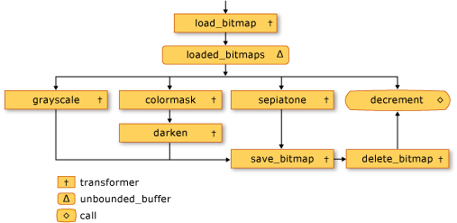
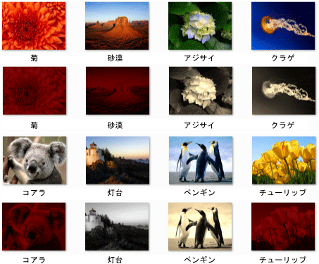

# チュートリアル: イメージ処理ネットワークの作成
[!INCLUDE[vs2017banner](../../assembler/inline/includes/vs2017banner.md)]

ここでは、イメージ処理を実行する非同期メッセージ ブロックのネットワークを作成する方法について説明します。  
  
 このネットワークでは、イメージに対して実行する操作がそのイメージの特性に基づいて決定されます。  この例では、*データ フロー* モデルを使用して、ネットワークでイメージをルーティングします。  データ フロー モデルでは、プログラムの独立したコンポーネントどうしがメッセージを送信することによって通信します。  メッセージを受信したコンポーネントは、あるアクションを実行し、その結果を別のコンポーネントに渡すことができます。  このモデルと*制御フロー* モデルを比較してください。制御フロー モデルでは、アプリケーションは制御構造 \(条件付きステートメントやループなど\) を使用してプログラムでの操作順序を制御します。  
  
 データ フローに基づくネットワークでは、タスクの*パイプライン*が作成されます。  タスク全体がいくつかの部分に分けられ、パイプラインの各ステージによって同時に実行されます。  これは、自動車製造の組み立てラインに似ています。  各車両が組み立てラインを通るときに、あるステーションではフレームが組み立てられ、別のステーションではエンジンが取り付けられます。  複数の車両を同時に組み立てることができれば、1 台ずつ車両を完成させていくよりも組み立てラインのスループットが向上します。  
  
## 必須コンポーネント  
 このチュートリアルを開始する前に、次のドキュメントを参照してください。  
  
-   [非同期メッセージ ブロック](../../parallel/concrt/asynchronous-message-blocks.md)  
  
-   [方法: メッセージ ブロック フィルターを使用する](../../parallel/concrt/how-to-use-a-message-block-filter.md)  
  
-   [チュートリアル: データフロー エージェントの作成](../Topic/Walkthrough:%20Creating%20a%20Dataflow%20Agent.md)  
  
 また、このチュートリアルを開始する前に、[!INCLUDE[ndptecgdiplus](../../parallel/concrt/includes/ndptecgdiplus_md.md)] の基本を理解しておくことをお勧めします。  [!INCLUDE[ndptecgdiplus](../../parallel/concrt/includes/ndptecgdiplus_md.md)] の詳細については、「[GDI\+](_gdiplus_GDI_start_cpp)」を参照してください。  
  
##   セクション  
 このチュートリアルは、次のセクションで構成されています。  
  
-   [イメージ処理機能の定義](#functionality)  
  
-   [イメージ処理ネットワークの作成](#network)  
  
-   [完全な例](#complete)  
  
##   イメージ処理機能の定義  
 ここでは、ディスクから読み取られるイメージをイメージ処理ネットワークで処理するときに使用されるサポート関数について説明します。  
  
 `GetRGB` および `MakeColor` の各関数は、指定された色の個々の要素をそれぞれ抽出および結合します。  
  
 [!code-cpp[concrt-image-processing-filter#2](../../parallel/concrt/codesnippet/CPP/walkthrough-creating-an-image-processing-network_1.cpp)]  
  
 `ProcessImage` 関数は、指定された [std::function](../../standard-library/function-class.md) オブジェクトを呼び出して、[!INCLUDE[ndptecgdiplus](../../parallel/concrt/includes/ndptecgdiplus_md.md)] [Bitmap](https://msdn.microsoft.com/en-us/library/ms534420.aspx) オブジェクト内の各ピクセルの色の値を変換します。  `ProcessImage` 関数とビットマップの各行を並列で処理するために [concurrency::parallel\_for](../Topic/parallel_for%20Function.md) アルゴリズムを使用します。  
  
 [!code-cpp[concrt-image-processing-filter#3](../../parallel/concrt/codesnippet/CPP/walkthrough-creating-an-image-processing-network_2.cpp)]  
  
 `Grayscale`、`Sepiatone`、`ColorMask`、および `Darken` の各関数は、`ProcessImage` 関数を呼び出して、`Bitmap` オブジェクト内の各ピクセルの色の値を変換します。  これらの各関数は、ラムダ式を使用して、1 つのピクセルの色の変換を定義します。  
  
 [!code-cpp[concrt-image-processing-filter#4](../../parallel/concrt/codesnippet/CPP/walkthrough-creating-an-image-processing-network_3.cpp)]  
  
 `GetColorDominance` 関数も `ProcessImage` 関数を呼び出します。  ただし、それぞれの色の値を変更するのではなく、この関数は赤、緑、または青の要素がイメージを管理するかどうかを判定するために [concurrency::combinable](../../parallel/concrt/reference/combinable-class.md) オブジェクトを使用します。  
  
 [!code-cpp[concrt-image-processing-filter#5](../../parallel/concrt/codesnippet/CPP/walkthrough-creating-an-image-processing-network_4.cpp)]  
  
 `GetEncoderClsid` 関数は、エンコーダーの特定の MIME タイプのクラス識別子を取得します。  アプリケーションは、この関数を使用して、ビットマップのエンコーダーを取得します。  
  
 [!code-cpp[concrt-image-processing-filter#6](../../parallel/concrt/codesnippet/CPP/walkthrough-creating-an-image-processing-network_5.cpp)]  
  
 \[[トップ](#top)\]  
  
##   イメージ処理ネットワークの作成  
 ここでは、特定のディレクトリ内の各 [!INCLUDE[TLA#tla_jpeg](../../parallel/concrt/includes/tlasharptla_jpeg_md.md)] \(.jpg\) イメージに対してイメージ処理を実行する非同期メッセージ ブロックのネットワークを作成する方法について説明します。  このネットワークでは、次のイメージ処理操作が実行されます。  
  
1.  Tom が作成したイメージについては、グレースケールに変換します。  
  
2.  最も優勢な色が赤であるイメージについては、緑と青の要素を削除してから暗くします。  
  
3.  他のイメージについては、セピア調を適用します。  
  
 ネットワークでは、これらの条件のうち最初に一致した 1 つのイメージ処理操作だけが適用されます。  たとえば、イメージが Tom によって作成されている場合、最も優勢な色が赤であっても、そのイメージはグレースケールに変換されるだけです。  
  
 ネットワークで各イメージ処理操作が実行された後、イメージはビットマップ \(.bmp\) ファイルとしてディスクに保存されます。  
  
 次の手順では、このイメージ処理ネットワークを実装し、そのネットワークを特定のディレクトリ内の各 [!INCLUDE[TLA#tla_jpeg](../../parallel/concrt/includes/tlasharptla_jpeg_md.md)] イメージに適用する関数を作成する方法を示します。  
  
#### イメージ処理ネットワークを作成するには  
  
1.  ディスク上のディレクトリの名前を受け取る `ProcessImages` という関数を作成します。  
  
     [!code-cpp[concrt-image-processing-filter#7](../../parallel/concrt/codesnippet/CPP/walkthrough-creating-an-image-processing-network_6.cpp)]  
  
2.  `ProcessImages` 関数内に `countdown_event` 変数を作成します。  `countdown_event` クラスについては、このチュートリアルの後半で説明します。  
  
     [!code-cpp[concrt-image-processing-filter#8](../../parallel/concrt/codesnippet/CPP/walkthrough-creating-an-image-processing-network_7.cpp)]  
  
3.  `Bitmap` オブジェクトを元のファイル名に関連付ける [std::map](../Topic/map%20Class.md) オブジェクトを作成します。  
  
     [!code-cpp[concrt-image-processing-filter#9](../../parallel/concrt/codesnippet/CPP/walkthrough-creating-an-image-processing-network_8.cpp)]  
  
4.  次のコードを追加して、イメージ処理ネットワークのメンバーを定義します。  
  
     [!code-cpp[concrt-image-processing-filter#10](../../parallel/concrt/codesnippet/CPP/walkthrough-creating-an-image-processing-network_9.cpp)]  
  
5.  次のコードを追加して、ネットワークを接続します。  
  
     [!code-cpp[concrt-image-processing-filter#11](../../parallel/concrt/codesnippet/CPP/walkthrough-creating-an-image-processing-network_10.cpp)]  
  
6.  次のコードを追加して、ディレクトリ内の各 [!INCLUDE[TLA#tla_jpeg](../../parallel/concrt/includes/tlasharptla_jpeg_md.md)] ファイルの完全なパスをネットワークのヘッド ノードに送信します。  
  
     [!code-cpp[concrt-image-processing-filter#12](../../parallel/concrt/codesnippet/CPP/walkthrough-creating-an-image-processing-network_11.cpp)]  
  
7.  `countdown_event` 変数がゼロになるまで待ちます。  
  
     [!code-cpp[concrt-image-processing-filter#13](../../parallel/concrt/codesnippet/CPP/walkthrough-creating-an-image-processing-network_12.cpp)]  
  
 ネットワークのメンバーを次の表に示します。  
  
|メンバー|説明|  
|----------|--------|  
|`load_bitmap`|ディスクから `Bitmap` オブジェクトを読み込み、`map` オブジェクトにイメージを元のファイル名に関連付けるエントリを追加する [concurrency::transformer](../../parallel/concrt/reference/transformer-class.md) オブジェクト。|  
|`loaded_bitmaps`|イメージ処理に読み込まれたイメージがフィルターに送信する [concurrency::unbounded\_buffer](../Topic/unbounded_buffer%20Class.md) オブジェクト。|  
|`grayscale`|Tom が作成したイメージをグレースケールに変換する `transformer` オブジェクト。  作成者の判別には、イメージのメタデータが使用されます。|  
|`colormask`|最も優勢な色が赤であるイメージから緑と青の要素を削除する `transformer` オブジェクト。|  
|`darken`|最も優勢な色が赤であるイメージを暗くする `transformer` オブジェクト。|  
|`sepiatone`|Tom 以外が作成し、最も優勢な色が赤ではないイメージにセピア調を適用する `transformer` オブジェクト。|  
|`save_bitmap`|処理した `image` をビットマップとしてディスクに保存する `transformer` オブジェクト。  `save_bitmap` では、`map` オブジェクトから元のファイル名を取得し、そのファイル名拡張子を .bmp に変更します。|  
|`delete_bitmap`|イメージ用のメモリを解放する `transformer` オブジェクト。|  
|`decrement`|ネットワークのターミナル ノードとして機能する [concurrency::call](../../parallel/concrt/reference/call-class.md) オブジェクト。  `countdown_event` オブジェクトをデクリメントし、イメージが処理されたことをメイン アプリケーションに通知します。|  
  
 `loaded_bitmaps` メッセージ バッファーは、`unbounded_buffer` オブジェクトとして `Bitmap` オブジェクトを複数の受信側に提供するため重要です。  ターゲット ブロックが `Bitmap` オブジェクトを受け入れると、`unbounded_buffer` オブジェクトはその `Bitmap` オブジェクトを他のターゲットには提供しなくなります。  そのため、オブジェクトを `unbounded_buffer` オブジェクトにリンクする順序が重要になります。  `grayscale`、`colormask`、および `sepiatone` の各メッセージ ブロックは、それぞれフィルターを使用して特定の `Bitmap` オブジェクトだけを受け入れます。  `decrement` メッセージ バッファーは、他のメッセージ バッファーによって拒否されたすべての `Bitmap` オブジェクトを受け入れるため、`loaded_bitmaps` メッセージ バッファーの重要なターゲットになります。  `unbounded_buffer` オブジェクトは、メッセージを順番に伝達するために必要です。  したがって、`unbounded_buffer` オブジェクトは、新しいターゲット ブロックがリンクされるまでブロックし、現在のターゲット ブロックがメッセージを受け入れない場合はそのメッセージを受け入れます。  
  
 メッセージを最初に受け入れた 1 つのメッセージ ブロックだけでなく、複数のメッセージ ブロックでメッセージを処理することがアプリケーションで要求される場合は、`overwrite_buffer` など、別の型のメッセージ ブロックを使用できます。  `overwrite_buffer` クラスには、一度に 1 つのメッセージが保持され、そのメッセージは各ターゲットに伝達されます。  
  
 次の図は、イメージ処理ネットワークを示しています。  
  
   
  
 この例では、`countdown_event` オブジェクトにより、すべてのイメージが処理された時点でイメージ処理ネットワークからメイン アプリケーションに通知されるようになっています。  `countdown_event` クラスは、カウンター値がゼロになったときに通知を送信するために [concurrency::event](../Topic/event%20Class.md) オブジェクトを使用します。  メイン アプリケーションは、ネットワークにファイル名を送信するたびにカウンターをインクリメントします。  ネットワークのターミナル ノードは、各イメージが処理された後、カウンターをデクリメントします。  メイン アプリケーションは、指定されたディレクトリを走査した後、カウンターがゼロになったことが `countdown_event` オブジェクトから通知されるまで待機します。  
  
 次の例は、`countdown_event` クラスを示しています。  
  
 [!code-cpp[concrt-image-processing-filter#14](../../parallel/concrt/codesnippet/CPP/walkthrough-creating-an-image-processing-network_13.cpp)]  
  
 \[[トップ](#top)\]  
  
##   完全な例  
 コード例全体を次に示します。  `wmain` 関数は、[!INCLUDE[ndptecgdiplus](../../parallel/concrt/includes/ndptecgdiplus_md.md)] ライブラリを管理し、`ProcessImages` 関数を呼び出して `Sample Pictures` ディレクトリ内の [!INCLUDE[TLA#tla_jpeg](../../parallel/concrt/includes/tlasharptla_jpeg_md.md)] ファイルを処理します。  
  
 [!code-cpp[concrt-image-processing-filter#15](../../parallel/concrt/codesnippet/CPP/walkthrough-creating-an-image-processing-network_14.cpp)]  
  
 次の図は、サンプル出力を示しています。  各ソース イメージの下に、対応する変更後のイメージが示されています。  
  
   
  
 Tom Alphin によって作成された `Lighthouse` は、グレースケールに変換されています。  最も優勢な色が赤である `Chrysanthemum`、`Desert`、`Koala`、および `Tulips` については、青と緑の要素が削除され、暗くされています。  既定の条件に合致する `Hydrangeas`、`Jellyfish`、および `Penguins` については、セピア調が適用されています。  
  
 \[[トップ](#top)\]  
  
### コードのコンパイル  
 プログラム例をコピーし、Visual Studio のプロジェクトに貼り付けるか、`イメージ処理network.cpp` という名前で、Visual Studio のコマンド プロンプト ウィンドウで次のコマンドを実行してファイルに貼り付けます。  
  
 **cl.exe \/DUNICODE \/EHsc image\-processing\-network.cpp \/link gdiplus.lib**  
  
## 参照  
 [同時実行ランタイムのチュートリアル](../Topic/Concurrency%20Runtime%20Walkthroughs.md)