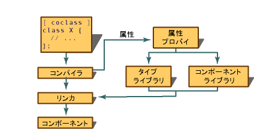

# Basic Mechanics of Attributes
[!INCLUDE[vs2017banner](../assembler/inline/includes/vs2017banner.md)]

プロジェクトに属性を挿入する 3 とおりの方法があります。  まずソース・コードに手動で追加できます。  第 2 にプロジェクトのプロパティ グリッドを使用して列を挿入することもできます。  最後にウィザードを使用して列を挿入することもできます。  \[プロパティ\] ウィンドウと各種ウィザードの使用の詳細については[Visual C\+\+ の作成と管理のプロジェクト](../ide/creating-and-managing-visual-cpp-projects.md) を参照してください。  
  
 Visual C\+\+ .NET 以降ではコンパイラはソース ファイルの属性の存在を認識して動的にコンパイル中に実行を解析および検証できます。  
  
 同様にプロジェクトがビルドされるとコンパイラはC\+\+ のソース ファイルを解析するにはオブジェクト ファイルを作成します。  ただしコンパイラが属性に検出するとコンパイラが解析され構文的に検証されます。  コンパイラはコードを動的に挿入するかコンパイル時に他の変更を加えるに属性プロバイダーを呼び出します。  プロバイダーの実装は属性の種類によって異なります。  たとえばATL 関連の属性は Atlprov.dll によって実装されます。  
  
 次の図はコンパイラの属性とプロバイダー間の関係を示します。  
  
   
  
> [!NOTE]
>  属性の使用方法はソース ファイルの内容は変更されません。  一度だけ生成されたコード属性はデバッグ セッション中に表示されますあります。  またプロジェクト内の各ソース ファイルの場合属性の別の結果を表示するテキスト ファイルを生成できます。  この手順の詳細については[\/Fx \(挿入されたコードのマージ\)](../build/reference/fx-merge-injected-code.md) と [挿入されたコードのデバッグ](../Topic/How%20to:%20Debug%20Injected%20Code.md) を参照してください。  
  
 ほとんどの C\+\+ 構造体のように属性に適切な使用を定義する一連の特性があります。  このような属性コンテキスト参照し各属性に関するトピックの属性コンテキストの表で説明します。  たとえば[コクラス](../windows/coclass.md) の属性は. C\+\+ ソース ファイル内のどこにでも挿入できる [cpp\_quote](../Topic/cpp_quote.md) の属性に対して既存のクラスまたは構造体にのみ適用できません。  
  
## 参照  
 [Concepts](../windows/attributed-programming-concepts.md)