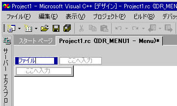

# Creating a Menu
[!INCLUDE[vs2017banner](../assembler/inline/includes/vs2017banner.md)]

> [!NOTE]
>  \[リソース\] ウィンドウは Express Edition では使用できません。  
  
### 標準メニューを作成するには  
  
1.  **\[表示\]** メニューの **\[リソース ビュー\]** をクリックし、**\[メニュー\]** 見出しを右クリックし、**\[リソースの追加\]** をクリックします。**\[メニュー\]** をクリックします。  
  
2.  メニュー バーで、"ここへ入力" と表示されている四角形の **\[新しい項目\]** ボックスを選びます。  
  
       
\[新しい項目\] ボックス  
  
3.  たとえば「ファイル」など、新しいメニューの名前を入力します。  
  
     入力したテキストは、**メニュー** エディターと、[プロパティ ウィンドウ](../Topic/Properties%20Window.md)の **\[キャプション\]** ボックスの両方に表示されます。 新しいメニューのプロパティはこのどちらからでも編集できます。  
  
     メニュー バーで新しいメニューの名前を指定すると、さらに別のメニューを追加できるように \[新しい項目\] ボックスが右に移動し、最初のメニューの下に新しい \[新しい項目\] ボックスが表示されます。この新しいボックスでメニュー コマンドを追加できます。  
  
       
メニュー名の入力後にフォーカスが移動した \[新しい項目\] ボックス  
  
    > [!NOTE]
    >  メニュー バーで単一項目のメニューを作成するには、\[Popup\] プロパティを \[False\] に設定します。  
  
 マネージ プロジェクトにリソースを追加する方法については、『*.NET Framework 開発者ガイド*』の「[アプリケーションのリソース](../Topic/Resources%20in%20Desktop%20Apps.md)」を参照してください。マネージ プロジェクトにリソース ファイルを手動で追加する方法、リソースへのアクセス方法、静的なリソースの表示方法、リソース文字列をプロパティに割り当てる方法については、「[チュートリアル : Windows フォームのローカリゼーション](http://msdn.microsoft.com/ja-jp/9a96220d-a19b-4de0-9f48-01e5d82679e5)」および「[Walkthrough: Using Resources for Localization with ASP.NET](../Topic/Walkthrough:%20Using%20Resources%20for%20Localization%20with%20ASP.NET.md)」をご覧ください。  
  
 **要件**  
  
 Win32  
  
## 参照  
 [Menu Editor](../Topic/Menu%20Editor.md)