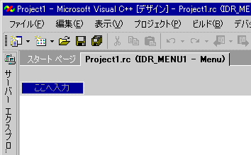

# メニュー (C++) の作成

> [!NOTE]
> **リソース ウィンドウ**Express エディションでは使用できません。

### 標準メニューを作成するには

1. **[表示]** メニューの **[リソース ビュー]** をクリックし、 **[メニュー]** 見出しを右クリックし、 **[リソースの追加]** をクリックします。 **[メニュー]** をクリックします。

2. メニュー バーで、"ここへ入力" と表示されている四角形の **[新しい項目]** ボックスを選びます。

     
[新しい項目] ボックス

3. たとえば「ファイル」など、新しいメニューの名前を入力します。

   入力したテキストは、 **メニュー** エディターと、 **プロパティ ウィンドウ** の [[キャプション]](/visualstudio/ide/reference/properties-window)ボックスの両方に表示されます。 新しいメニューのプロパティはこのどちらからでも編集できます。

   メニュー バーで新しいメニューの名前を指定すると、さらに別のメニューを追加できるように [新しい項目] ボックスが右に移動し、最初のメニューの下に新しい [新しい項目] ボックスが表示されます。この新しいボックスでメニュー コマンドを追加できます。

     
メニュー名の入力後にフォーカスが移動した [新しい項目] ボックス

   > [!NOTE]
   > メニュー バーの単一項目のメニューを作成するには、設定、**ポップアップ**プロパティを**False**します。

マネージ プロジェクトにリソースを追加する方法についてを参照してください[Resources in Desktop Apps](/dotnet/framework/resources/index)で、 *.NET Framework 開発者ガイド*します。 マネージ プロジェクトにリソース ファイルを手動で追加、リソースへのアクセス、静的リソースの表示方法、およびリソース文字列のプロパティを割り当てる方法については、次を参照してください。[デスクトップ アプリのリソース ファイルの作成](/dotnet/framework/resources/creating-resource-files-for-desktop-apps)です。 管理対象アプリ内のリソースのグローバリゼーションとローカリゼーションについては、次を参照してください。 [Globalizing and Localizing .NET Framework Applications](/dotnet/standard/globalization-localization/index)します。

## 要件

Win32

## 関連項目

[メニュー エディター](../windows/menu-editor.md)