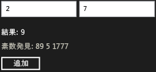

# チュートリアル: WRL を使用した基本的な Windows ランタイム コンポーネントの作成
このドキュメントでは、Windows ランタイム C++ テンプレート ライブラリ (WRL) を使用して基本的な Windows ランタイム コンポーネントを作成する方法を示します。 コンポーネントは、2 つの数値を追加し、結果が素数である場合、イベントを発生させます。 このドキュメントでは、JavaScript を使用するユニバーサル Windows プラットフォーム アプリからコンポーネントを使用する方法も示します。  
  
## 必須コンポーネント  
  
-   エクスペリエンス、 [Windows ランタイム](http://msdn.microsoft.com/library/windows/apps/br211377.aspx)です。  
  
-   COM の使用経験。  
  
### 2 つの数値を加算する基本的な Windows ランタイム コンポーネントを作成するには  
  
1.  Visual Studio で、Visual C の作成`WRLClassLibrary`プロジェクト。 ドキュメント[クラス ライブラリ プロジェクト テンプレート](../windows/wrl-class-library-project-template.md)このテンプレートをダウンロードする方法について説明します。 プロジェクトに `Contoso` という名前を付けます。  
  
2.  Contoso.cpp および Contoso.idl では、「Calculator」と"WinRTClass"すべてインスタンスを置き換えます。  
  
3.  Contoso.idl で追加、`Add`メソッドを`ICalculator`インターフェイスです。  
  
     [!code-cpp[wrl-basic-component#1](../windows/codesnippet/CPP/walkthrough-creating-a-basic-windows-runtime-component-using-wrl_1.idl)]  
  
4.  Contoso.cpp で追加、`Add`メソッドを`public`のセクションで、`Calculator`クラスです。  
  
     [!code-cpp[wrl-basic-component#2](../windows/codesnippet/CPP/walkthrough-creating-a-basic-windows-runtime-component-using-wrl_2.cpp)]  
  
    > [!IMPORTANT]
    >  COM コンポーネントを作成するためを使用してください、`__stdcall`呼び出し規約です。  
  
     使用することをお勧め`_Out_`とソース注釈言語 (SAL) の注釈に他の関数がそのパラメーターを使用する方法について説明します。 SAL 注釈は、戻り値の説明にも使用されます。 SAL 注釈を使用、 [C/C++ コード分析ツール](/visualstudio/code-quality/code-analysis-for-c-cpp-overview)をソース コードの C および C++ での障害を検出します。 ツールによって報告される一般的なコーディング エラーは、バッファー オーバーラン、初期化されていないメモリ、null ポインターが逆参照、およびメモリとリソースのリークが発生します。  
  
### JavaScript を使用するユニバーサル Windows プラットフォーム アプリからコンポーネントを使用するのには  
  
1.  Visual Studio で、追加、新しい JavaScript`Blank App`プロジェクトを`Contoso`ソリューションです。 プロジェクトに `CalculatorJS` という名前を付けます。  
  
2.  `CalculatorJS`プロジェクトへの参照を追加、`Contoso`プロジェクト。  
  
3.  Default.html で置き換える、`body`にこれらの UI 要素のセクション。  
  
     [!code-html[wrl-basic-component#3](../windows/codesnippet/Html/walkthrough-creating-a-basic-windows-runtime-component-using-wrl_3.html)]  
  
4.  Default.js で実装、`OnClick`関数。  
  
     [!code-javascript[wrl-basic-component#4](../windows/codesnippet/JavaScript/walkthrough-creating-a-basic-windows-runtime-component-using-wrl_4.js)]  
  
    > [!NOTE]
    >  JavaScript では、メソッド名の最初の文字を標準的な名前付け規則に一致するように小文字に変更されます。  
  
### 素数を計算するときに発生するイベントを追加するには  
  
1.  宣言の前に、Contoso.idl で`ICalculator`、デリゲート型を定義する`PrimeNumberEvent`、提供する、`int`引数。  
  
     [!code-cpp[wrl-basic-component#5](../windows/codesnippet/CPP/walkthrough-creating-a-basic-windows-runtime-component-using-wrl_5.idl)]  
  
     使用すると、`delegate`キーワード、MIDL コンパイラの作成を含むインターフェイス、`Invoke`そのデリゲートのシグネチャに一致するメソッド。 この例では、生成されたファイル Contoso_h.h 定義、`IPrimeNumberEvent`後の手順で使用されるインターフェイス。  
  
     [!code-cpp[wrl-basic-component#13](../windows/codesnippet/CPP/walkthrough-creating-a-basic-windows-runtime-component-using-wrl_6.cpp)]  
  
2.  `ICalculator`インターフェイスでは、定義、`PrimeNumberFound`イベント。 `eventadd`と`eventremove`属性を指定するのコンシューマー、`ICalculator`インターフェイス両方をサブスクライブしてこのイベントの登録を解除します。  
  
     [!code-cpp[wrl-basic-component#6](../windows/codesnippet/CPP/walkthrough-creating-a-basic-windows-runtime-component-using-wrl_7.idl)]  
  
3.  Contoso.cpp で追加、 `private` [Microsoft::WRL::EventSource](../windows/eventsource-class.md)メンバー変数をイベント サブスクライバーを管理し、イベント ハンドラーを呼び出します。  
  
     [!code-cpp[wrl-basic-component#7](../windows/codesnippet/CPP/walkthrough-creating-a-basic-windows-runtime-component-using-wrl_8.cpp)]  
  
4.  Contoso.cpp、実装、`add_PrimeNumberFound`と`remove_PrimeNumberFound`メソッドです。  
  
     [!code-cpp[wrl-basic-component#8](../windows/codesnippet/CPP/walkthrough-creating-a-basic-windows-runtime-component-using-wrl_9.cpp)]  
  
### 素数を計算するときにイベントを発生させる  
  
1.  Contoso.cpp で追加、`IsPrime`メソッドを`private`のセクションで、`Calculator`クラスです。  
  
     [!code-cpp[wrl-basic-component#12](../windows/codesnippet/CPP/walkthrough-creating-a-basic-windows-runtime-component-using-wrl_10.cpp)]  
  
2.  変更、`Calculator`の`Add`メソッドを呼び出す、 [Microsoft::WRL::EventSource::InvokeAll](../windows/eventsource-invokeall-method.md)素数を計算するときのメソッドです。  
  
     [!code-cpp[wrl-basic-component#11](../windows/codesnippet/CPP/walkthrough-creating-a-basic-windows-runtime-component-using-wrl_11.cpp)]  
  
### JavaScript からイベントを処理するには  
  
1.  Default.html で変更、`body`素数を含むテキスト領域を記載します。  
  
     [!code-html[wrl-basic-component#9](../windows/codesnippet/Html/walkthrough-creating-a-basic-windows-runtime-component-using-wrl_12.html)]  
  
2.  Default.js で変更、`Add`を処理する関数、`PrimeNumberFound`イベント。 イベント ハンドラーは、素数の数を前の手順で定義されているテキスト領域に追加します。  
  
     [!code-javascript[wrl-basic-component#10](../windows/codesnippet/JavaScript/walkthrough-creating-a-basic-windows-runtime-component-using-wrl_13.js)]  
  
    > [!NOTE]
    >  JavaScript では、イベント名は小文字に変更され、標準的な名前付け規則に一致するように"on"と付加されます。  
  
 次の図は、基本的な電卓アプリを示します。  
  
   
  
## 次の手順  
  
## 関連項目  
 [Windows ランタイム C++ テンプレート ライブラリ (WRL)](../windows/windows-runtime-cpp-template-library-wrl.md)   
 [クラス ライブラリ プロジェクト テンプレート](../windows/wrl-class-library-project-template.md)   
 [C/C++ コード分析ツール](/visualstudio/code-quality/code-analysis-for-c-cpp-overview)